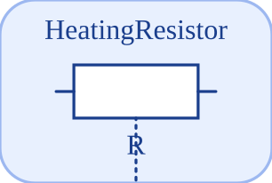

# HeatingResistor


<p align="center">

</p>
Resistance qui dissipe sa puissance P = v^2 / R sous forme de chaleur dans un port thermique.

## 📝 Syntaxe

- Type de bloc : HeatingResistor

## 📥 Argument d'entrée

- broches physiques - 3 broche(s) physique(s) non orientee(s) ; 0 entree(s) de signal.

## 📤 Argument de sortie

- ports de signal - 0 sortie(s) de signal (lectures de capteur).

## 📄 Description


Composant acausal (Electrique (acausal)). Resistance qui dissipe sa puissance P = v^2 / R sous forme de chaleur dans un port thermique. 

| Champ | Valeur |
| --- | --- |
| Module | <code>nflow_blocks</code> | 
| Bibliotheque | Electrique (acausal) | 
| Type | <code>HeatingResistor</code> | 
| Libelle | HeatingResistor | 
| Solveur | Abaisse vers <code>physicalIsland</code>. Solveur de reference <code>dae</code> (differentiel-algebrique) ; la boucle a pas fixe et les solveurs explicites natifs (<code>ode1</code>/<code>ode4</code>/<code>ode45</code>) sont egalement pris en charge (un ilot multicorps articule necessite <code>dae</code>). | 

  

<b>Sources d implementation</b> 

**Manifest:** `modules/nflow_blocks/libraries/acausal_electrical/library.json`
 

<details>
<summary>Catalog: <code>modules/nflow_blocks/functions/+NFlow/+internal/acausalCatalog.m</code></summary>

```matlab
  c{end + 1} = entry('HeatingResistor', 'Electrical', 'electrical', 'physicalIsland', ...
    'resistor', {{'p', 'a'}, {'n', 'b'}, {'heatPort', 'a', 'thermal'}}, {{'R', 'R', 1000, 'ohm'}}, '', '', ...
    'Resistor that dissipates its power P = v^2 / R as heat into a thermal port.');
```

</details>


## 🔗 Voir aussi

[Ground](../../nflow_blocks/acausal_electrical/Ground.md), [Resistor](../../nflow_blocks/acausal_electrical/Resistor.md), [Conductor](../../nflow_blocks/acausal_electrical/Conductor.md).

## 🕔 Historique

| Version | 📄 Description     |
| ------- | --------------- |
| 1.0.0   | initial version |

<!--
## 👤 Auteur

Allan CORNET
-->
