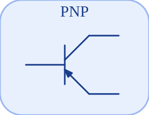

# PNP


<p align="center">

</p>
Transistor bipolaire PNP (Ebers-Moll) : broches collecteur, base et emetteur.

## 📝 Syntaxe

- Type de bloc : PNP

## 📥 Argument d'entrée

- broches physiques - 3 broche(s) physique(s) non orientee(s) ; 0 entree(s) signal.

## 📤 Argument de sortie

- ports signal - 0 sortie(s) signal (lectures de capteur).

## 📄 Description


Composant acausal (Electrique (acausal)). Transistor bipolaire PNP (Ebers-Moll) : broches collecteur, base et emetteur. 

| Champ | Valeur |
| --- | --- |
| Module | <code>nflow_blocks</code> | 
| Bibliotheque | Electrique (acausal) | 
| Type | <code>PNP</code> | 
| Libelle | PNP | 
| Solveur | Abaisse vers <code>physicalIsland</code>. Solveur de reference <code>dae</code> (differentiel-algebrique) ; la boucle a pas fixe et les solveurs explicites natifs (<code>ode1</code>/<code>ode4</code>/<code>ode45</code>) sont egalement pris en charge (un ilot multicorps articule necessite <code>dae</code>). | 

  

<b>Sources d implementation</b> 

**Manifest:** `modules/nflow_blocks/libraries/acausal_electrical/library.json`
 

<details>
<summary>Catalog: <code>modules/nflow_blocks/functions/+NFlow/+internal/acausalCatalog.m</code></summary>

```matlab
  c{end + 1} = entry('PNP', 'Electrical', 'electrical', 'physicalIsland', ...
    'pnp', {{'C', 'a'}, {'B', 'c'}, {'E', 'b'}}, ...
    {{'Is', 'Is', 1e-16, 'A'}, {'Vt', 'Vt', 0.025, 'V'}, ...
     {'Bf', 'Bf', 100, '1'}, {'Br', 'Br', 1, '1'}}, '', '', ...
    'PNP bipolar transistor (Ebers-Moll): collector, base and emitter pins.');
```

</details>


## 🔗 Voir aussi

[Ground](../../nflow_blocks/acausal_electrical/Ground.md), [Resistor](../../nflow_blocks/acausal_electrical/Resistor.md), [HeatingResistor](../../nflow_blocks/acausal_electrical/HeatingResistor.md).

## 🕔 Historique

| Version | 📄 Description     |
| ------- | --------------- |
| 1.0.0   | initial version |

<!--
## 👤 Auteur

Allan CORNET
-->
