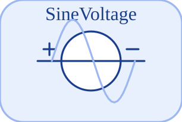

# SineVoltage


<p align="center">

</p>
Source de tension sinusoidale : v = Amplitude sin(2 pi Frequency t + Phase).

## 📝 Syntaxe

- Type de bloc : SineVoltage

## 📥 Argument d'entrée

- broches physiques - 2 broche(s) physique(s) non orientee(s) ; 0 entree(s) signal.

## 📤 Argument de sortie

- ports signal - 0 sortie(s) signal (lectures de capteur).

## 📄 Description


Composant acausal (Electrique (acausal)). Source de tension sinusoidale : v = Amplitude sin(2 pi Frequency t + Phase). 

| Champ | Valeur |
| --- | --- |
| Module | <code>nflow_blocks</code> | 
| Bibliotheque | Electrique (acausal) | 
| Type | <code>SineVoltage</code> | 
| Libelle | SineVoltage | 
| Solveur | Abaisse vers <code>physicalIsland</code>. Solveur de reference <code>dae</code> (differentiel-algebrique) ; la boucle a pas fixe et les solveurs explicites natifs (<code>ode1</code>/<code>ode4</code>/<code>ode45</code>) sont egalement pris en charge (un ilot multicorps articule necessite <code>dae</code>). | 

  

<b>Sources d implementation</b> 

**Manifest:** `modules/nflow_blocks/libraries/acausal_electrical/library.json`
 

<details>
<summary>Catalog: <code>modules/nflow_blocks/functions/+NFlow/+internal/acausalCatalog.m</code></summary>

```matlab
  c{end + 1} = entry('SineVoltage', 'Electrical', 'electrical', 'physicalIsland', ...
    'vsource', {{'p', 'a'}, {'n', 'b'}}, ...
    {{'Amplitude', 'Amplitude', 1, 'V'}, {'Frequency', 'Frequency', 1, 'Hz'}, {'Phase', 'Phase', 0, 'rad'}}, ...
    '', '', 'Sine voltage source: v = Amplitude sin(2 pi Frequency t + Phase).');
```

</details>


## 🔗 Voir aussi

[Ground](../../nflow_blocks/acausal_electrical/Ground.md), [Resistor](../../nflow_blocks/acausal_electrical/Resistor.md), [HeatingResistor](../../nflow_blocks/acausal_electrical/HeatingResistor.md).

## 🕔 Historique

| Version | 📄 Description     |
| ------- | --------------- |
| 1.0.0   | initial version |

<!--
## 👤 Auteur

Allan CORNET
-->
