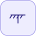

# PlanarFixed


<p align="center">

</p>
Repere rigidement fixe au point monde (x, y).

## 📝 Syntaxe

- Type de bloc : PlanarFixed

## 📥 Argument d'entrée

- broches physiques - 1 broche(s) physique(s) non orientee(s) ; 0 entree(s) de signal.

## 📤 Argument de sortie

- ports de signal - 0 sortie(s) de signal (lectures de capteur).

## 📄 Description


Composant acausal (Planaire (acausal)). Repere rigidement fixe au point monde (x, y). 

| Champ | Valeur |
| --- | --- |
| Module | <code>nflow_blocks</code> | 
| Bibliotheque | Planaire (acausal) | 
| Type | <code>PlanarFixed</code> | 
| Libelle | PlanarFixed | 
| Solveur | Abaisse vers <code>planarMechanicalIsland</code>. Solveur de reference <code>dae</code> (algebro-differentiel) ; la boucle a pas fixe et les solveurs explicites natifs (<code>ode1</code>/<code>ode4</code>/<code>ode45</code>) sont egalement pris en charge (un ilot multicorps articule necessite <code>dae</code>). | 

  

<b>Sources d implementation</b> 

**Manifest:** `modules/nflow_blocks/libraries/acausal_planar/library.json`
 

<details>
<summary>Catalog: <code>modules/nflow_blocks/functions/+NFlow/+internal/planarCatalog.m</code></summary>

```matlab
  c{end + 1} = pl_entry('PlanarFixed', 'World', {'frame'}, ...
    {{'x', 0, 'm'}, {'y', 0, 'm'}}, '', ...
    'Frame rigidly fixed at the world point (x, y).');
```

</details>


## 🔗 Voir aussi

[PlanarWorld](../../nflow_blocks/acausal_planar/PlanarWorld.md), [PlanarBody](../../nflow_blocks/acausal_planar/PlanarBody.md), [PlanarPointMass](../../nflow_blocks/acausal_planar/PlanarPointMass.md).

## 🕔 Historique

| Version | 📄 Description     |
| ------- | --------------- |
| 1.0.0   | initial version |

<!--
## 👤 Auteur

Allan CORNET
-->
