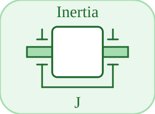

# Inertia


<p align="center">

</p>
Inertie en rotation : J dw/dt = tau\_net.

## 📝 Syntaxe

- Type de bloc : Inertia

## 📥 Argument d'entrée

- broches physiques - 1 broche(s) physique(s) non orientee(s) ; 0 entree(s) de signal.

## 📤 Argument de sortie

- ports de signal - 0 sortie(s) de signal (lectures de capteur).

## 📄 Description


Composant acausal (Rotation (acausal)). Inertie en rotation : J dw/dt = tau\_net. 

| Champ | Valeur |
| --- | --- |
| Module | <code>nflow_blocks</code> | 
| Bibliotheque | Rotation (acausal) | 
| Type | <code>Inertia</code> | 
| Libelle | Inertia | 
| Solveur | Abaisse vers <code>mechanicalTranslationalIsland</code>. Solveur de reference <code>dae</code> (differentiel-algebrique) ; la boucle a pas fixe et les solveurs explicites natifs (<code>ode1</code>/<code>ode4</code>/<code>ode45</code>) sont egalement pris en charge (un ilot multicorps articule necessite <code>dae</code>). | 

  

<b>Sources d implementation</b> 

**Manifest:** `modules/nflow_blocks/libraries/acausal_rotational/library.json`
 

<details>
<summary>Catalog: <code>modules/nflow_blocks/functions/+NFlow/+internal/acausalCatalog.m</code></summary>

```matlab
  c{end + 1} = entry('Inertia', 'Rotational', 'rotational', 'mechanicalTranslationalIsland', ...
    'mass', {{'flange', 'node'}}, ...
    {{'J', 'm', 1, 'kg.m2'}, {'phi0', 's0', 0, 'rad'}, {'w0', 'v0', 0, 'rad/s'}}, '', '', ...
    'Rotational inertia: J dw/dt = tau_net.');
```

</details>


## 🔗 Voir aussi

[EMF](../../nflow_blocks/acausal_rotational/EMF.md), [RotSpring](../../nflow_blocks/acausal_rotational/RotSpring.md), [RotDamper](../../nflow_blocks/acausal_rotational/RotDamper.md).

## 🕔 Historique

| Version | 📄 Description     |
| ------- | --------------- |
| 1.0.0   | initial version |

<!--
## 👤 Auteur

Allan CORNET
-->
