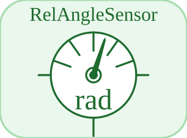

# RelAngleSensor


<p align="center">

</p>
Mesure l angle relatif phi\_a - phi\_b entre deux brides.

## 📝 Syntaxe

- Type de bloc : RelAngleSensor

## 📥 Argument d'entrée

- broches physiques - 2 broche(s) physique(s) non orientee(s) ; 0 entree(s) de signal.

## 📤 Argument de sortie

- ports de signal - 1 sortie(s) de signal (lectures de capteur).

## 📄 Description


Composant acausal (Rotation (acausal)). Mesure l angle relatif phi\_a - phi\_b entre deux brides. 

| Champ | Valeur |
| --- | --- |
| Module | <code>nflow_blocks</code> | 
| Bibliotheque | Rotation (acausal) | 
| Type | <code>RelAngleSensor</code> | 
| Libelle | RelAngleSensor | 
| Solveur | Abaisse vers <code>mechanicalTranslationalIsland</code>. Solveur de reference <code>dae</code> (differentiel-algebrique) ; la boucle a pas fixe et les solveurs explicites natifs (<code>ode1</code>/<code>ode4</code>/<code>ode45</code>) sont egalement pris en charge (un ilot multicorps articule necessite <code>dae</code>). | 

  

<b>Sources d implementation</b> 

**Manifest:** `modules/nflow_blocks/libraries/acausal_rotational/library.json`
 

<details>
<summary>Catalog: <code>modules/nflow_blocks/functions/+NFlow/+internal/acausalCatalog.m</code></summary>

```matlab
  c{end + 1} = entry('RelAngleSensor', 'Rotational', 'rotational', 'mechanicalTranslationalIsland', ...
    'relPositionSensor', {{'a', 'a'}, {'b', 'b'}}, {}, '', 'angle', ...
    'Measures the relative angle phi_a - phi_b between two flanges.');
```

</details>


## 🔗 Voir aussi

[EMF](../../nflow_blocks/acausal_rotational/EMF.md), [Inertia](../../nflow_blocks/acausal_rotational/Inertia.md), [RotSpring](../../nflow_blocks/acausal_rotational/RotSpring.md).

## 🕔 Historique

| Version | 📄 Description     |
| ------- | --------------- |
| 1.0.0   | initial version |

<!--
## 👤 Auteur

Allan CORNET
-->
