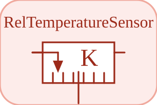

# RelTemperatureSensor

<p align="center">

</p>
Mesure la difference de temperature T\_a - T\_b.

## 📝 Syntaxe

- Type de bloc : RelTemperatureSensor

## 📥 Argument d'entrée

- broches physiques - 2 broche(s) physique(s) non orientee(s) ; 0 entree(s) de signal.

## 📤 Argument de sortie

- ports de signal - 1 sortie(s) de signal (lectures de capteur).

## 📄 Description

Composant acausal (Thermique (acausal)). Mesure la difference de temperature T_a - T_b.

| Champ        | Valeur                                                                                                                                                                                                                                                                                                              |
| ------------ | ------------------------------------------------------------------------------------------------------------------------------------------------------------------------------------------------------------------------------------------------------------------------------------------------------------------- |
| Module       | <code>nflow_blocks</code>                                                                                                                                                                                                                                                                                           |
| Bibliotheque | Thermique (acausal)                                                                                                                                                                                                                                                                                                 |
| Type         | <code>RelTemperatureSensor</code>                                                                                                                                                                                                                                                                                   |
| Libelle      | RelTemperatureSensor                                                                                                                                                                                                                                                                                                |
| Solveur      | Abaisse vers <code>physicalIsland</code>. Solveur de reference <code>dae</code> (differentiel-algebrique) ; la boucle a pas fixe et les solveurs explicites natifs (<code>ode1</code>/<code>ode4</code>/<code>ode45</code>) sont egalement pris en charge (un ilot multicorps articule necessite <code>dae</code>). |

<b>Sources d implementation</b>

<details>
<summary>Manifest: <code>modules/nflow_blocks/libraries/acausal_thermal/library.json</code></summary>

```json
{
  "id": "builtin.acausal_thermal",
  "title": "Thermal (acausal)",
  "version": "1.0.0",
  "format": "nflow-2",
  "metadata": {
    "author": "Allan CORNET",
    "tool": "Nelson nflow"
  },
  "comment": "Acausal thermal components (physical pins); lower to physicalIsland.",
  "license": "LGPL-3.0",
  "builtin": true,
  "renderModule": false,
  "blocks": [
    {
      "type": "HeatCapacitor",
      "label": "HeatCapacitor",
      "acausal": true,
      "domain": "thermal",
      "width": 100,
      "height": 80,
      "physicalPins": [
        {
          "name": "port",
          "x": 0,
          "y": 40,
          "side": "left",
          "domain": "thermal"
        }
      ],
      "inputs": [],
      "outputs": [],
      "defaultParams": {
        "C": 1,
        "T0": 293.15
      },
      "icon": "HeatCapacitor.svg",
      "render": {
        "type": "image",
        "src": "HeatCapacitor.svg"
      },
      "help": "Lumped heat capacity: C dT/dt = Q_flow (port referenced to 0)."
    },
    {
      "type": "ThermalConductor",
      "label": "ThermalConductor",
      "acausal": true,
      "domain": "thermal",
      "width": 100,
      "height": 80,
      "physicalPins": [
        {
          "name": "a",
          "x": 0,
          "y": 40,
          "side": "left",
          "domain": "thermal"
        },
        {
          "name": "b",
          "x": 100,
          "y": 40,
          "side": "right",
          "domain": "thermal"
        }
      ],
      "inputs": [],
      "outputs": [],
      "defaultParams": {
        "G": 1
      },
      "icon": "ThermalConductor.svg",
      "render": {
        "type": "image",
        "src": "ThermalConductor.svg"
      },
      "help": "Thermal conductor: Q_flow = G (T_a - T_b)."
    },
    {
      "type": "ThermalResistor",
      "label": "ThermalResistor",
      "acausal": true,
      "domain": "thermal",
      "width": 100,
      "height": 80,
      "physicalPins": [
        {
          "name": "a",
          "x": 0,
          "y": 40,
          "side": "left",
          "domain": "thermal"
        },
        {
          "name": "b",
          "x": 100,
          "y": 40,
          "side": "right",
          "domain": "thermal"
        }
      ],
      "inputs": [],
      "outputs": [],
      "defaultParams": {
        "R": 1
      },
      "icon": "ThermalResistor.svg",
      "render": {
        "type": "image",
        "src": "ThermalResistor.svg"
      },
      "help": "Thermal resistor: Q_flow = (T_a - T_b) / R."
    },
    {
      "type": "ConvectiveResistor",
      "label": "ConvectiveResistor",
      "acausal": true,
      "domain": "thermal",
      "width": 100,
      "height": 80,
      "physicalPins": [
        {
          "name": "a",
          "x": 0,
          "y": 40,
          "side": "left",
          "domain": "thermal"
        },
        {
          "name": "b",
          "x": 100,
          "y": 40,
          "side": "right",
          "domain": "thermal"
        }
      ],
      "inputs": [
        {
          "x": 50,
          "y": 0,
          "side": "top",
          "name": "R"
        }
      ],
      "outputs": [],
      "defaultParams": {},
      "icon": "ConvectiveResistor.svg",
      "render": {
        "type": "image",
        "src": "ConvectiveResistor.svg"
      },
      "help": "Convective resistor: Q_flow = (T_a - T_b) / Rc with a signal-driven Rc."
    },
    {
      "type": "Convection",
      "label": "Convection",
      "acausal": true,
      "domain": "thermal",
      "width": 100,
      "height": 80,
      "physicalPins": [
        {
          "name": "a",
          "x": 0,
          "y": 40,
          "side": "left",
          "domain": "thermal"
        },
        {
          "name": "b",
          "x": 100,
          "y": 40,
          "side": "right",
          "domain": "thermal"
        }
      ],
      "inputs": [
        {
          "x": 50,
          "y": 0,
          "side": "top",
          "name": "G"
        }
      ],
      "outputs": [],
      "defaultParams": {},
      "icon": "Convection.svg",
      "render": {
        "type": "image",
        "src": "Convection.svg"
      },
      "help": "Convection: Q_flow = Gc (T_a - T_b) with a signal-driven coefficient Gc."
    },
    {
      "type": "BodyRadiation",
      "label": "BodyRadiation",
      "acausal": true,
      "domain": "thermal",
      "width": 100,
      "height": 80,
      "physicalPins": [
        {
          "name": "a",
          "x": 0,
          "y": 40,
          "side": "left",
          "domain": "thermal"
        },
        {
          "name": "b",
          "x": 100,
          "y": 40,
          "side": "right",
          "domain": "thermal"
        }
      ],
      "inputs": [],
      "outputs": [],
      "defaultParams": {
        "Gr": 1
      },
      "icon": "BodyRadiation.svg",
      "render": {
        "type": "image",
        "src": "BodyRadiation.svg"
      },
      "help": "Radiation (Stefan-Boltzmann): Q_flow = Gr (T_a^4 - T_b^4)."
    },
    {
      "type": "FixedTemperature",
      "label": "FixedTemperature",
      "acausal": true,
      "domain": "thermal",
      "width": 100,
      "height": 80,
      "physicalPins": [
        {
          "name": "port",
          "x": 0,
          "y": 40,
          "side": "left",
          "domain": "thermal"
        }
      ],
      "inputs": [],
      "outputs": [],
      "defaultParams": {
        "T": 293.15
      },
      "icon": "FixedTemperature.svg",
      "render": {
        "type": "image",
        "src": "FixedTemperature.svg"
      },
      "help": "Boundary at a fixed temperature T."
    },
    {
      "type": "PrescribedTemperature",
      "label": "PrescribedTemperature",
      "acausal": true,
      "domain": "thermal",
      "width": 100,
      "height": 80,
      "physicalPins": [
        {
          "name": "port",
          "x": 0,
          "y": 40,
          "side": "left",
          "domain": "thermal"
        }
      ],
      "inputs": [
        {
          "x": 50,
          "y": 0,
          "side": "top",
          "name": "V"
        }
      ],
      "outputs": [],
      "defaultParams": {},
      "icon": "PrescribedTemperature.svg",
      "render": {
        "type": "image",
        "src": "PrescribedTemperature.svg"
      },
      "help": "Temperature boundary driven by the input signal."
    },
    {
      "type": "FixedHeatFlow",
      "label": "FixedHeatFlow",
      "acausal": true,
      "domain": "thermal",
      "width": 100,
      "height": 80,
      "physicalPins": [
        {
          "name": "port",
          "x": 0,
          "y": 40,
          "side": "left",
          "domain": "thermal"
        }
      ],
      "inputs": [],
      "outputs": [],
      "defaultParams": {
        "Q": 0
      },
      "icon": "FixedHeatFlow.svg",
      "render": {
        "type": "image",
        "src": "FixedHeatFlow.svg"
      },
      "help": "Constant heat flow Q into the connected port."
    },
    {
      "type": "PrescribedHeatFlow",
      "label": "PrescribedHeatFlow",
      "acausal": true,
      "domain": "thermal",
      "width": 100,
      "height": 80,
      "physicalPins": [
        {
          "name": "port",
          "x": 0,
          "y": 40,
          "side": "left",
          "domain": "thermal"
        }
      ],
      "inputs": [
        {
          "x": 50,
          "y": 0,
          "side": "top",
          "name": "I"
        }
      ],
      "outputs": [],
      "defaultParams": {},
      "icon": "PrescribedHeatFlow.svg",
      "render": {
        "type": "image",
        "src": "PrescribedHeatFlow.svg"
      },
      "help": "Heat flow into the port driven by the input signal."
    },
    {
      "type": "TemperatureSensor",
      "label": "TemperatureSensor",
      "acausal": true,
      "domain": "thermal",
      "width": 100,
      "height": 80,
      "physicalPins": [
        {
          "name": "port",
          "x": 0,
          "y": 40,
          "side": "left",
          "domain": "thermal"
        }
      ],
      "inputs": [],
      "outputs": [
        {
          "x": 50,
          "y": 80,
          "side": "bottom",
          "name": "potential"
        }
      ],
      "defaultParams": {},
      "icon": "TemperatureSensor.svg",
      "render": {
        "type": "image",
        "src": "TemperatureSensor.svg"
      },
      "help": "Measures the absolute temperature of a port."
    },
    {
      "type": "RelTemperatureSensor",
      "label": "RelTemperatureSensor",
      "acausal": true,
      "domain": "thermal",
      "width": 100,
      "height": 80,
      "physicalPins": [
        {
          "name": "a",
          "x": 0,
          "y": 40,
          "side": "left",
          "domain": "thermal"
        },
        {
          "name": "b",
          "x": 100,
          "y": 40,
          "side": "right",
          "domain": "thermal"
        }
      ],
      "inputs": [],
      "outputs": [
        {
          "x": 50,
          "y": 80,
          "side": "bottom",
          "name": "voltage"
        }
      ],
      "defaultParams": {},
      "icon": "RelTemperatureSensor.svg",
      "render": {
        "type": "image",
        "src": "RelTemperatureSensor.svg"
      },
      "help": "Measures the temperature difference T_a - T_b."
    },
    {
      "type": "HeatFlowSensor",
      "label": "HeatFlowSensor",
      "acausal": true,
      "domain": "thermal",
      "width": 100,
      "height": 80,
      "physicalPins": [
        {
          "name": "a",
          "x": 0,
          "y": 40,
          "side": "left",
          "domain": "thermal"
        },
        {
          "name": "b",
          "x": 100,
          "y": 40,
          "side": "right",
          "domain": "thermal"
        }
      ],
      "inputs": [],
      "outputs": [
        {
          "x": 50,
          "y": 80,
          "side": "bottom",
          "name": "current"
        }
      ],
      "defaultParams": {},
      "icon": "HeatFlowSensor.svg",
      "render": {
        "type": "image",
        "src": "HeatFlowSensor.svg"
      },
      "help": "Measures the heat flow through the connection."
    }
  ]
}
```

</details>


<details>
<summary>Catalog: <code>modules/nflow_blocks/functions/+NFlow/+internal/acausalCatalog.m</code></summary>

```matlab
  c{end + 1} = entry('RelTemperatureSensor', 'Thermal', 'thermal', 'physicalIsland', ...
    'voltageSensor', {{'a', 'a'}, {'b', 'b'}}, {}, '', 'voltage', ...
    'Measures the temperature difference T_a - T_b.');
```

</details>

## 🔗 Voir aussi

[HeatCapacitor](../../nflow_blocks/acausal_thermal/HeatCapacitor.md), [ThermalConductor](../../nflow_blocks/acausal_thermal/ThermalConductor.md), [ThermalResistor](../../nflow_blocks/acausal_thermal/ThermalResistor.md).

## 🕔 Historique

| Version | 📄 Description  |
| ------- | --------------- |
| 1.0.0   | initial version |

<!--
## 👤 Auteur

Allan CORNET
-->
