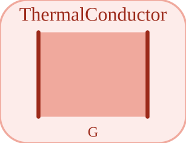

# ThermalConductor


<p align="center">

</p>
Conducteur thermique : Q\_flow = G (T\_a - T\_b).

## 📝 Syntaxe

- Type de bloc : ThermalConductor

## 📥 Argument d'entrée

- broches physiques - 2 broche(s) physique(s) non orientee(s) ; 0 entree(s) de signal.

## 📤 Argument de sortie

- ports de signal - 0 sortie(s) de signal (lectures de capteur).

## 📄 Description


Composant acausal (Thermique (acausal)). Conducteur thermique : Q\_flow = G (T\_a - T\_b). 

| Champ | Valeur |
| --- | --- |
| Module | <code>nflow_blocks</code> | 
| Bibliotheque | Thermique (acausal) | 
| Type | <code>ThermalConductor</code> | 
| Libelle | ThermalConductor | 
| Solveur | Abaisse vers <code>physicalIsland</code>. Solveur de reference <code>dae</code> (differentiel-algebrique) ; la boucle a pas fixe et les solveurs explicites natifs (<code>ode1</code>/<code>ode4</code>/<code>ode45</code>) sont egalement pris en charge (un ilot multicorps articule necessite <code>dae</code>). | 

  

<b>Sources d implementation</b> 

**Manifest:** `modules/nflow_blocks/libraries/acausal_thermal/library.json`
 

<details>
<summary>Catalog: <code>modules/nflow_blocks/functions/+NFlow/+internal/acausalCatalog.m</code></summary>

```matlab
  c{end + 1} = entry('ThermalConductor', 'Thermal', 'thermal', 'physicalIsland', ...
    'conductor', {{'a', 'a'}, {'b', 'b'}}, {{'G', 'G', 1, 'W/K'}}, '', '', ...
    'Thermal conductor: Q_flow = G (T_a - T_b).');
```

</details>


## 🔗 Voir aussi

[HeatCapacitor](../../nflow_blocks/acausal_thermal/HeatCapacitor.md), [ThermalResistor](../../nflow_blocks/acausal_thermal/ThermalResistor.md), [ConvectiveResistor](../../nflow_blocks/acausal_thermal/ConvectiveResistor.md).

## 🕔 Historique

| Version | 📄 Description     |
| ------- | --------------- |
| 1.0.0   | initial version |

<!--
## 👤 Auteur

Allan CORNET
-->
