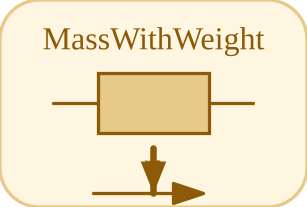

# MassWithWeight


<p align="center">

</p>
Masse coulissante sous gravite : m dv/dt = F\_net - m g (se developpe en Mass + ConstantForce).

## 📝 Syntaxe

- Type de bloc : MassWithWeight

## 📥 Argument d'entrée

- broches physiques - 1 broche(s) physique(s) non dirigee(s) ; 0 entree(s) de signal.

## 📤 Argument de sortie

- ports de signal - 0 sortie(s) de signal (lectures de capteur).

## 📄 Description


Composant acausal (Translation (acausal)). Masse coulissante sous gravite : m dv/dt = F\_net - m g (se developpe en Mass + ConstantForce). 

| Champ | Valeur |
| --- | --- |
| Module | <code>nflow_blocks</code> | 
| Bibliotheque | Translation (acausal) | 
| Type | <code>MassWithWeight</code> | 
| Libelle | MassWithWeight | 
| Solveur | Abaisse vers <code>mechanicalTranslationalIsland</code>. Solveur de reference <code>dae</code> (differentiel-algebrique) ; la boucle a pas fixe et les solveurs explicites natifs (<code>ode1</code>/<code>ode4</code>/<code>ode45</code>) sont egalement pris en charge (un ilot multicorps articule necessite <code>dae</code>). | 

  

<b>Sources d implementation</b> 

**Manifest:** `modules/nflow_blocks/libraries/acausal_translational/library.json`
 

<details>
<summary>Catalog: <code>modules/nflow_blocks/functions/+NFlow/+internal/acausalCatalog.m</code></summary>

```matlab
  c{end + 1} = entry('MassWithWeight', 'Translational', 'translational', 'mechanicalTranslationalIsland', ...
    'mass', {{'flange', 'node'}}, ...
    {{'m', 'm', 1, 'kg'}, {'g', 'g', 9.81, 'm/s2'}, {'s0', 's0', 0, 'm'}, {'v0', 'v0', 0, 'm/s'}}, '', '', ...
    'Sliding mass under gravity: m dv/dt = F_net - m g (expands to Mass + ConstantForce).');
```

</details>


## 🔗 Voir aussi

[TranslationalEMF](../../nflow_blocks/acausal_translational/TranslationalEMF.md), [Mass](../../nflow_blocks/acausal_translational/Mass.md), [SlidingMass](../../nflow_blocks/acausal_translational/SlidingMass.md).

## 🕔 Historique

| Version | 📄 Description     |
| ------- | --------------- |
| 1.0.0   | initial version |

<!--
## 👤 Auteur

Allan CORNET
-->
