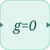

# constraint

<p align="center">

</p>
Etat algebrique (differentiel-algebrique) resolu par le solveur DAE.

## 📝 Syntaxe

- Type de bloc : constraint

## 📥 Argument d'entrée

- ports d entree - 1 port d entree : le residu de contrainte g.

## 📤 Argument de sortie

- ports de sortie - 1 port de sortie : l etat algebrique z.

## 📄 Description

Etat algebrique (differentiel-algebrique) resolu par le solveur DAE.

| Champ        | Valeur                    |
| ------------ | ------------------------- |
| Module       | <code>nflow_blocks</code> |
| Bibliotheque | Blocs continus            |
| Type         | <code>constraint</code>   |
| Etiquette    | Constraint                |

<b>Description</b>

Le bloc Constraint introduit un etat <b>algebrique</b> <b>z</b> (sa sortie). Il n a pas de derivee propre ; le solveur DAE ajuste <b>z</b> pour annuler le signal d entree <b>g</b>. Cablez le diagramme pour que l entree calcule le residu de contrainte <b>g(z, x) = 0</b> (typiquement en utilisant la sortie z du bloc), et le solveur maintient le systeme sur cette variete.

Ce bloc n a de sens que sous le solveur differentiel-algebrique : mettez le <code>solver</code> du modele a <code>dae</code>. Sous un autre solveur, ou en code C / Rust genere, il est rejete avec un message clair (pas de lowering explicite pour un systeme differentiel-algebrique).

<b>Ports</b>

<b>Entree(s)</b>

| Port   | Role                                              | Cote   | Position  |
| ------ | ------------------------------------------------- | ------ | --------- |
| Port_1 | Le residu de contrainte g, annule par le solveur. | gauche | x=0, y=40 |

<b>Sortie(s)</b>

| Port   | Role                                          | Cote   | Position   |
| ------ | --------------------------------------------- | ------ | ---------- |
| Port_1 | L etat algebrique z determine par le solveur. | droite | x=80, y=40 |

<b>Parametres</b>

| Parametre                     | Valeur par defaut |
| ----------------------------- | ----------------- |
| <code>InitialCondition</code> | 0                 |

La condition initiale n est qu une estimation de depart pour z ; le solveur la raffine vers une valeur coherente avec IDACalcIC.

<b>Caracteristiques du bloc</b>

| Champ                      | Valeur                       |
| -------------------------- | ---------------------------- |
| Type de bloc               | constraint                   |
| Famille                    | Blocs continus               |
| Taille rendue              | 80 x 80                      |
| Phases                     | INIT, OUTPUT, DERIVATIVE     |
| Etat interne ou historique | un etat algebrique (masse-0) |
| Type de donnees du signal  | valeurs numeriques double    |

<b>Equation ou regle</b>
$$0 = g(z, x),\qquad y = z$$

<b>Sources d implementation</b>

<details>
<summary>Manifest: <code>modules/nflow_blocks/libraries/continuous/library.json</code></summary>

```json
{
  "id": "builtin.continuous",
  "title": "Continuous",
  "version": "1.0.0",
  "format": "nflow-2",
  "metadata": {
    "author": "Allan CORNET",
    "created": "2026-03-21",
    "tool": "Nelson nflow"
  },
  "comment": "Blocks for continuous-time systems",
  "license": "LGPL-3.0",
  "builtin": true,
  "blocks": [
    {
      "type": "integrator",
      "label": "Integrator",
      "icon": "integrator.svg",
      "phases": ["INIT", "OUTPUT", "UPDATE"],
      "width": 80,
      "height": 80,
      "inputs": [
        {
          "x": 0,
          "y": 40,
          "side": "left"
        }
      ],
      "outputs": [
        {
          "x": 80,
          "y": 40,
          "side": "right"
        }
      ],
      "defaultParams": {
        "InitialCondition": 0,
        "ExternalReset": "none",
        "InitialConditionSource": "internal",
        "LowerSaturationLimit": "-inf",
        "UpperSaturationLimit": "inf"
      },
      "render": {
        "type": "math",
        "useRectElement": true,
        "bodyClass": "block-body integrator-body",
        "mathGroupClass": "integrator-math",
        "formula": "\\frac{1}{s}"
      }
    },
    {
      "type": "tf",
      "label": "Transfer Fn",
      "icon": "tf.svg",
      "phases": ["INIT", "OUTPUT", "ALGEBRAIC", "UPDATE"],
      "width": 85,
      "height": 80,
      "inputs": [
        {
          "x": 0,
          "y": 40,
          "side": "left"
        }
      ],
      "outputs": [
        {
          "x": 85,
          "y": 40,
          "side": "right"
        }
      ],
      "defaultParams": {
        "Numerator": [3],
        "Denominator": [1, 3]
      },
      "render": {
        "type": "math",
        "bodyClass": "block-body",
        "mathGroupClass": "tf-math",
        "formula": "\\frac{N(s)}{D(s)}"
      }
    },
    {
      "type": "delay",
      "label": "Delay",
      "icon": "delay.svg",
      "phases": ["INIT", "OUTPUT", "UPDATE"],
      "width": 80,
      "height": 80,
      "inputs": [
        {
          "x": 0,
          "y": 40,
          "side": "left"
        }
      ],
      "outputs": [
        {
          "x": 80,
          "y": 40,
          "side": "right"
        }
      ],
      "defaultParams": {
        "DelayTime": 0.1
      },
      "render": {
        "type": "math",
        "bodyClass": "block-body",
        "mathGroupClass": "delay-math",
        "formula": "e^{-sT}"
      }
    },
    {
      "type": "stateSpace",
      "label": "State-Space",
      "icon": "stateSpace.svg",
      "phases": ["INIT", "OUTPUT", "UPDATE"],
      "width": 160,
      "height": 80,
      "inputs": [
        {
          "x": 0,
          "y": 40,
          "side": "left"
        }
      ],
      "outputs": [
        {
          "x": 160,
          "y": 40,
          "side": "right"
        }
      ],
      "defaultParams": {
        "A": 1,
        "B": 1,
        "C": 1,
        "D": 0,
        "InitialCondition": 0
      },
      "render": {
        "type": "math",
        "bodyClass": "block-body",
        "mathGroupClass": "state-space-math",
        "formula": "\\dot{x}=Ax+Bu",
        "textSize": "16px"
      }
    },
    {
      "type": "lpf",
      "label": "LPF",
      "icon": "lpf.svg",
      "phases": ["INIT", "OUTPUT", "UPDATE"],
      "width": 80,
      "height": 80,
      "inputs": [
        {
          "x": 0,
          "y": 40,
          "side": "left"
        }
      ],
      "outputs": [
        {
          "x": 80,
          "y": 40,
          "side": "right"
        }
      ],
      "defaultParams": {
        "Cutoff": 1
      },
      "render": {
        "src": "lpf.svg",
        "type": "image"
      }
    },
    {
      "type": "hpf",
      "label": "HPF",
      "icon": "hpf.svg",
      "phases": ["INIT", "OUTPUT", "UPDATE"],
      "width": 80,
      "height": 80,
      "inputs": [
        {
          "x": 0,
          "y": 40,
          "side": "left"
        }
      ],
      "outputs": [
        {
          "x": 80,
          "y": 40,
          "side": "right"
        }
      ],
      "defaultParams": {
        "Cutoff": 1
      },
      "render": {
        "src": "hpf.svg",
        "type": "image"
      }
    },
    {
      "type": "derivative",
      "label": "Derivative",
      "icon": "derivative.svg",
      "phases": ["INIT", "OUTPUT", "UPDATE"],
      "width": 80,
      "height": 80,
      "inputs": [
        {
          "x": 0,
          "y": 40,
          "side": "left"
        }
      ],
      "outputs": [
        {
          "x": 80,
          "y": 40,
          "side": "right"
        }
      ],
      "defaultParams": {},
      "render": {
        "type": "math",
        "useRectElement": true,
        "bodyClass": "block-body",
        "mathGroupClass": "derivative-math",
        "formula": "\\frac{d}{dt}"
      }
    },
    {
      "type": "pid",
      "label": "PID",
      "icon": "pid.svg",
      "phases": ["INIT", "OUTPUT", "UPDATE"],
      "width": 80,
      "height": 80,
      "inputs": [
        {
          "x": 0,
          "y": 40,
          "side": "left"
        }
      ],
      "outputs": [
        {
          "x": 80,
          "y": 40,
          "side": "right"
        }
      ],
      "defaultParams": {
        "P": 1,
        "I": 0,
        "D": 0,
        "N": 0,
        "LowerSaturationLimit": "-inf",
        "UpperSaturationLimit": "inf"
      },
      "render": {
        "type": "math",
        "bodyClass": "block-body",
        "mathGroupClass": "pid-math",
        "formula": "\\mathsf{PID}"
      }
    },
    {
      "type": "constraint",
      "label": "Constraint",
      "icon": "constraint.svg",
      "phases": ["INIT", "OUTPUT", "DERIVATIVE"],
      "width": 80,
      "height": 80,
      "inputs": [
        {
          "x": 0,
          "y": 40,
          "side": "left"
        }
      ],
      "outputs": [
        {
          "x": 80,
          "y": 40,
          "side": "right"
        }
      ],
      "defaultParams": {
        "InitialCondition": 0
      },
      "render": {
        "type": "math",
        "bodyClass": "block-body",
        "mathGroupClass": "constraint-math",
        "formula": "g=0"
      }
    }
  ]
}
```

</details>


<details>
<summary>Runtime: <code>modules/nflow_blocks/src/cpp/continuous/constraint.cpp</code></summary>

```cpp
//=============================================================================
// Copyright (c) 2016-present Allan CORNET (Nelson)
//=============================================================================
// This file is part of Nelson.
//=============================================================================
// LICENCE_BLOCK_BEGIN
// SPDX-License-Identifier: LGPL-3.0-or-later
// LICENCE_BLOCK_END
//=============================================================================
// Algebraic constraint block (§5.6, Lot D3.2). Declares one ALGEBRAIC state z
// (its output); the DAE solver drives the block's input g -> 0, so z is defined
// implicitly by the equation g(z, x) = 0 the surrounding diagram builds. OUTPUT
// emits z = x[xOffset]; DERIVATIVE writes the residual g (the block input) into
// the xdot slot, which the solver-loop residual assembly reads as the algebraic
// residual because this state's id = 0 (BlockMetadata::algebraicState). There is
// no fixed-step / discrete meaning; the block only works under the `dae` solver.
//=============================================================================
#include "SimEngineTypes.hpp"
#include "BlockRegistry.hpp"
#include "FieldNames.hpp"
#include "NFlowBlockDescriptor.hpp"
#include "continuous_blocks.hpp"
//=============================================================================
namespace Nelson {
namespace NFlow {
    //=============================================================================
    bool
    handleConstraint(SimCtx& ctx, const Block& b, Phase phase)
    {
        auto& st = getState(ctx, b.nid);
        if (phase == Phase::INIT) {
            nflow::BlockDescriptor bd(b, ctx.variables);
            st.scalar = bd.paramDouble(nflow::kInitial, 0.0); // initial guess for z
            st.output = st.scalar;
            return false;
        }
        if (phase == Phase::OUTPUT) {
            const double* xs = blockX(ctx, b.nid);
            setOutput(ctx, b.nid, xs ? xs[0] : st.scalar);
            return false;
        }
        if (phase == Phase::DERIVATIVE) {
            // The algebraic residual IS the block's input g; store it in the xdot
            // slot so the DAE residual assembly picks it up (id = 0 -> r = g).
            double* xdot = blockXdot(ctx, b.nid);
            if (xdot) {
                xdot[0] = getInput(ctx, b.nid, 0, 0.0);
            }
            return false;
        }
        return false;
    }
    //=============================================================================
} // namespace NFlow
} // namespace Nelson
//=============================================================================

```

</details>

## 🔗 Voir aussi

[integrator](../../nflow_blocks/continuous/integrator.md), [stateSpace](../../nflow_blocks/continuous/stateSpace.md).

## 🕔 Historique

| Version | 📄 Description  |
| ------- | --------------- |
| 1.0.0   | initial version |

<!--
## 👤 Auteur

Allan CORNET
-->
