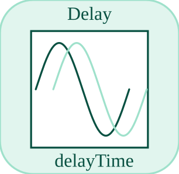

# delay

<p align="center">

</p>
Retarde un signal avec un tampon circulaire.

## 📝 Syntaxe

- Block type: delay

## 📥 Argument d'entrée

- input ports - 1 port(s) d entree declare(s).

## 📤 Argument de sortie

- output ports - 1 port(s) de sortie declare(s).

## 📄 Description

Retarde un signal avec un tampon circulaire.

| Champ        | Valeur                    |
| ------------ | ------------------------- |
| Module       | <code>nflow_blocks</code> |
| Bibliotheque | Blocs continus            |
| Type         | <code>delay</code>        |
| Libelle      | Delay                     |

<b>Description</b>

Retarde un signal avec un tampon circulaire.

<b>Ports</b>

<b>Entree(s)</b>

| Port   | Role                             | Cote | Position  |
| ------ | -------------------------------- | ---- | --------- |
| Port_1 | Signal numerique lu par le bloc. | left | x=0, y=40 |

<b>Sortie(s)</b>

| Port   | Role                                  | Cote  | Position   |
| ------ | ------------------------------------- | ----- | ---------- |
| Port_1 | Signal numerique produit par le bloc. | right | x=80, y=40 |

<b>Parametres</b>

| Parametre          | Valeur par defaut |
| ------------------ | ----------------- |
| <code>delay</code> | 0.1               |

<b>Cles de l inspecteur</b>

Ces cles serialisees sont exposees par l inspecteur du bloc.

- <code>delay</code>

<b>Caracteristiques du bloc</b>

| Champ                      | Valeur                    |
| -------------------------- | ------------------------- |
| Type de bloc               | delay                     |
| Famille                    | Blocs continus            |
| Taille graphique           | 80 x 80                   |
| Phases                     | INIT, OUTPUT, UPDATE      |
| Traversee directe          | voir Algorithmes          |
| Etat ou historique interne | oui                       |
| Type de donnees signaux    | valeurs numeriques double |

<b>Algorithmes</b>

- INIT alloue un tampon depuis delay / dt avec au moins un echantillon.
- OUTPUT emet la valeur retardee courante. UPDATE stocke l entree courante et avance l index.

<b>Equation ou regle</b>
$$y(t) \approx u(t - delay)$$

<b>Capacites et limites</b>

La page decrit le comportement runtime natif observe dans les sources C++ du module. Les phases declarees indiquent quand le moteur de simulation appelle le bloc.

Generation de code : prise en charge pour C et Rust.

<b>Sources d implementation</b>

<details>
<summary>Manifest: <code>modules/nflow_blocks/libraries/continuous/library.json</code></summary>

```json
{
  "id": "builtin.continuous",
  "title": "Continuous",
  "version": "1.0.0",
  "format": "nflow-2",
  "metadata": {
    "author": "Allan CORNET",
    "created": "2026-03-21",
    "tool": "Nelson nflow"
  },
  "comment": "Blocks for continuous-time systems",
  "license": "LGPL-3.0",
  "builtin": true,
  "blocks": [
    {
      "type": "integrator",
      "label": "Integrator",
      "icon": "integrator.svg",
      "phases": ["INIT", "OUTPUT", "UPDATE"],
      "width": 80,
      "height": 80,
      "inputs": [
        {
          "x": 0,
          "y": 40,
          "side": "left"
        }
      ],
      "outputs": [
        {
          "x": 80,
          "y": 40,
          "side": "right"
        }
      ],
      "defaultParams": {
        "InitialCondition": 0,
        "ExternalReset": "none",
        "InitialConditionSource": "internal",
        "LowerSaturationLimit": "-inf",
        "UpperSaturationLimit": "inf"
      },
      "render": {
        "type": "math",
        "useRectElement": true,
        "bodyClass": "block-body integrator-body",
        "mathGroupClass": "integrator-math",
        "formula": "\\frac{1}{s}"
      }
    },
    {
      "type": "tf",
      "label": "Transfer Fn",
      "icon": "tf.svg",
      "phases": ["INIT", "OUTPUT", "ALGEBRAIC", "UPDATE"],
      "width": 85,
      "height": 80,
      "inputs": [
        {
          "x": 0,
          "y": 40,
          "side": "left"
        }
      ],
      "outputs": [
        {
          "x": 85,
          "y": 40,
          "side": "right"
        }
      ],
      "defaultParams": {
        "Numerator": [3],
        "Denominator": [1, 3]
      },
      "render": {
        "type": "math",
        "bodyClass": "block-body",
        "mathGroupClass": "tf-math",
        "formula": "\\frac{N(s)}{D(s)}"
      }
    },
    {
      "type": "delay",
      "label": "Delay",
      "icon": "delay.svg",
      "phases": ["INIT", "OUTPUT", "UPDATE"],
      "width": 80,
      "height": 80,
      "inputs": [
        {
          "x": 0,
          "y": 40,
          "side": "left"
        }
      ],
      "outputs": [
        {
          "x": 80,
          "y": 40,
          "side": "right"
        }
      ],
      "defaultParams": {
        "DelayTime": 0.1
      },
      "render": {
        "type": "math",
        "bodyClass": "block-body",
        "mathGroupClass": "delay-math",
        "formula": "e^{-sT}"
      }
    },
    {
      "type": "stateSpace",
      "label": "State-Space",
      "icon": "stateSpace.svg",
      "phases": ["INIT", "OUTPUT", "UPDATE"],
      "width": 160,
      "height": 80,
      "inputs": [
        {
          "x": 0,
          "y": 40,
          "side": "left"
        }
      ],
      "outputs": [
        {
          "x": 160,
          "y": 40,
          "side": "right"
        }
      ],
      "defaultParams": {
        "A": 1,
        "B": 1,
        "C": 1,
        "D": 0,
        "InitialCondition": 0
      },
      "render": {
        "type": "math",
        "bodyClass": "block-body",
        "mathGroupClass": "state-space-math",
        "formula": "\\dot{x}=Ax+Bu",
        "textSize": "16px"
      }
    },
    {
      "type": "lpf",
      "label": "LPF",
      "icon": "lpf.svg",
      "phases": ["INIT", "OUTPUT", "UPDATE"],
      "width": 80,
      "height": 80,
      "inputs": [
        {
          "x": 0,
          "y": 40,
          "side": "left"
        }
      ],
      "outputs": [
        {
          "x": 80,
          "y": 40,
          "side": "right"
        }
      ],
      "defaultParams": {
        "Cutoff": 1
      },
      "render": {
        "src": "lpf.svg",
        "type": "image"
      }
    },
    {
      "type": "hpf",
      "label": "HPF",
      "icon": "hpf.svg",
      "phases": ["INIT", "OUTPUT", "UPDATE"],
      "width": 80,
      "height": 80,
      "inputs": [
        {
          "x": 0,
          "y": 40,
          "side": "left"
        }
      ],
      "outputs": [
        {
          "x": 80,
          "y": 40,
          "side": "right"
        }
      ],
      "defaultParams": {
        "Cutoff": 1
      },
      "render": {
        "src": "hpf.svg",
        "type": "image"
      }
    },
    {
      "type": "derivative",
      "label": "Derivative",
      "icon": "derivative.svg",
      "phases": ["INIT", "OUTPUT", "UPDATE"],
      "width": 80,
      "height": 80,
      "inputs": [
        {
          "x": 0,
          "y": 40,
          "side": "left"
        }
      ],
      "outputs": [
        {
          "x": 80,
          "y": 40,
          "side": "right"
        }
      ],
      "defaultParams": {},
      "render": {
        "type": "math",
        "useRectElement": true,
        "bodyClass": "block-body",
        "mathGroupClass": "derivative-math",
        "formula": "\\frac{d}{dt}"
      }
    },
    {
      "type": "pid",
      "label": "PID",
      "icon": "pid.svg",
      "phases": ["INIT", "OUTPUT", "UPDATE"],
      "width": 80,
      "height": 80,
      "inputs": [
        {
          "x": 0,
          "y": 40,
          "side": "left"
        }
      ],
      "outputs": [
        {
          "x": 80,
          "y": 40,
          "side": "right"
        }
      ],
      "defaultParams": {
        "P": 1,
        "I": 0,
        "D": 0,
        "N": 0,
        "LowerSaturationLimit": "-inf",
        "UpperSaturationLimit": "inf"
      },
      "render": {
        "type": "math",
        "bodyClass": "block-body",
        "mathGroupClass": "pid-math",
        "formula": "\\mathsf{PID}"
      }
    },
    {
      "type": "constraint",
      "label": "Constraint",
      "icon": "constraint.svg",
      "phases": ["INIT", "OUTPUT", "DERIVATIVE"],
      "width": 80,
      "height": 80,
      "inputs": [
        {
          "x": 0,
          "y": 40,
          "side": "left"
        }
      ],
      "outputs": [
        {
          "x": 80,
          "y": 40,
          "side": "right"
        }
      ],
      "defaultParams": {
        "InitialCondition": 0
      },
      "render": {
        "type": "math",
        "bodyClass": "block-body",
        "mathGroupClass": "constraint-math",
        "formula": "g=0"
      }
    }
  ]
}
```

</details>


<details>
<summary>Runtime: <code>modules/nflow_blocks/src/cpp/continuous/delay.cpp</code></summary>

```cpp
//=============================================================================
// Copyright (c) 2016-present Allan CORNET (Nelson)
//=============================================================================
// This file is part of Nelson.
//=============================================================================
// LICENCE_BLOCK_BEGIN
// SPDX-License-Identifier: LGPL-3.0-or-later
// LICENCE_BLOCK_END
//=============================================================================
#include "SimEngineTypes.hpp"
#include "BlockRegistry.hpp"
#include "FieldNames.hpp"
#include "NFlowBlockDescriptor.hpp"
#include "NFlowCodegenPolynomial.hpp"
#include "NFlowCodegenHelpers.hpp"
#include <cmath>
#include <algorithm>
#include "continuous_blocks.hpp"
//=============================================================================
bool
Nelson::NFlow::handleDelay(SimCtx& ctx, const Block& b, Phase phase)
{
    auto& st = getState(ctx, b.nid);
    const int w = outputWidth(ctx, b.nid, 0);
    // Ring buffer per element: delayBuffer is a flat [w * len] array, element e
    // occupying [e*len, e*len+len). delayIndex (0..len-1) is shared.
    if (phase == Phase::INIT) {
        nflow::BlockDescriptor bd(b, ctx.variables);
        double delayTime = bd.paramDouble(nflow::kDelay, 0.0);
        double delaySamp = delayTime / std::max(ctx.dt, 1e-12);
        int steps = std::max(1, (int)std::ceil(delaySamp) + 1);
        int len = std::max(2, steps + 1);
        st.delayBuffer.assign((size_t)len * std::max(1, w), 0.0);
        st.delayIndex = 0;
        st.delaySamples = delaySamp;
        return false;
    }
    const int total = (int)st.delayBuffer.size();
    const int len = (w > 0) ? total / std::max(1, w) : total;
    if (phase == Phase::OUTPUT) {
        if (len < 2) {
            setOutput(ctx, b.nid, 0.0);
            return false;
        }
        double ds = st.delaySamples < 0 ? 0 : st.delaySamples;
        int d0 = (int)std::floor(ds);
        double frac = ds - d0;
        if (d0 > len - 2) {
            d0 = len - 2;
            frac = 1.0;
        }
        const int base = st.delayIndex;
        // buf[base - j] holds u(k - j) for j >= 1; u(k - 0) is the input of the
        // step now running, which is not in the ring yet. A delay of less than
        // one step needs it: with DelayTime 0 the block IS a wire, and reading
        // buf[base] instead handed back a sample from a whole ring ago.
        const int i0 = ((base - d0) % len + len) % len;
        const int i1 = ((base - d0 - 1) % len + len) % len;
        SigView live = getInputSig(ctx, b.nid, 0);
        double* y = outputSlice(ctx, b.nid, 0);
        for (int e = 0; e < std::max(1, w); ++e) {
            const double* buf = st.delayBuffer.data() + (size_t)e * len;
            const double v0 = (d0 == 0) ? sigAt(live, e) : buf[i0];
            y[e] = v0 * (1.0 - frac) + buf[i1] * frac;
        }
        return false;
    }
    if (phase == Phase::UPDATE) {
        if (len < 1) {
            return false;
        }
        SigView u = getInputSig(ctx, b.nid, 0);
        for (int e = 0; e < std::max(1, w); ++e) {
            st.delayBuffer[(size_t)e * len + st.delayIndex] = sigAt(u, e);
        }
        st.delayIndex = (st.delayIndex + 1) % len;
        return false;
    }
    return false;
}
//=============================================================================
Nelson::NFlow::BlockCodegenTemplate
Nelson::NFlow::getCodeGenCDelay()
{
    BlockCodegenTemplate t;
    t.sharedPriority = 2;
    t.emitState = [](const BlockCodegenStateArgs& a) {
        nflow::BlockDescriptor bd(*a.block, *a.variables);
        double delaySamples = std::fmax(0.0, bd.paramDouble(nflow::kDelay, 0.0) / a.dt);
        int steps = std::max(1, static_cast<int>(std::ceil(delaySamples)) + 1);
        a.declState("double delay_buf_" + a.id + "[" + std::to_string(steps + 1) + "];");
        a.addState("delay_idx_" + a.id, "0", "int");
        a.addInit("  for (int i = 0; i < " + std::to_string(steps + 1) + "; i++) s->delay_buf_"
            + a.id + "[i] = 0.0;");
    };
    t.emitStep = [](const BlockCodegenArgs& a) {
        nflow::BlockDescriptor bd(*a.block, *a.variables);
        double delaySamples = std::fmax(0.0, bd.paramDouble(nflow::kDelay, 0.0) / a.dt);
        int steps = std::max(1, static_cast<int>(std::ceil(delaySamples)) + 1);
        a.line("out_" + a.id + " = delay_step(s->delay_buf_" + a.id + ", "
            + std::to_string(steps + 1) + ", &s->delay_idx_" + a.id + ", " + a.in[0] + ", "
            + a.fmt(delaySamples) + ");");
    };
    t.emitShared = [](const BlockCodegenStateArgs& a) {
        if (!a.once("delay:helper")) {
            return;
        }
        a.addHelper("static double delay_step(double* buf, int len, int* idx, double "
                    "input, double delaySamples) {");
        a.addHelper("  if (!buf || !idx || len <= 0) return 0.0;");
        a.addHelper("  if (delaySamples < 0.0) delaySamples = 0.0;");
        a.addHelper("  int d0 = (int)floor(delaySamples);");
        a.addHelper("  double frac = delaySamples - d0;");
        a.addHelper("  if (d0 > len - 2) d0 = len - 2;");
        a.addHelper("  const int base = *idx;");
        a.addHelper("  int i0 = base - d0;");
        a.addHelper("  int i1 = base - d0 - 1;");
        a.addHelper("  while (i0 < 0) i0 += len;");
        a.addHelper("  while (i1 < 0) i1 += len;");
        // buf[base] still holds the sample of a whole ring ago; the input of
        // the step now running is the d0 == 0 term.
        a.addHelper("  double s0 = (d0 == 0) ? input : buf[i0 % len];");
        a.addHelper("  double s1 = buf[i1 % len];");
        a.addHelper("  double out = s0 * (1.0 - frac) + s1 * frac;");
        a.addHelper("  buf[base] = input;");
        a.addHelper("  *idx = (base + 1) % len;");
        a.addHelper("  return out;");
        a.addHelper("}");
        a.addHelper("");
    };
    return t;
}
//=============================================================================
Nelson::NFlow::BlockCodegenTemplate
Nelson::NFlow::getCodeGenRustDelay()
{
    BlockCodegenTemplate t;
    t.sharedPriority = 2;
    t.emitState = [](const BlockCodegenStateArgs& a) {
        nflow::BlockDescriptor bd(*a.block, *a.variables);
        double ds = std::fmax(0.0, bd.paramDouble(nflow::kDelay, 0.0) / a.dt);
        // Keep the +1 INSIDE the max, exactly as the C backend and the
        // interpreter (handleDelay INIT) compute the ring length. With the
        // +1 outside, a zero delay time sized the buffer one element too
        // long, shifting its output by a whole sample versus the simulator.
        int steps = std::max(1, static_cast<int>(std::ceil(ds)) + 1);
        a.declState("    pub delay_buf_" + a.id + ": [f64; " + std::to_string(steps + 1) + "],");
        a.declState("    pub delay_idx_" + a.id + ": usize,");
        a.addInit("    s.delay_buf_" + a.id + " = [" + a.fmt(0.0) + "; " + std::to_string(steps + 1)
            + "];");
        a.addInit("    s.delay_idx_" + a.id + " = 0_usize;");
    };
    t.emitStep = [](const BlockCodegenArgs& a) {
        nflow::BlockDescriptor bd(*a.block, *a.variables);
        double ds = std::fmax(0.0, bd.paramDouble(nflow::kDelay, 0.0) / a.dt);
        a.line("out_" + a.id + " = delay_step(&mut s.delay_buf_" + a.id + ", &mut s.delay_idx_"
            + a.id + ", " + a.in[0] + ", " + a.fmt(ds) + ");");
    };
    t.emitShared = [](const BlockCodegenStateArgs& a) {
        if (!a.once("delay:helper")) {
            return;
        }
        a.addHelper("#[inline]");
        a.addHelper("fn delay_step(buf: &mut [f64], idx: &mut usize,");
        a.addHelper("              input: f64, delay_samples: f64) -> f64 {");
        a.addHelper("    let len = buf.len();");
        a.addHelper("    if len == 0 { return 0.0_f64; }");
        a.addHelper("    let ds = if delay_samples < 0.0 { 0.0_f64 } else { delay_samples };");
        a.addHelper("    let d0 = libm::floor(ds) as usize;");
        a.addHelper("    let frac = ds - d0 as f64;");
        a.addHelper("    let d0 = if d0 > len - 2 { len - 2 } else { d0 };");
        a.addHelper("    let base = *idx;");
        a.addHelper("    let i0 = (base + len - d0)     % len;");
        a.addHelper("    let i1 = (base + len - d0 + len - 1) % len;");
        a.addHelper("    let s0 = if d0 == 0 { input } else { buf[i0] };");
        a.addHelper("    let out = s0 * (1.0_f64 - frac) + buf[i1] * frac;");
        a.addHelper("    buf[base] = input;");
        a.addHelper("    *idx = (base + 1) % len;");
        a.addHelper("    out");
        a.addHelper("}");
        a.addHelper("");
    };
    return t;
}
//=============================================================================

```

</details>

## 🔗 Voir aussi

[ddelay](../../nflow_blocks/discrete/ddelay.md), [unitDelay](../../nflow_blocks/discrete/unitDelay.md), [zoh](../../nflow_blocks/discrete/zoh.md).

## 🕔 Historique

| Version | 📄 Description  |
| ------- | --------------- |
| 1.0.0   | initial version |

<!--
## 👤 Auteur

Allan CORNET
-->
