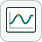

# dashboardScope

Trace les signaux lies en fonction du temps de simulation.

## 📝 Syntaxe

- Block type: dashboardScope

## 📄 Description

Trace les signaux lies en fonction du temps de simulation. 

| Champ | Valeur |
| --- | --- |
| Module | <code>nflow_blocks</code> | 
| Bibliotheque | Blocs tableau de bord | 
| Type | <code>dashboardScope</code> | 
| Libelle | Dashboard Scope | 

  

<b>Description</b> 

Le bloc Dashboard Scope affiche un ou plusieurs signaux lies sous forme de courbes sur une fenetre temporelle glissante. Il echantillonne les signaux connectes apres chaque pas de simulation et rafraichit le trace, permettant de suivre l evolution des signaux pendant l execution. 

<b>Ports</b> 

<b>Entree(s)</b> 

Ce bloc ne declare aucune entree. 

<b>Sortie(s)</b> 

Ce bloc ne declare aucune sortie. 

<b>Parametres</b> 

| Parametre | Valeur par defaut | 
| --- | --- | 
| <code>LabelPosition</code> | Hide | 
| <code>Binding</code> |  | 
| <code>ShowInitialText</code> | on | 
| <code>TimeSpan</code> | auto | 
| <code>LegendPosition</code> | Top | 
| <code>ScaleAtStop</code> | on | 
| <code>UpdateMode</code> | Wrap | 
| <code>NormalizeYAxis</code> | off | 
| <code>TicksPosition</code> | Outside | 
| <code>TickLabels</code> | All | 
| <code>Grid</code> | All | 
| <code>Border</code> | on | 
| <code>Markers</code> | off | 
| <code>FontColor</code> | [0, 0, 0] | 
| <code>YLimits</code> | [-3, 3] | 
| <code>Colors</code> | [] | 

 

<b>Cles de l inspecteur</b> 

Ces cles serialisees sont exposees par l inspecteur du bloc. 

- <code>LabelPosition</code> 
- <code>Binding</code> 
- <code>ShowInitialText</code> 
- <code>TimeSpan</code> 
- <code>LegendPosition</code> 
- <code>ScaleAtStop</code> 
- <code>UpdateMode</code> 
- <code>NormalizeYAxis</code> 
- <code>TicksPosition</code> 
- <code>TickLabels</code> 
- <code>Grid</code> 
- <code>Border</code> 
- <code>Markers</code> 
- <code>FontColor</code> 
- <code>YLimits</code> 
- <code>Colors</code> 

<b>Caracteristiques du bloc</b> 

| Champ | Valeur |
| --- | --- |
| Type de bloc | dashboardScope | 
| Famille | Blocs tableau de bord | 
| Taille graphique | 230 x 165 | 
| Phases | INIT, AFTER\_STEP | 
| Traversee directe | voir Algorithmes | 
| Etat ou historique interne | oui | 
| Type de donnees signaux | valeurs numeriques double | 

 

<b>Algorithmes</b> 

- INIT reinitialise le widget a son affichage initial. 
- AFTER\_STEP echantillonne le signal lie et rafraichit l affichage. 
- Le bloc ne fait que visualiser le signal; il ne declare aucun port de signal en entree ou sortie. 

<b>Capacites et limites</b> 

La page decrit le comportement runtime natif observe dans les sources C++ du module. Les phases declarees indiquent quand le moteur de simulation appelle le bloc. 

Generation de code : prise en charge pour C et Rust. 

<b>Sources d implementation</b> 

**Manifest:** `modules/nflow_blocks/libraries/dashboard/library.json`
 

**Runtime:** `modules/nflow_blocks/src/cpp/DashboardHandlers.cpp`

## 🔗 Voir aussi

[dashboardDisplay](../../nflow_blocks/dashboard/dashboardDisplay.md), [dashboardEdit](../../nflow_blocks/dashboard/dashboardEdit.md), [dashboardGauge](../../nflow_blocks/dashboard/dashboardGauge.md), [dashboardHalfGauge](../../nflow_blocks/dashboard/dashboardHalfGauge.md).

## 🕔 Historique

| Version | 📄 Description     |
| ------- | --------------- |
| 1.0.0   | initial version |

<!--
## 👤 Auteur

Allan CORNET
-->
