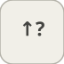

# detectIncrease


<p align="center">

</p>
Sort 1 quand l entree augmente strictement par rapport au pas precedent.

## 📝 Syntaxe

- Type de bloc : detectIncrease

## 📥 Argument d'entrée

- ports d entree - 1 port(s) d entree declare(s).

## 📤 Argument de sortie

- ports de sortie - 1 port(s) de sortie declare(s).

## 📄 Description


Sort 1 quand l entree augmente strictement par rapport au pas precedent. 

| Champ | Valeur |
| --- | --- |
| Module | <code>nflow_blocks</code> | 
| Bibliotheque | Discret | 
| Type | <code>detectIncrease</code> | 
| Libelle | Detect Increase | 

  

<b>Description</b> 

Sort 1 a tout pas ou l'entree est strictement superieure a sa valeur au pas precedent, sinon 0. <code>InitialCondition</code> initialise la valeur avant le premier pas. Avec etat ; element par element. 

<b>Ports</b> 

<b>Entree(s)</b> 

| Port | Role | Cote | Position | 
| --- | --- | --- | --- | 
| Port\_1 | Signal numerique lu par le bloc. | gauche | x=0, y=40 | 

 

<b>Sortie(s)</b> 

| Port | Role | Cote | Position | 
| --- | --- | --- | --- | 
| Port\_1 | Signal numerique produit par le bloc. | droite | x=80, y=40 | 

 

<b>Parametres</b> 

| Parametre | Valeur par defaut | 
| --- | --- | 
| <code>InitialCondition</code> | 0 | 

 

<b>Caracteristiques du bloc</b> 

| Champ | Valeur |
| --- | --- |
| Type de bloc | detectIncrease | 
| Famille | Discret | 
| Taille rendue | 80 x 80 | 
| Phases | INIT, OUTPUT, UPDATE | 
| Etat interne ou historique | oui | 
| Type de donnees du signal | valeurs numeriques double | 

 

<b>Algorithmes</b> 

- OUTPUT : out = (u > prev) ? 1 : 0. UPDATE : prev = u. 

<b>Equation ou regle</b> 
$$y_k = [\,u_k > u_{k-1}\,]$$
 

<b>Capacites etendues</b> 

<b>Sources d implementation</b> 

Generation de code : prise en charge pour C et Rust. 

**Manifest:** `modules/nflow_blocks/libraries/discrete/library.json`
 

**Runtime:** `modules/nflow_blocks/src/cpp/discrete/detectIncrease.cpp`


## 💡 Exemple

Une rampe montante donne 1 a chaque pas apres le premier.

```matlab
d.blocks={ struct('id','r','type','ramp','inputs',0,'outputs',1,'params',struct('slope',1)), struct('id','di','type','detectIncrease','inputs',1,'outputs',1,'params',struct('InitialCondition',0)), struct('id','w','type','toWorkspace','inputs',1,'outputs',0,'params',struct('VariableName','y','SaveFormat','Array')) };
d.connections={ struct('from','r','to','di','fromIndex',0,'toIndex',0), struct('from','di','to','w','fromIndex',0,'toIndex',0) };
d.sampleTime=0.1; d.duration=1.0; d.solver='discrete'; d.variables=struct();
r=jsondecode(__nflow_simulate__(jsonencode(d)));
```


## 🔗 Voir aussi

[detectDecrease](../../nflow_blocks/discrete/detectDecrease.md), [detectChange](../../nflow_blocks/discrete/detectChange.md).

## 🕔 Historique

| Version | 📄 Description     |
| ------- | --------------- |
| 1.0.0   | initial version |

<!--
## 👤 Auteur

Allan CORNET
-->
