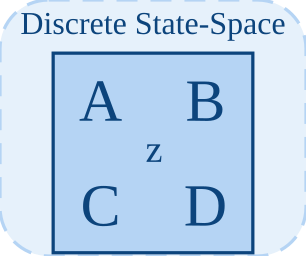

# dstateSpace

<p align="center">

</p>
Implemente un modele d etat discret scalaire.

## 📝 Syntaxe

- Block type: dstateSpace

## 📥 Argument d'entrée

- input ports - 1 port(s) d entree declare(s).

## 📤 Argument de sortie

- output ports - 1 port(s) de sortie declare(s).

## 📄 Description

Implemente un modele d etat discret scalaire.

| Champ        | Valeur                    |
| ------------ | ------------------------- |
| Module       | <code>nflow_blocks</code> |
| Bibliotheque | Blocs discrets            |
| Type         | <code>dstateSpace</code>  |
| Libelle      | Discrete State-Space      |

<b>Description</b>

Implemente un modele d etat discret scalaire.

<b>Ports</b>

<b>Entree(s)</b>

| Port   | Role                             | Cote | Position  |
| ------ | -------------------------------- | ---- | --------- |
| Port_1 | Signal numerique lu par le bloc. | left | x=0, y=40 |

<b>Sortie(s)</b>

| Port   | Role                                  | Cote  | Position   |
| ------ | ------------------------------------- | ----- | ---------- |
| Port_1 | Signal numerique produit par le bloc. | right | x=80, y=40 |

<b>Parametres</b>

| Parametre       | Valeur par defaut |
| --------------- | ----------------- |
| <code>A</code>  | 1                 |
| <code>B</code>  | 1                 |
| <code>C</code>  | 1                 |
| <code>D</code>  | 0                 |
| <code>ts</code> | 0.1               |

<b>Cles de l inspecteur</b>

Ces cles serialisees sont exposees par l inspecteur du bloc.

- <code>A</code>
- <code>B</code>
- <code>C</code>
- <code>D</code>
- <code>ts</code>

<b>Caracteristiques du bloc</b>

| Champ                      | Valeur                    |
| -------------------------- | ------------------------- |
| Type de bloc               | dstateSpace               |
| Famille                    | Blocs discrets            |
| Taille graphique           | 80 x 80                   |
| Phases                     | INIT, OUTPUT, UPDATE      |
| Traversee directe          | voir Algorithmes          |
| Etat ou historique interne | oui                       |
| Type de donnees signaux    | valeurs numeriques double |

<b>Algorithmes</b>

- INIT remet a zero l etat, la sortie, le prochain instant et ts.
- OUTPUT emet la sortie memorisee. UPDATE s execute aux instants d echantillonnage.
- A la mise a jour, y = C\*x + D\*u et x_next = A\*x + B\*u; ts vaut au moins 0.001.

<b>Equation ou regle</b>
$$y_k = Cx_k + Du_k,\quad x_{k+1} = Ax_k + Bu_k$$

<b>Capacites et limites</b>

La page decrit le comportement runtime natif observe dans les sources C++ du module. Les phases declarees indiquent quand le moteur de simulation appelle le bloc.

Generation de code : prise en charge pour C et Rust.

<b>Sources d implementation</b>

<details>
<summary>Manifest: <code>modules/nflow_blocks/libraries/discrete/library.json</code></summary>

```json
{
  "id": "builtin.discrete",
  "title": "Discrete",
  "version": "1.0.0",
  "format": "nflow-2",
  "metadata": {
    "author": "Allan CORNET",
    "created": "2026-03-21",
    "tool": "Nelson nflow"
  },
  "comment": "Blocks for discrete-time systems",
  "license": "LGPL-3.0",
  "builtin": true,
  "blocks": [
    {
      "type": "zoh",
      "label": "ZOH",
      "icon": "zoh.svg",
      "phases": ["INIT", "OUTPUT", "UPDATE"],
      "width": 80,
      "height": 80,
      "inputs": [
        {
          "x": 0,
          "y": 40,
          "side": "left"
        }
      ],
      "outputs": [
        {
          "x": 80,
          "y": 40,
          "side": "right"
        }
      ],
      "defaultParams": {
        "SampleTime": 0.1
      },
      "render": {
        "type": "image",
        "src": "zoh.svg"
      }
    },
    {
      "type": "foh",
      "label": "FOH",
      "icon": "foh.svg",
      "phases": ["INIT", "OUTPUT", "UPDATE"],
      "width": 80,
      "height": 80,
      "inputs": [
        {
          "x": 0,
          "y": 40,
          "side": "left"
        }
      ],
      "outputs": [
        {
          "x": 80,
          "y": 40,
          "side": "right"
        }
      ],
      "defaultParams": {
        "SampleTime": 0.1
      },
      "render": {
        "type": "image",
        "src": "foh.svg"
      }
    },
    {
      "type": "dtf",
      "icon": "dtf.svg",
      "label": "Discrete TF",
      "phases": ["INIT", "OUTPUT", "UPDATE"],
      "width": 80,
      "height": 80,
      "inputs": [
        {
          "x": 0,
          "y": 40,
          "side": "left"
        }
      ],
      "outputs": [
        {
          "x": 80,
          "y": 40,
          "side": "right"
        }
      ],
      "defaultParams": {
        "Numerator": [1],
        "Denominator": [1, -0.5],
        "SampleTime": 0.1
      },
      "render": {
        "type": "image",
        "src": "dtf.svg"
      }
    },
    {
      "type": "ddelay",
      "icon": "ddelay.svg",
      "label": "Discrete Delay",
      "phases": ["INIT", "OUTPUT", "UPDATE"],
      "width": 80,
      "height": 80,
      "inputs": [
        {
          "x": 0,
          "y": 40,
          "side": "left"
        }
      ],
      "outputs": [
        {
          "x": 80,
          "y": 40,
          "side": "right"
        }
      ],
      "defaultParams": {
        "DelayLength": 1,
        "SampleTime": 0.1
      },
      "render": {
        "type": "image",
        "src": "ddelay.svg"
      }
    },
    {
      "type": "dstateSpace",
      "icon": "dstateSpace.svg",
      "label": "Discrete State-Space",
      "phases": ["INIT", "OUTPUT", "UPDATE"],
      "width": 80,
      "height": 80,
      "inputs": [
        {
          "x": 0,
          "y": 40,
          "side": "left"
        }
      ],
      "outputs": [
        {
          "x": 80,
          "y": 40,
          "side": "right"
        }
      ],
      "defaultParams": {
        "A": 1,
        "B": 1,
        "C": 1,
        "D": 0,
        "SampleTime": 0.1
      },
      "render": {
        "type": "image",
        "src": "dstateSpace.svg"
      }
    },
    {
      "type": "unitDelay",
      "label": "Unit Delay",
      "icon": "unitDelay.svg",
      "phases": ["INIT", "OUTPUT", "UPDATE"],
      "width": 80,
      "height": 80,
      "inputs": [
        {
          "x": 0,
          "y": 40,
          "side": "left"
        }
      ],
      "outputs": [
        {
          "x": 80,
          "y": 40,
          "side": "right"
        }
      ],
      "defaultParams": {
        "InitialCondition": 0
      },
      "render": {
        "type": "image",
        "src": "exports/unitDelay.svg",
        "svgMode": "element",
        "preserveAspectRatio": "none",
        "x": 0,
        "y": 0,
        "width": 80,
        "height": 80
      }
    },
    {
      "type": "rateTransition",
      "label": "Rate Transition",
      "icon": "rateTransition.svg",
      "phases": ["INIT", "OUTPUT", "UPDATE"],
      "width": 80,
      "height": 80,
      "inputs": [
        {
          "x": 0,
          "y": 40,
          "side": "left"
        }
      ],
      "outputs": [
        {
          "x": 80,
          "y": 40,
          "side": "right"
        }
      ],
      "defaultParams": {
        "OutPortSampleTime": -1,
        "InitialCondition": 0
      },
      "render": {
        "type": "image",
        "src": "exports/rateTransition.svg",
        "svgMode": "element",
        "preserveAspectRatio": "none",
        "x": 0,
        "y": 0,
        "width": 80,
        "height": 80
      }
    },
    {
      "type": "difference",
      "label": "Difference",
      "icon": "difference.svg",
      "phases": ["INIT", "OUTPUT", "UPDATE"],
      "width": 80,
      "height": 80,
      "inputs": [
        {
          "x": 0,
          "y": 40,
          "side": "left"
        }
      ],
      "outputs": [
        {
          "x": 80,
          "y": 40,
          "side": "right"
        }
      ],
      "defaultParams": {
        "ICPrevInput": 0
      },
      "render": {
        "type": "image",
        "src": "exports/difference.svg",
        "svgMode": "element",
        "preserveAspectRatio": "none",
        "x": 0,
        "y": 0,
        "width": 80,
        "height": 80
      }
    },
    {
      "type": "detectChange",
      "label": "Detect Change",
      "icon": "detectChange.svg",
      "phases": ["INIT", "OUTPUT", "UPDATE"],
      "width": 80,
      "height": 80,
      "inputs": [
        {
          "x": 0,
          "y": 40,
          "side": "left"
        }
      ],
      "outputs": [
        {
          "x": 80,
          "y": 40,
          "side": "right"
        }
      ],
      "defaultParams": {
        "InitialCondition": 0
      },
      "render": {
        "type": "image",
        "src": "exports/detectChange.svg",
        "svgMode": "element",
        "preserveAspectRatio": "none",
        "x": 0,
        "y": 0,
        "width": 80,
        "height": 80
      }
    },
    {
      "type": "detectIncrease",
      "label": "Detect Increase",
      "icon": "detectIncrease.svg",
      "phases": ["INIT", "OUTPUT", "UPDATE"],
      "width": 80,
      "height": 80,
      "inputs": [
        {
          "x": 0,
          "y": 40,
          "side": "left"
        }
      ],
      "outputs": [
        {
          "x": 80,
          "y": 40,
          "side": "right"
        }
      ],
      "defaultParams": {
        "InitialCondition": 0
      },
      "render": {
        "type": "image",
        "src": "exports/detectIncrease.svg",
        "svgMode": "element",
        "preserveAspectRatio": "none",
        "x": 0,
        "y": 0,
        "width": 80,
        "height": 80
      }
    },
    {
      "type": "detectDecrease",
      "label": "Detect Decrease",
      "icon": "detectDecrease.svg",
      "phases": ["INIT", "OUTPUT", "UPDATE"],
      "width": 80,
      "height": 80,
      "inputs": [
        {
          "x": 0,
          "y": 40,
          "side": "left"
        }
      ],
      "outputs": [
        {
          "x": 80,
          "y": 40,
          "side": "right"
        }
      ],
      "defaultParams": {
        "InitialCondition": 0
      },
      "render": {
        "type": "image",
        "src": "exports/detectDecrease.svg",
        "svgMode": "element",
        "preserveAspectRatio": "none",
        "x": 0,
        "y": 0,
        "width": 80,
        "height": 80
      }
    },
    {
      "type": "risingEdge",
      "label": "Rising Edge",
      "icon": "risingEdge.svg",
      "phases": ["INIT", "OUTPUT", "UPDATE"],
      "width": 80,
      "height": 80,
      "inputs": [
        {
          "x": 0,
          "y": 40,
          "side": "left"
        }
      ],
      "outputs": [
        {
          "x": 80,
          "y": 40,
          "side": "right"
        }
      ],
      "defaultParams": {
        "InitialCondition": 0
      }
    },
    {
      "type": "fallingEdge",
      "label": "Falling Edge",
      "icon": "fallingEdge.svg",
      "phases": ["INIT", "OUTPUT", "UPDATE"],
      "width": 80,
      "height": 80,
      "inputs": [
        {
          "x": 0,
          "y": 40,
          "side": "left"
        }
      ],
      "outputs": [
        {
          "x": 80,
          "y": 40,
          "side": "right"
        }
      ],
      "defaultParams": {
        "InitialCondition": 0
      }
    }
  ]
}
```

</details>


<details>
<summary>Runtime: <code>modules/nflow_blocks/src/cpp/discrete/dstateSpace.cpp</code></summary>

```cpp
//=============================================================================
// Copyright (c) 2016-present Allan CORNET (Nelson)
//=============================================================================
// This file is part of Nelson.
//=============================================================================
// LICENCE_BLOCK_BEGIN
// SPDX-License-Identifier: LGPL-3.0-or-later
// LICENCE_BLOCK_END
//=============================================================================
#include "SimEngineTypes.hpp"
#include "BlockRegistry.hpp"
#include "FieldNames.hpp"
#include "NFlowBlockDescriptor.hpp"
#include "StateSpaceMatrices.hpp"
#include <cmath>
#include <algorithm>
#include "discrete_blocks.hpp"
//=============================================================================
// MIMO form: x(k+1) = A x(k) + B u(k), y(k) = C x(k) + D u(k). The state lives
// in st.vec (nx entries) and the emitted output in st.outLatch (ny), advanced on
// the block's own sample hits like every other discrete block here.
static bool
dstateSpaceMimo(
    Nelson::NFlow::SimCtx& ctx, const Nelson::NFlow::Block& b, Nelson::NFlow::Phase phase)
{
    using namespace Nelson::NFlow;
    auto& st = getState(ctx, b.nid);
    const int nu = (numInputs(ctx, b.nid) > 0) ? std::max(1, b.inWidth(0)) : 1;
    const SsMatrices m = ssBuild(b, ctx.variables, nu);
    if (phase == Phase::INIT) {
        nflow::BlockDescriptor bd(b, ctx.variables);
        st.dTs = std::max(0.001, bd.paramDouble(nflow::kTs, 0.1));
        st.dNextTime = 0.0;
        st.vec = ssInitialStateOf(bd, m.nx);
        st.outLatch.assign((size_t)m.ny, 0.0);
        st.output = 0.0;
        return false;
    }
    if ((int)st.vec.size() != m.nx) {
        st.vec.assign((size_t)m.nx, 0.0);
    }
    if ((int)st.outLatch.size() != m.ny) {
        st.outLatch.assign((size_t)m.ny, 0.0);
    }
    if (phase == Phase::ALGEBRAIC) {
        // y(k) = C x(k) + D u(k): the state as it stands and the input of THIS
        // step, like the scalar form.
        SigView u = getInputSig(ctx, b.nid, 0);
        double* y = outputSlice(ctx, b.nid, 0);
        const int wy = std::min(m.ny, std::max(1, outputWidth(ctx, b.nid, 0)));
        std::vector<double> tmp((size_t)m.ny, 0.0);
        ssEmit(m, st.vec.data(), u, tmp.data());
        for (int i = 0; i < wy; ++i) {
            y[i] = tmp[(size_t)i];
        }
        return false;
    }
    if (phase == Phase::UPDATE) {
        if (ctx.t + 1e-9 >= st.dNextTime) {
            SigView u = getInputSig(ctx, b.nid, 0);
            ssEmit(m, st.vec.data(), u, st.outLatch.data());
            std::vector<double> next((size_t)m.nx, 0.0);
            ssAdvance(m, st.vec.data(), u, next.data());
            st.vec = next;
            st.dNextTime = ctx.t + st.dTs;
            st.output = st.outLatch.empty() ? 0.0 : st.outLatch[0];
        }
        return false;
    }
    return false;
}
//=============================================================================
bool
Nelson::NFlow::handleDstateSpace(SimCtx& ctx, const Block& b, Phase phase)
{
    auto& st = getState(ctx, b.nid);
    // Two forms share this block. Scalar A/B/C/D is the historical one: each is
    // a single number applied INDEPENDENTLY per signal element, so a width-3
    // input carries three unrelated first-order states. A matrix anywhere makes
    // it a MIMO state space - A is nx x nx, B nx x nu, C ny x nx, D ny x nu -
    // read exactly as the continuous stateSpace reads it. A matrix used to be
    // refused outright, so a discrete MIMO plant had to be written as a
    // continuous one.
    if (!ssIsScalarForm(b, ctx.variables)) {
        return dstateSpaceMimo(ctx, b, phase);
    }
    // Element-wise (scalar A/B/C/D applied independently per element): st.vec
    // is the per-element state, st.outLatch the per-element output.
    const int w = std::max(1, outputWidth(ctx, b.nid, 0));
    if (phase == Phase::INIT) {
        st.scalar = 0.0;
        nflow::BlockDescriptor bd(b, ctx.variables);
        st.dTs = std::max(0.001, bd.paramDouble(nflow::kTs, 0.1));
        st.dNextTime = 0.0;
        st.dLastOut = 0.0;
        st.output = 0.0;
        st.vec.assign(w, 0.0);
        st.outLatch.assign(w, 0.0);
        return false;
    }
    if (phase == Phase::ALGEBRAIC) {
        // y(k) = C x(k) + D u(k): the state as it stands, and the input of THIS
        // step. It used to emit C x(k+1) + D u(k-1) - the state already advanced
        // and the whole thing a step late - so a block with a non-zero D
        // answered a step after its input moved.
        nflow::BlockDescriptor bd(b, ctx.variables);
        const double C_ = bd.paramDouble(nflow::kC, 0.0);
        const double D_ = bd.paramDouble(nflow::kD, 0.0);
        SigView u = getInputSig(ctx, b.nid, 0);
        return emitElementwise(ctx, b.nid, [&](int e) {
            const double x = (e < (int)st.vec.size()) ? st.vec[e] : 0.0;
            return C_ * x + D_ * sigAt(u, e);
        });
    }
    if (phase == Phase::UPDATE) {
        nflow::BlockDescriptor bd(b, ctx.variables);
        double A_ = bd.paramDouble(nflow::kA, 0.0);
        double B_ = bd.paramDouble(nflow::kB, 0.0);
        double C_ = bd.paramDouble(nflow::kC, 0.0);
        double D_ = bd.paramDouble(nflow::kD, 0.0);
        double ts_v = std::max(0.001, bd.paramDouble(nflow::kTs, st.dTs));
        st.dTs = ts_v;
        if (ctx.t + 1e-9 >= st.dNextTime) {
            if ((int)st.vec.size() != w) {
                st.vec.assign(w, 0.0);
            }
            if ((int)st.outLatch.size() != w) {
                st.outLatch.assign(w, 0.0);
            }
            SigView u = getInputSig(ctx, b.nid, 0);
            for (int e = 0; e < w; ++e) {
                // Emit first (ALGEBRAIC read x(k)), advance after: x(k+1) = A x(k) + B u(k).
                st.outLatch[e] = C_ * st.vec[e] + D_ * sigAt(u, e);
                st.vec[e] = A_ * st.vec[e] + B_ * sigAt(u, e);
            }
            st.dNextTime = ctx.t + ts_v;
            st.output = st.outLatch.empty() ? 0.0 : st.outLatch[0];
        }
        return false;
    }
    return false;
}
//=============================================================================
Nelson::NFlow::BlockCodegenTemplate
Nelson::NFlow::getCodeGenCDstateSpace()
{
    BlockCodegenTemplate t;
    t.emitState = [](const BlockCodegenStateArgs& a) {
        a.addState("dss_x_" + a.id, "", "");
        a.addState("dss_next_" + a.id, "", "");
        a.addState("dss_last_" + a.id, "", "");
    };
    // No emitOutput: y(k) = C x(k) + D u(k) reads the CURRENT input, so it is
    // formed from the state as it stands and the state advances afterwards.
    t.emitStep = [](const BlockCodegenArgs& a) {
        nflow::BlockDescriptor bd(*a.block, *a.variables);
        double A = bd.paramDouble(nflow::kA, 0.0);
        double B = bd.paramDouble(nflow::kB, 0.0);
        double C = bd.paramDouble(nflow::kC, 0.0);
        double D = bd.paramDouble(nflow::kD, 0.0);
        double ts = std::fmax(0.001, bd.paramDouble(nflow::kTs, 0.0));
        if (ts == 0) {
            ts = a.dt;
        }
        a.line("if (t + 1e-6 >= s->dss_next_" + a.id + ") {");
        a.line("  s->dss_last_" + a.id + " = " + a.fmt(C) + " * s->dss_x_" + a.id + " + " + a.fmt(D)
            + " * " + a.in[0] + ";");
        a.line("  s->dss_x_" + a.id + " = " + a.fmt(A) + " * s->dss_x_" + a.id + " + " + a.fmt(B)
            + " * " + a.in[0] + ";");
        a.line("  s->dss_next_" + a.id + " = t + " + a.fmt(ts) + ";");
        a.line("}");
        a.line("out_" + a.id + " = s->dss_last_" + a.id + ";");
    };
    return t;
}
//=============================================================================
Nelson::NFlow::BlockCodegenTemplate
Nelson::NFlow::getCodeGenRustDstateSpace()
{
    BlockCodegenTemplate t;
    t.emitState = [](const BlockCodegenStateArgs& a) {
        a.addState("dss_x_" + a.id, "", "");
        a.addState("dss_next_" + a.id, "", "");
        a.addState("dss_last_" + a.id, "", "");
    };
    // Same ordering as the C template: emit from x(k), then advance.
    t.emitStep = [](const BlockCodegenArgs& a) {
        nflow::BlockDescriptor bd(*a.block, *a.variables);
        double A = bd.paramDouble(nflow::kA, 0.0);
        double B = bd.paramDouble(nflow::kB, 0.0);
        double C = bd.paramDouble(nflow::kC, 0.0);
        double D = bd.paramDouble(nflow::kD, 0.0);
        double ts = std::fmax(0.001, bd.paramDouble(nflow::kTs, 0.0));
        if (ts == 0) {
            ts = a.dt;
        }
        a.line("if t + 1e-6 >= s.dss_next_" + a.id + " {");
        a.line("    s.dss_last_" + a.id + " = " + a.fmt(C) + " * s.dss_x_" + a.id + " + " + a.fmt(D)
            + " * " + a.in[0] + ";");
        a.line("    s.dss_x_" + a.id + " = " + a.fmt(A) + " * s.dss_x_" + a.id + " + " + a.fmt(B)
            + " * " + a.in[0] + ";");
        a.line("    s.dss_next_" + a.id + " = t + " + a.fmt(ts) + ";");
        a.line("}");
        a.line("out_" + a.id + " = s.dss_last_" + a.id + ";");
    };
    return t;
}
//=============================================================================

```

</details>

## 🔗 Voir aussi

[dtf](../../nflow_blocks/discrete/dtf.md), [stateSpace](../../nflow_blocks/continuous/stateSpace.md), [unitDelay](../../nflow_blocks/discrete/unitDelay.md).

## 🕔 Historique

| Version | 📄 Description  |
| ------- | --------------- |
| 1.0.0   | initial version |

<!--
## 👤 Auteur

Allan CORNET
-->
