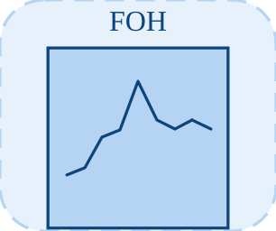

# foh

<p align="center">

</p>
Maintien d ordre un pour valeurs d entree echantillonnees.

## 📝 Syntaxe

- Block type: foh

## 📥 Argument d'entrée

- input ports - 1 port(s) d entree declare(s).

## 📤 Argument de sortie

- output ports - 1 port(s) de sortie declare(s).

## 📄 Description

Maintien d ordre un pour valeurs d entree echantillonnees.

| Champ        | Valeur                    |
| ------------ | ------------------------- |
| Module       | <code>nflow_blocks</code> |
| Bibliotheque | Blocs discrets            |
| Type         | <code>foh</code>          |
| Libelle      | FOH                       |

<b>Description</b>

Maintien d ordre un pour valeurs d entree echantillonnees.

<b>Ports</b>

<b>Entree(s)</b>

| Port   | Role                             | Cote | Position  |
| ------ | -------------------------------- | ---- | --------- |
| Port_1 | Signal numerique lu par le bloc. | left | x=0, y=40 |

<b>Sortie(s)</b>

| Port   | Role                                  | Cote  | Position   |
| ------ | ------------------------------------- | ----- | ---------- |
| Port_1 | Signal numerique produit par le bloc. | right | x=80, y=40 |

<b>Parametres</b>

| Parametre       | Valeur par defaut |
| --------------- | ----------------- |
| <code>ts</code> | 0.1               |

<b>Cles de l inspecteur</b>

Ces cles serialisees sont exposees par l inspecteur du bloc.

- <code>ts</code>

<b>Caracteristiques du bloc</b>

| Champ                      | Valeur                    |
| -------------------------- | ------------------------- |
| Type de bloc               | foh                       |
| Famille                    | Blocs discrets            |
| Taille graphique           | 80 x 80                   |
| Phases                     | INIT, OUTPUT, UPDATE      |
| Traversee directe          | voir Algorithmes          |
| Etat ou historique interne | oui                       |
| Type de donnees signaux    | valeurs numeriques double |

<b>Algorithmes</b>

- INIT efface les echantillons precedent/courant et planifie l echantillonnage.
- OUTPUT emet la sortie maintenue interpolee. UPDATE echantillonne l entree a ts.
- ts est contraint a au moins 0.001.

<b>Equation ou regle</b>

linear interpolation between sampled values

<b>Capacites et limites</b>

La page decrit le comportement runtime natif observe dans les sources C++ du module. Les phases declarees indiquent quand le moteur de simulation appelle le bloc.

Generation de code : prise en charge pour C et Rust.

<b>Sources d implementation</b>

<details>
<summary>Manifest: <code>modules/nflow_blocks/libraries/discrete/library.json</code></summary>

```json
{
  "id": "builtin.discrete",
  "title": "Discrete",
  "version": "1.0.0",
  "format": "nflow-2",
  "metadata": {
    "author": "Allan CORNET",
    "created": "2026-03-21",
    "tool": "Nelson nflow"
  },
  "comment": "Blocks for discrete-time systems",
  "license": "LGPL-3.0",
  "builtin": true,
  "blocks": [
    {
      "type": "zoh",
      "label": "ZOH",
      "icon": "zoh.svg",
      "phases": ["INIT", "OUTPUT", "UPDATE"],
      "width": 80,
      "height": 80,
      "inputs": [
        {
          "x": 0,
          "y": 40,
          "side": "left"
        }
      ],
      "outputs": [
        {
          "x": 80,
          "y": 40,
          "side": "right"
        }
      ],
      "defaultParams": {
        "SampleTime": 0.1
      },
      "render": {
        "type": "image",
        "src": "zoh.svg"
      }
    },
    {
      "type": "foh",
      "label": "FOH",
      "icon": "foh.svg",
      "phases": ["INIT", "OUTPUT", "UPDATE"],
      "width": 80,
      "height": 80,
      "inputs": [
        {
          "x": 0,
          "y": 40,
          "side": "left"
        }
      ],
      "outputs": [
        {
          "x": 80,
          "y": 40,
          "side": "right"
        }
      ],
      "defaultParams": {
        "SampleTime": 0.1
      },
      "render": {
        "type": "image",
        "src": "foh.svg"
      }
    },
    {
      "type": "dtf",
      "icon": "dtf.svg",
      "label": "Discrete TF",
      "phases": ["INIT", "OUTPUT", "UPDATE"],
      "width": 80,
      "height": 80,
      "inputs": [
        {
          "x": 0,
          "y": 40,
          "side": "left"
        }
      ],
      "outputs": [
        {
          "x": 80,
          "y": 40,
          "side": "right"
        }
      ],
      "defaultParams": {
        "Numerator": [1],
        "Denominator": [1, -0.5],
        "SampleTime": 0.1
      },
      "render": {
        "type": "image",
        "src": "dtf.svg"
      }
    },
    {
      "type": "ddelay",
      "icon": "ddelay.svg",
      "label": "Discrete Delay",
      "phases": ["INIT", "OUTPUT", "UPDATE"],
      "width": 80,
      "height": 80,
      "inputs": [
        {
          "x": 0,
          "y": 40,
          "side": "left"
        }
      ],
      "outputs": [
        {
          "x": 80,
          "y": 40,
          "side": "right"
        }
      ],
      "defaultParams": {
        "DelayLength": 1,
        "SampleTime": 0.1
      },
      "render": {
        "type": "image",
        "src": "ddelay.svg"
      }
    },
    {
      "type": "dstateSpace",
      "icon": "dstateSpace.svg",
      "label": "Discrete State-Space",
      "phases": ["INIT", "OUTPUT", "UPDATE"],
      "width": 80,
      "height": 80,
      "inputs": [
        {
          "x": 0,
          "y": 40,
          "side": "left"
        }
      ],
      "outputs": [
        {
          "x": 80,
          "y": 40,
          "side": "right"
        }
      ],
      "defaultParams": {
        "A": 1,
        "B": 1,
        "C": 1,
        "D": 0,
        "SampleTime": 0.1
      },
      "render": {
        "type": "image",
        "src": "dstateSpace.svg"
      }
    },
    {
      "type": "unitDelay",
      "label": "Unit Delay",
      "icon": "unitDelay.svg",
      "phases": ["INIT", "OUTPUT", "UPDATE"],
      "width": 80,
      "height": 80,
      "inputs": [
        {
          "x": 0,
          "y": 40,
          "side": "left"
        }
      ],
      "outputs": [
        {
          "x": 80,
          "y": 40,
          "side": "right"
        }
      ],
      "defaultParams": {
        "InitialCondition": 0
      },
      "render": {
        "type": "image",
        "src": "exports/unitDelay.svg",
        "svgMode": "element",
        "preserveAspectRatio": "none",
        "x": 0,
        "y": 0,
        "width": 80,
        "height": 80
      }
    },
    {
      "type": "rateTransition",
      "label": "Rate Transition",
      "icon": "rateTransition.svg",
      "phases": ["INIT", "OUTPUT", "UPDATE"],
      "width": 80,
      "height": 80,
      "inputs": [
        {
          "x": 0,
          "y": 40,
          "side": "left"
        }
      ],
      "outputs": [
        {
          "x": 80,
          "y": 40,
          "side": "right"
        }
      ],
      "defaultParams": {
        "OutPortSampleTime": -1,
        "InitialCondition": 0
      },
      "render": {
        "type": "image",
        "src": "exports/rateTransition.svg",
        "svgMode": "element",
        "preserveAspectRatio": "none",
        "x": 0,
        "y": 0,
        "width": 80,
        "height": 80
      }
    },
    {
      "type": "difference",
      "label": "Difference",
      "icon": "difference.svg",
      "phases": ["INIT", "OUTPUT", "UPDATE"],
      "width": 80,
      "height": 80,
      "inputs": [
        {
          "x": 0,
          "y": 40,
          "side": "left"
        }
      ],
      "outputs": [
        {
          "x": 80,
          "y": 40,
          "side": "right"
        }
      ],
      "defaultParams": {
        "ICPrevInput": 0
      },
      "render": {
        "type": "image",
        "src": "exports/difference.svg",
        "svgMode": "element",
        "preserveAspectRatio": "none",
        "x": 0,
        "y": 0,
        "width": 80,
        "height": 80
      }
    },
    {
      "type": "detectChange",
      "label": "Detect Change",
      "icon": "detectChange.svg",
      "phases": ["INIT", "OUTPUT", "UPDATE"],
      "width": 80,
      "height": 80,
      "inputs": [
        {
          "x": 0,
          "y": 40,
          "side": "left"
        }
      ],
      "outputs": [
        {
          "x": 80,
          "y": 40,
          "side": "right"
        }
      ],
      "defaultParams": {
        "InitialCondition": 0
      },
      "render": {
        "type": "image",
        "src": "exports/detectChange.svg",
        "svgMode": "element",
        "preserveAspectRatio": "none",
        "x": 0,
        "y": 0,
        "width": 80,
        "height": 80
      }
    },
    {
      "type": "detectIncrease",
      "label": "Detect Increase",
      "icon": "detectIncrease.svg",
      "phases": ["INIT", "OUTPUT", "UPDATE"],
      "width": 80,
      "height": 80,
      "inputs": [
        {
          "x": 0,
          "y": 40,
          "side": "left"
        }
      ],
      "outputs": [
        {
          "x": 80,
          "y": 40,
          "side": "right"
        }
      ],
      "defaultParams": {
        "InitialCondition": 0
      },
      "render": {
        "type": "image",
        "src": "exports/detectIncrease.svg",
        "svgMode": "element",
        "preserveAspectRatio": "none",
        "x": 0,
        "y": 0,
        "width": 80,
        "height": 80
      }
    },
    {
      "type": "detectDecrease",
      "label": "Detect Decrease",
      "icon": "detectDecrease.svg",
      "phases": ["INIT", "OUTPUT", "UPDATE"],
      "width": 80,
      "height": 80,
      "inputs": [
        {
          "x": 0,
          "y": 40,
          "side": "left"
        }
      ],
      "outputs": [
        {
          "x": 80,
          "y": 40,
          "side": "right"
        }
      ],
      "defaultParams": {
        "InitialCondition": 0
      },
      "render": {
        "type": "image",
        "src": "exports/detectDecrease.svg",
        "svgMode": "element",
        "preserveAspectRatio": "none",
        "x": 0,
        "y": 0,
        "width": 80,
        "height": 80
      }
    },
    {
      "type": "risingEdge",
      "label": "Rising Edge",
      "icon": "risingEdge.svg",
      "phases": ["INIT", "OUTPUT", "UPDATE"],
      "width": 80,
      "height": 80,
      "inputs": [
        {
          "x": 0,
          "y": 40,
          "side": "left"
        }
      ],
      "outputs": [
        {
          "x": 80,
          "y": 40,
          "side": "right"
        }
      ],
      "defaultParams": {
        "InitialCondition": 0
      }
    },
    {
      "type": "fallingEdge",
      "label": "Falling Edge",
      "icon": "fallingEdge.svg",
      "phases": ["INIT", "OUTPUT", "UPDATE"],
      "width": 80,
      "height": 80,
      "inputs": [
        {
          "x": 0,
          "y": 40,
          "side": "left"
        }
      ],
      "outputs": [
        {
          "x": 80,
          "y": 40,
          "side": "right"
        }
      ],
      "defaultParams": {
        "InitialCondition": 0
      }
    }
  ]
}
```

</details>


<details>
<summary>Runtime: <code>modules/nflow_blocks/src/cpp/discrete/foh.cpp</code></summary>

```cpp
//=============================================================================
// Copyright (c) 2016-present Allan CORNET (Nelson)
//=============================================================================
// This file is part of Nelson.
//=============================================================================
// LICENCE_BLOCK_BEGIN
// SPDX-License-Identifier: LGPL-3.0-or-later
// LICENCE_BLOCK_END
//=============================================================================
#include "SimEngineTypes.hpp"
#include "BlockRegistry.hpp"
#include "FieldNames.hpp"
#include "NFlowBlockDescriptor.hpp"
#include <cmath>
#include <algorithm>
#include "discrete_blocks.hpp"
//=============================================================================
bool
Nelson::NFlow::handleFoh(SimCtx& ctx, const Block& b, Phase phase)
{
    auto& st = getState(ctx, b.nid);
    const int w = outputWidth(ctx, b.nid, 0);
    // st.vec = current sample, st.vec2 = previous sample (per element); timing
    // (dLastTime/dNextTime) is shared. st.outLatch holds the interpolated out.
    if (phase == Phase::INIT) {
        st.scalar = 0.0;
        st.scalar2 = 0.0;
        st.dLastTime = 0.0;
        st.dNextTime = 0.0;
        st.output = 0.0;
        if (w > 1) {
            st.vec.assign(w, 0.0);
            st.vec2.assign(w, 0.0);
            st.outLatch.assign(w, 0.0);
        }
        return false;
    }
    if (phase == Phase::ALGEBRAIC) {
        // At a hit the hold takes the sample THERE, so the output at that
        // instant is the current input; between hits it rides the slope built
        // from the last two samples. Emitting only what the previous UPDATE had
        // committed delayed the block by a whole sample period, the same way the
        // zero-order hold used to be delayed. Pure: UPDATE owns the state.
        nflow::BlockDescriptor bd(b, ctx.variables);
        const double ts = std::max(0.001, bd.paramDouble(nflow::kTs, ctx.dt));
        const bool hit = (ctx.t + 1e-6 >= st.dNextTime);
        SigView u = getInputSig(ctx, b.nid, 0);
        return emitElementwise(ctx, b.nid, [&](int i) {
            if (hit) {
                return sigAt(u, i);
            }
            const double last = (w <= 1) ? st.scalar : ((i < (int)st.vec.size()) ? st.vec[i] : 0.0);
            const double prev
                = (w <= 1) ? st.scalar2 : ((i < (int)st.vec2.size()) ? st.vec2[i] : 0.0);
            return last + ((last - prev) / ts) * (ctx.t - st.dLastTime);
        });
    }
    if (phase == Phase::UPDATE) {
        nflow::BlockDescriptor bd(b, ctx.variables);
        double ts = std::max(0.001, bd.paramDouble(nflow::kTs, ctx.dt));
        if (w <= 1) {
            double inp = getInput(ctx, b.nid, 0, 0.0);
            if (ctx.t + 1e-6 >= st.dNextTime) {
                st.scalar2 = st.scalar;
                st.scalar = inp;
                st.dLastTime = ctx.t;
                st.dNextTime = ctx.t + ts;
            }
            double slope = (st.scalar - st.scalar2) / ts;
            st.output = st.scalar + slope * (ctx.t - st.dLastTime);
        } else {
            SigView u = getInputSig(ctx, b.nid, 0);
            if ((int)st.vec.size() != w) {
                st.vec.assign(w, 0.0);
            }
            if ((int)st.vec2.size() != w) {
                st.vec2.assign(w, 0.0);
            }
            if ((int)st.outLatch.size() != w) {
                st.outLatch.assign(w, 0.0);
            }
            const bool sample = (ctx.t + 1e-6 >= st.dNextTime);
            if (sample) {
                for (int i = 0; i < w; ++i) {
                    st.vec2[i] = st.vec[i];
                    st.vec[i] = sigAt(u, i);
                }
                st.dLastTime = ctx.t;
                st.dNextTime = ctx.t + ts;
            }
            for (int i = 0; i < w; ++i) {
                double slope = (st.vec[i] - st.vec2[i]) / ts;
                st.outLatch[i] = st.vec[i] + slope * (ctx.t - st.dLastTime);
            }
        }
        return false;
    }
    return false;
}
//=============================================================================
Nelson::NFlow::BlockCodegenTemplate
Nelson::NFlow::getCodeGenCFoh()
{
    BlockCodegenTemplate t;
    t.emitState = [](const BlockCodegenStateArgs& a) {
        a.addState("foh_prev_" + a.id, "", "");
        a.addState("foh_last_" + a.id, "", "");
        a.addState("foh_last_t_" + a.id, "", "");
        a.addState("foh_next_" + a.id, "", "");
        a.addState("foh_out_" + a.id, "", "");
    };
    // No emitOutput: the hold takes its sample AT the hit instant, so the sample
    // has to be taken before the output is formed. Forming it first delayed the
    // block by a whole sample period, exactly as the zero-order hold used to be.
    t.emitStep = [](const BlockCodegenArgs& a) {
        nflow::BlockDescriptor bd(*a.block, *a.variables);
        double ts = std::fmax(0.001, bd.paramDouble(nflow::kTs, 0.0));
        if (ts == 0) {
            ts = a.dt;
        }
        a.line("if (t + 1e-6 >= s->foh_next_" + a.id + ") {");
        a.line("  s->foh_prev_" + a.id + " = s->foh_last_" + a.id + ";");
        a.line("  s->foh_last_" + a.id + " = " + a.in[0] + ";");
        a.line("  s->foh_last_t_" + a.id + " = t;");
        a.line("  s->foh_next_" + a.id + " = t + " + a.fmt(ts) + ";");
        a.line("}");
        a.line("{ double slope = (s->foh_last_" + a.id + " - s->foh_prev_" + a.id + ") / "
            + a.fmt(ts) + ";");
        a.line("  s->foh_out_" + a.id + " = s->foh_last_" + a.id + " + slope * (t - s->foh_last_t_"
            + a.id + "); }");
        a.line("out_" + a.id + " = s->foh_out_" + a.id + ";");
    };
    return t;
}
//=============================================================================
Nelson::NFlow::BlockCodegenTemplate
Nelson::NFlow::getCodeGenRustFoh()
{
    BlockCodegenTemplate t;
    t.emitState = [](const BlockCodegenStateArgs& a) {
        a.addState("foh_prev_" + a.id, "", "");
        a.addState("foh_last_" + a.id, "", "");
        a.addState("foh_last_t_" + a.id, "", "");
        a.addState("foh_next_" + a.id, "", "");
        a.addState("foh_out_" + a.id, "", "");
    };
    // Same reordering as the C template: sample, then form the output.
    t.emitStep = [](const BlockCodegenArgs& a) {
        nflow::BlockDescriptor bd(*a.block, *a.variables);
        double ts = std::fmax(0.001, bd.paramDouble(nflow::kTs, 0.0));
        if (ts == 0) {
            ts = a.dt;
        }
        a.line("if t + 1e-6 >= s.foh_next_" + a.id + " {");
        a.line("    s.foh_prev_" + a.id + " = s.foh_last_" + a.id + ";");
        a.line("    s.foh_last_" + a.id + " = " + a.in[0] + ";");
        a.line("    s.foh_last_t_" + a.id + " = t;");
        a.line("    s.foh_next_" + a.id + " = t + " + a.fmt(ts) + ";");
        a.line("}");
        a.line("{");
        a.line("    let slope = (s.foh_last_" + a.id + " - s.foh_prev_" + a.id + ") / " + a.fmt(ts)
            + ";");
        a.line("    s.foh_out_" + a.id + " = s.foh_last_" + a.id + " + slope * (t - s.foh_last_t_"
            + a.id + ");");
        a.line("}");
        a.line("out_" + a.id + " = s.foh_out_" + a.id + ";");
    };
    return t;
}
//=============================================================================

```

</details>

## 🔗 Voir aussi

[zoh](../../nflow_blocks/discrete/zoh.md), [unitDelay](../../nflow_blocks/discrete/unitDelay.md).

## 🕔 Historique

| Version | 📄 Description  |
| ------- | --------------- |
| 1.0.0   | initial version |

<!--
## 👤 Auteur

Allan CORNET
-->
