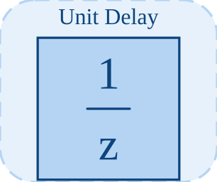

# unitDelay

<p align="center">

</p>
Retarde l entree d une mise a jour.

## 📝 Syntaxe

- Block type: unitDelay

## 📥 Argument d'entrée

- input ports - 1 port(s) d entree declare(s).

## 📤 Argument de sortie

- output ports - 1 port(s) de sortie declare(s).

## 📄 Description

Retarde l entree d une mise a jour.

| Champ        | Valeur                    |
| ------------ | ------------------------- |
| Module       | <code>nflow_blocks</code> |
| Bibliotheque | Blocs discrets            |
| Type         | <code>unitDelay</code>    |
| Libelle      | Unit Delay                |

<b>Description</b>

Retarde l entree d une mise a jour.

<b>Ports</b>

<b>Entree(s)</b>

| Port   | Role                             | Cote | Position  |
| ------ | -------------------------------- | ---- | --------- |
| Port_1 | Signal numerique lu par le bloc. | left | x=0, y=40 |

<b>Sortie(s)</b>

| Port   | Role                                  | Cote  | Position   |
| ------ | ------------------------------------- | ----- | ---------- |
| Port_1 | Signal numerique produit par le bloc. | right | x=80, y=40 |

<b>Parametres</b>

| Parametre            | Valeur par defaut |
| -------------------- | ----------------- |
| <code>initial</code> | 0                 |

<b>Cles de l inspecteur</b>

Ces cles serialisees sont exposees par l inspecteur du bloc.

- <code>initial</code>

<b>Caracteristiques du bloc</b>

| Champ                      | Valeur                    |
| -------------------------- | ------------------------- |
| Type de bloc               | unitDelay                 |
| Famille                    | Blocs discrets            |
| Taille graphique           | 80 x 80                   |
| Phases                     | INIT, OUTPUT, UPDATE      |
| Traversee directe          | voir Algorithmes          |
| Etat ou historique interne | oui                       |
| Type de donnees signaux    | valeurs numeriques double |

<b>Algorithmes</b>

- INIT stocke initial.
- OUTPUT emet la valeur memorisee. UPDATE stocke l entree courante pour la prochaine phase OUTPUT.

<b>Equation ou regle</b>
$$y_k = u_{k-1}$$

<b>Capacites et limites</b>

La page decrit le comportement runtime natif observe dans les sources C++ du module. Les phases declarees indiquent quand le moteur de simulation appelle le bloc.

Generation de code : prise en charge pour C et Rust.

<b>Sources d implementation</b>

<details>
<summary>Manifest: <code>modules/nflow_blocks/libraries/discrete/library.json</code></summary>

```json
{
  "id": "builtin.discrete",
  "title": "Discrete",
  "version": "1.0.0",
  "format": "nflow-2",
  "metadata": {
    "author": "Allan CORNET",
    "created": "2026-03-21",
    "tool": "Nelson nflow"
  },
  "comment": "Blocks for discrete-time systems",
  "license": "LGPL-3.0",
  "builtin": true,
  "blocks": [
    {
      "type": "zoh",
      "label": "ZOH",
      "icon": "zoh.svg",
      "phases": ["INIT", "OUTPUT", "UPDATE"],
      "width": 80,
      "height": 80,
      "inputs": [
        {
          "x": 0,
          "y": 40,
          "side": "left"
        }
      ],
      "outputs": [
        {
          "x": 80,
          "y": 40,
          "side": "right"
        }
      ],
      "defaultParams": {
        "SampleTime": 0.1
      },
      "render": {
        "type": "image",
        "src": "zoh.svg"
      }
    },
    {
      "type": "foh",
      "label": "FOH",
      "icon": "foh.svg",
      "phases": ["INIT", "OUTPUT", "UPDATE"],
      "width": 80,
      "height": 80,
      "inputs": [
        {
          "x": 0,
          "y": 40,
          "side": "left"
        }
      ],
      "outputs": [
        {
          "x": 80,
          "y": 40,
          "side": "right"
        }
      ],
      "defaultParams": {
        "SampleTime": 0.1
      },
      "render": {
        "type": "image",
        "src": "foh.svg"
      }
    },
    {
      "type": "dtf",
      "icon": "dtf.svg",
      "label": "Discrete TF",
      "phases": ["INIT", "OUTPUT", "UPDATE"],
      "width": 80,
      "height": 80,
      "inputs": [
        {
          "x": 0,
          "y": 40,
          "side": "left"
        }
      ],
      "outputs": [
        {
          "x": 80,
          "y": 40,
          "side": "right"
        }
      ],
      "defaultParams": {
        "Numerator": [1],
        "Denominator": [1, -0.5],
        "SampleTime": 0.1
      },
      "render": {
        "type": "image",
        "src": "dtf.svg"
      }
    },
    {
      "type": "ddelay",
      "icon": "ddelay.svg",
      "label": "Discrete Delay",
      "phases": ["INIT", "OUTPUT", "UPDATE"],
      "width": 80,
      "height": 80,
      "inputs": [
        {
          "x": 0,
          "y": 40,
          "side": "left"
        }
      ],
      "outputs": [
        {
          "x": 80,
          "y": 40,
          "side": "right"
        }
      ],
      "defaultParams": {
        "DelayLength": 1,
        "SampleTime": 0.1
      },
      "render": {
        "type": "image",
        "src": "ddelay.svg"
      }
    },
    {
      "type": "dstateSpace",
      "icon": "dstateSpace.svg",
      "label": "Discrete State-Space",
      "phases": ["INIT", "OUTPUT", "UPDATE"],
      "width": 80,
      "height": 80,
      "inputs": [
        {
          "x": 0,
          "y": 40,
          "side": "left"
        }
      ],
      "outputs": [
        {
          "x": 80,
          "y": 40,
          "side": "right"
        }
      ],
      "defaultParams": {
        "A": 1,
        "B": 1,
        "C": 1,
        "D": 0,
        "SampleTime": 0.1
      },
      "render": {
        "type": "image",
        "src": "dstateSpace.svg"
      }
    },
    {
      "type": "unitDelay",
      "label": "Unit Delay",
      "icon": "unitDelay.svg",
      "phases": ["INIT", "OUTPUT", "UPDATE"],
      "width": 80,
      "height": 80,
      "inputs": [
        {
          "x": 0,
          "y": 40,
          "side": "left"
        }
      ],
      "outputs": [
        {
          "x": 80,
          "y": 40,
          "side": "right"
        }
      ],
      "defaultParams": {
        "InitialCondition": 0
      },
      "render": {
        "type": "image",
        "src": "exports/unitDelay.svg",
        "svgMode": "element",
        "preserveAspectRatio": "none",
        "x": 0,
        "y": 0,
        "width": 80,
        "height": 80
      }
    },
    {
      "type": "rateTransition",
      "label": "Rate Transition",
      "icon": "rateTransition.svg",
      "phases": ["INIT", "OUTPUT", "UPDATE"],
      "width": 80,
      "height": 80,
      "inputs": [
        {
          "x": 0,
          "y": 40,
          "side": "left"
        }
      ],
      "outputs": [
        {
          "x": 80,
          "y": 40,
          "side": "right"
        }
      ],
      "defaultParams": {
        "OutPortSampleTime": -1,
        "InitialCondition": 0
      },
      "render": {
        "type": "image",
        "src": "exports/rateTransition.svg",
        "svgMode": "element",
        "preserveAspectRatio": "none",
        "x": 0,
        "y": 0,
        "width": 80,
        "height": 80
      }
    },
    {
      "type": "difference",
      "label": "Difference",
      "icon": "difference.svg",
      "phases": ["INIT", "OUTPUT", "UPDATE"],
      "width": 80,
      "height": 80,
      "inputs": [
        {
          "x": 0,
          "y": 40,
          "side": "left"
        }
      ],
      "outputs": [
        {
          "x": 80,
          "y": 40,
          "side": "right"
        }
      ],
      "defaultParams": {
        "ICPrevInput": 0
      },
      "render": {
        "type": "image",
        "src": "exports/difference.svg",
        "svgMode": "element",
        "preserveAspectRatio": "none",
        "x": 0,
        "y": 0,
        "width": 80,
        "height": 80
      }
    },
    {
      "type": "detectChange",
      "label": "Detect Change",
      "icon": "detectChange.svg",
      "phases": ["INIT", "OUTPUT", "UPDATE"],
      "width": 80,
      "height": 80,
      "inputs": [
        {
          "x": 0,
          "y": 40,
          "side": "left"
        }
      ],
      "outputs": [
        {
          "x": 80,
          "y": 40,
          "side": "right"
        }
      ],
      "defaultParams": {
        "InitialCondition": 0
      },
      "render": {
        "type": "image",
        "src": "exports/detectChange.svg",
        "svgMode": "element",
        "preserveAspectRatio": "none",
        "x": 0,
        "y": 0,
        "width": 80,
        "height": 80
      }
    },
    {
      "type": "detectIncrease",
      "label": "Detect Increase",
      "icon": "detectIncrease.svg",
      "phases": ["INIT", "OUTPUT", "UPDATE"],
      "width": 80,
      "height": 80,
      "inputs": [
        {
          "x": 0,
          "y": 40,
          "side": "left"
        }
      ],
      "outputs": [
        {
          "x": 80,
          "y": 40,
          "side": "right"
        }
      ],
      "defaultParams": {
        "InitialCondition": 0
      },
      "render": {
        "type": "image",
        "src": "exports/detectIncrease.svg",
        "svgMode": "element",
        "preserveAspectRatio": "none",
        "x": 0,
        "y": 0,
        "width": 80,
        "height": 80
      }
    },
    {
      "type": "detectDecrease",
      "label": "Detect Decrease",
      "icon": "detectDecrease.svg",
      "phases": ["INIT", "OUTPUT", "UPDATE"],
      "width": 80,
      "height": 80,
      "inputs": [
        {
          "x": 0,
          "y": 40,
          "side": "left"
        }
      ],
      "outputs": [
        {
          "x": 80,
          "y": 40,
          "side": "right"
        }
      ],
      "defaultParams": {
        "InitialCondition": 0
      },
      "render": {
        "type": "image",
        "src": "exports/detectDecrease.svg",
        "svgMode": "element",
        "preserveAspectRatio": "none",
        "x": 0,
        "y": 0,
        "width": 80,
        "height": 80
      }
    },
    {
      "type": "risingEdge",
      "label": "Rising Edge",
      "icon": "risingEdge.svg",
      "phases": ["INIT", "OUTPUT", "UPDATE"],
      "width": 80,
      "height": 80,
      "inputs": [
        {
          "x": 0,
          "y": 40,
          "side": "left"
        }
      ],
      "outputs": [
        {
          "x": 80,
          "y": 40,
          "side": "right"
        }
      ],
      "defaultParams": {
        "InitialCondition": 0
      }
    },
    {
      "type": "fallingEdge",
      "label": "Falling Edge",
      "icon": "fallingEdge.svg",
      "phases": ["INIT", "OUTPUT", "UPDATE"],
      "width": 80,
      "height": 80,
      "inputs": [
        {
          "x": 0,
          "y": 40,
          "side": "left"
        }
      ],
      "outputs": [
        {
          "x": 80,
          "y": 40,
          "side": "right"
        }
      ],
      "defaultParams": {
        "InitialCondition": 0
      }
    }
  ]
}
```

</details>


<details>
<summary>Runtime: <code>modules/nflow_blocks/src/cpp/discrete/unitDelay.cpp</code></summary>

```cpp
//=============================================================================
// Copyright (c) 2016-present Allan CORNET (Nelson)
//=============================================================================
// This file is part of Nelson.
//=============================================================================
// LICENCE_BLOCK_BEGIN
// SPDX-License-Identifier: LGPL-3.0-or-later
// LICENCE_BLOCK_END
//=============================================================================
#include "SimEngineTypes.hpp"
#include "BlockRegistry.hpp"
#include "FieldNames.hpp"
#include "NFlowBlockDescriptor.hpp"
#include <cmath>
#include <algorithm>
#include "discrete_blocks.hpp"
//=============================================================================
bool
Nelson::NFlow::handleUnitDelay(SimCtx& ctx, const Block& b, Phase phase)
{
    auto& st = getState(ctx, b.nid);
    const int w = outputWidth(ctx, b.nid, 0);
    if (phase == Phase::INIT) {
        nflow::BlockDescriptor bd(b, ctx.variables);
        if (w <= 1) {
            st.scalar = bd.paramDouble(nflow::kInitial, 0.0);
            st.output = st.scalar;
        } else {
            std::vector<double> iniList = bd.paramList(nflow::kInitial);
            st.vec.assign(w, 0.0);
            for (int i = 0; i < w; ++i) {
                st.vec[i] = iniList.empty()
                    ? 0.0
                    : (i < (int)iniList.size() ? iniList[i] : iniList.back());
            }
        }
        return false;
    }
    if (phase == Phase::OUTPUT) {
        if (w <= 1) {
            setOutput(ctx, b.nid, st.output);
        } else {
            double* y = outputSlice(ctx, b.nid, 0);
            for (int i = 0; i < w; ++i) {
                y[i] = (i < (int)st.vec.size()) ? st.vec[i] : 0.0;
            }
        }
        return false;
    }
    if (phase == Phase::UPDATE) {
        if (w <= 1) {
            st.output = getInput(ctx, b.nid, 0, 0.0);
        } else {
            SigView u = getInputSig(ctx, b.nid, 0);
            if ((int)st.vec.size() != w) {
                st.vec.assign(w, 0.0);
            }
            for (int i = 0; i < w; ++i) {
                st.vec[i] = sigAt(u, i);
            }
        }
        return false;
    }
    return false;
}
//=============================================================================
Nelson::NFlow::BlockCodegenTemplate
Nelson::NFlow::getCodeGenCUnitDelay()
{
    BlockCodegenTemplate t;
    t.emitState = [](const BlockCodegenStateArgs& a) {
        nflow::BlockDescriptor bd(*a.block, *a.variables);
        a.addState(
            "unit_delay_" + a.id, nflow::formatNumber(bd.paramDouble(nflow::kInitial, 0.0)), "");
    };
    t.emitOutput = [](const BlockCodegenArgs& a) {
        a.line("out_" + a.id + " = s->unit_delay_" + a.id + ";");
    };
    t.emitStep = [](const BlockCodegenArgs& a) {
        a.line("out_" + a.id + " = s->unit_delay_" + a.id + ";");
        // Multi-rate: advance the stored state only on the block's sample hit
        // (roadmap 5.2). rate = round(SampleTime / base step); 1 = every step.
        const int rate = codegenSampleRate(a.params, a.dt);
        const std::string upd = "s->unit_delay_" + a.id + " = " + a.in[0] + ";";
        if (rate > 1) {
            a.line("if (__nflow_step % " + std::to_string(rate) + " == 0) " + upd);
        } else {
            a.line(upd);
        }
    };
    return t;
}
//=============================================================================
Nelson::NFlow::BlockCodegenTemplate
Nelson::NFlow::getCodeGenRustUnitDelay()
{
    BlockCodegenTemplate t;
    t.emitState = [](const BlockCodegenStateArgs& a) {
        nflow::BlockDescriptor bd(*a.block, *a.variables);
        a.addState("unit_delay_" + a.id, a.fmt(bd.paramDouble(nflow::kInitial, 0.0)), "");
    };
    t.emitOutput = [](const BlockCodegenArgs& a) {
        a.line("out_" + a.id + " = s.unit_delay_" + a.id + ";");
    };
    t.emitStep = [](const BlockCodegenArgs& a) {
        a.line("out_" + a.id + " = s.unit_delay_" + a.id + ";");
        // Multi-rate: advance the stored state only on the block's sample hit.
        const int rate = codegenSampleRate(a.params, a.dt);
        const std::string upd = "s.unit_delay_" + a.id + " = " + a.in[0] + ";";
        if (rate > 1) {
            a.line("if __nflow_step % " + std::to_string(rate) + " == 0 { " + upd + " }");
        } else {
            a.line(upd);
        }
    };
    return t;
}
//=============================================================================

```

</details>

## 🔗 Voir aussi

[ddelay](../../nflow_blocks/discrete/ddelay.md), [difference](../../nflow_blocks/discrete/difference.md), [zoh](../../nflow_blocks/discrete/zoh.md).

## 🕔 Historique

| Version | 📄 Description  |
| ------- | --------------- |
| 1.0.0   | initial version |

<!--
## 👤 Auteur

Allan CORNET
-->
