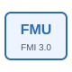

# fmu

Exécute une FMU de co-simulation dans un diagramme NFlow.

## 📝 Syntaxe

- Type de bloc : fmu

## 📄 Description

Le bloc <b>FMU</b> charge l'archive sélectionnée par <b>path</b> et avance son instance de co-simulation avec la simulation NFlow. 

Après l'import, les ports et paramètres du bloc suivent les variables exposées par la description du modèle FMU. 

## 🔗 Voir aussi

[fmuToBlock](../../nflow_fmi/fmuToBlock.md).