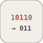

# extractBits


<p align="center">

</p>
Extrait NumBitsToExtract bits a partir de StartBit, alignes a droite.

## 📝 Syntaxe

- Type de bloc : extractBits

## 📥 Argument d'entrée

- ports d entree - 1 port(s) d entree declare(s).

## 📤 Argument de sortie

- ports de sortie - 1 port(s) de sortie declare(s).

## 📄 Description


Extrait NumBitsToExtract bits a partir de StartBit, alignes a droite. 

| Champ | Valeur |
| --- | --- |
| Module | <code>nflow_blocks</code> | 
| Bibliotheque | Logique / Operations sur les bits | 
| Type | <code>extractBits</code> | 
| Libelle | Extract Bits | 

  

<b>Description</b> 

Extrait un champ contigu de <code>NumBitsToExtract</code> bits a partir du bit <code>StartBit</code> (base 0, LSB) de l'entree entiere et l'aligne a droite dans la sortie. Les valeurs sont reinterpretees comme entiers non signes sur <code>NumBits</code> bits. Element par element. 

<b>Ports</b> 

<b>Entree(s)</b> 

| Port | Role | Cote | Position | 
| --- | --- | --- | --- | 
| Port\_1 | Signal numerique lu par le bloc. | gauche | x=0, y=40 | 

 

<b>Sortie(s)</b> 

| Port | Role | Cote | Position | 
| --- | --- | --- | --- | 
| Port\_1 | Signal numerique produit par le bloc. | droite | x=90, y=40 | 

 

<b>Parametres</b> 

| Parametre | Valeur par defaut | 
| --- | --- | 
| <code>StartBit</code> | 0 | 
| <code>NumBitsToExtract</code> | 8 | 
| <code>NumBits</code> | 32 | 

 

<b>Caracteristiques du bloc</b> 

| Champ | Valeur |
| --- | --- |
| Type de bloc | extractBits | 
| Famille | Logique / Operations sur les bits | 
| Taille rendue | 90 x 80 | 
| Phases | ALGEBRAIC | 
| Etat interne ou historique | non | 
| Type de donnees du signal | valeurs numeriques double | 

 

<b>Algorithmes</b> 

- ALGEBRAIC : out = (x >> StartBit) & ((1 << NumBitsToExtract) - 1). 

<b>Equation ou regle</b> 
$$y = (u \gg \text{StartBit}) \,\&\, (2^{\text{NumBitsToExtract}}-1)$$
 

<b>Capacites etendues</b> 

<b>Sources d implementation</b> 

Generation de code : prise en charge pour C et Rust. 

**Manifest:** `modules/nflow_blocks/libraries/logic/library.json`
 

**Runtime:** `modules/nflow_blocks/src/cpp/logic/extractBits.cpp`


## 💡 Exemple

Extraire le quartet haut de 180 (10110100) a partir du bit 4 : 1011 = 11.

```matlab
d.blocks={ struct('id','c','type','constant','inputs',0,'outputs',1,'params',struct('Value',180)), struct('id','e','type','extractBits','inputs',1,'outputs',1,'params',struct('StartBit',4,'NumBitsToExtract',4,'NumBits',8)), struct('id','w','type','toWorkspace','inputs',1,'outputs',0,'params',struct('VariableName','y','SaveFormat','Array')) };
d.connections={ struct('from','c','to','e','fromIndex',0,'toIndex',0), struct('from','e','to','w','fromIndex',0,'toIndex',0) };
d.sampleTime=0.1; d.duration=0.2; d.solver='discrete'; d.variables=struct();
r=jsondecode(__nflow_simulate__(jsonencode(d)));
```


## 🔗 Voir aussi

[bitwiseOperator](../../nflow_blocks/logic/bitwiseOperator.md), [shiftArithmetic](../../nflow_blocks/logic/shiftArithmetic.md).

## 🕔 Historique

| Version | 📄 Description     |
| ------- | --------------- |
| 1.0.0   | initial version |

<!--
## 👤 Auteur

Allan CORNET
-->
