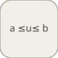

# intervalTest


<p align="center">

</p>
Sort 1 quand l entree est dans [LowerLimit, UpperLimit], sinon 0.

## 📝 Syntaxe

- Type de bloc : intervalTest

## 📥 Argument d'entrée

- ports d entree - 1 port(s) d entree declare(s).

## 📤 Argument de sortie

- ports de sortie - 1 port(s) de sortie declare(s).

## 📄 Description


Sort 1 quand l entree est dans [LowerLimit, UpperLimit], sinon 0. 

| Champ | Valeur |
| --- | --- |
| Module | <code>nflow_blocks</code> | 
| Bibliotheque | Logique / Operations sur les bits | 
| Type | <code>intervalTest</code> | 
| Libelle | Interval Test | 

  

<b>Description</b> 

Teste si l'entree <code>u</code> se trouve dans un intervalle statique. Les bornes <code>LowerLimit</code> et <code>UpperLimit</code> sont des parametres ; <code>IntervalClosedLeft</code> et <code>IntervalClosedRight</code> choisissent si chaque borne est incluse (<code>>=</code>/<code><=</code>) ou exclue (<code>></code>/<code><</code>). Le test est applique element par element sur une entree vectorielle. 

Retour algebrique pur (sans etat) : la sortie ne depend que de l'entree courante. 

<b>Ports</b> 

<b>Entree(s)</b> 

| Port | Role | Cote | Position | 
| --- | --- | --- | --- | 
| Port\_1 | Signal numerique lu par le bloc. | gauche | x=0, y=40 | 

 

<b>Sortie(s)</b> 

| Port | Role | Cote | Position | 
| --- | --- | --- | --- | 
| Port\_1 | Signal numerique produit par le bloc. | droite | x=100, y=40 | 

 

<b>Parametres</b> 

| Parametre | Valeur par defaut | 
| --- | --- | 
| <code>LowerLimit</code> | 0 | 
| <code>UpperLimit</code> | 1 | 
| <code>IntervalClosedLeft</code> | 1 | 
| <code>IntervalClosedRight</code> | 1 | 

 

<b>Caracteristiques du bloc</b> 

| Champ | Valeur |
| --- | --- |
| Type de bloc | intervalTest | 
| Famille | Logique / Operations sur les bits | 
| Taille rendue | 100 x 80 | 
| Phases | ALGEBRAIC | 
| Etat interne ou historique | non | 
| Type de donnees du signal | valeurs numeriques double | 

 

<b>Algorithmes</b> 

- ALGEBRAIC : out = (u >= LowerLimit) && (u <= UpperLimit) ? 1 : 0, avec comparaisons strictes si la borne est ouverte. 

<b>Equation ou regle</b> 
$$y = \begin{cases} 1 & \text{lo} \le u \le \text{up} \\ 0 & \text{otherwise} \end{cases}$$
 

<b>Capacites etendues</b> 

<b>Sources d implementation</b> 

Generation de code : prise en charge pour C et Rust. 

**Manifest:** `modules/nflow_blocks/libraries/logic/library.json`
 

**Runtime:** `modules/nflow_blocks/src/cpp/logic/intervalTest.cpp`


## 💡 Exemple

Tester une constante contre [0, 1] et afficher le resultat.

```matlab
d.blocks={ struct('id','c','type','constant','inputs',0,'outputs',1,'params',struct('Value',0.5)), struct('id','it','type','intervalTest','inputs',1,'outputs',1,'params',struct('LowerLimit',0,'UpperLimit',1)), struct('id','w','type','toWorkspace','inputs',1,'outputs',0,'params',struct('VariableName','y','SaveFormat','Array')) };
d.connections={ struct('from','c','to','it','fromIndex',0,'toIndex',0), struct('from','it','to','w','fromIndex',0,'toIndex',0) };
d.sampleTime=0.1; d.duration=0.2; d.solver='discrete'; d.variables=struct();
r=jsondecode(__nflow_simulate__(jsonencode(d)));
```


## 🔗 Voir aussi

[intervalTestDynamic](../../nflow_blocks/logic/intervalTestDynamic.md), [compareToConstant](../../nflow_blocks/logic/compareToConstant.md).

## 🕔 Historique

| Version | 📄 Description     |
| ------- | --------------- |
| 1.0.0   | initial version |

<!--
## 👤 Auteur

Allan CORNET
-->
