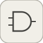

# logicalOperator

<p align="center">

</p>
AND/OR/NAND/NOR/XOR/XNOR/NOT logique configurable des entrees.

## 📝 Syntaxe

- Type de bloc : logicalOperator

## 📥 Argument d'entrée

- ports d entree - 2 port(s) d entree declare(s).

## 📤 Argument de sortie

- ports de sortie - 1 port(s) de sortie declare(s).

## 📄 Description

AND/OR/NAND/NOR/XOR/XNOR/NOT logique configurable des entrees.

| Champ        | Valeur                            |
| ------------ | --------------------------------- |
| Module       | <code>nflow_blocks</code>         |
| Bibliotheque | Logique / Operations sur les bits |
| Type         | <code>logicalOperator</code>      |
| Libelle      | Logical Operator                  |

<b>Description</b>

Un bloc logique unique et parametrable : <code>Operator</code> choisit AND, OR, NAND, NOR, XOR, XNOR ou NOT. Il reduit les N entrees element par element (une entree non nulle vaut vrai) ; NOT prend une seule entree et l'inverse. Complete les blocs fixes and / or / xor / not par un bloc configurable.

<b>Ports</b>

<b>Entree(s)</b>

| Port   | Role                             | Cote   | Position  |
| ------ | -------------------------------- | ------ | --------- |
| Port_1 | Signal numerique lu par le bloc. | gauche | x=0, y=26 |
| Port_2 | Signal numerique lu par le bloc. | gauche | x=0, y=54 |

<b>Sortie(s)</b>

| Port   | Role                                  | Cote   | Position   |
| ------ | ------------------------------------- | ------ | ---------- |
| Port_1 | Signal numerique produit par le bloc. | droite | x=80, y=40 |

<b>Parametres</b>

| Parametre             | Valeur par defaut |
| --------------------- | ----------------- |
| <code>Operator</code> | AND               |

<b>Caracteristiques du bloc</b>

| Champ                      | Valeur                            |
| -------------------------- | --------------------------------- |
| Type de bloc               | logicalOperator                   |
| Famille                    | Logique / Operations sur les bits |
| Taille rendue              | 80 x 80                           |
| Phases                     | ALGEBRAIC                         |
| Etat interne ou historique | non                               |
| Type de donnees du signal  | valeurs numeriques double         |

<b>Algorithmes</b>

- ALGEBRAIC : reduit les N entrees booleennes avec l'operateur choisi ; sortie booleenne (0/1).

<b>Capacites etendues</b>

<b>Sources d implementation</b>

Generation de code : prise en charge pour C et Rust.

<details>
<summary>Manifest: <code>modules/nflow_blocks/libraries/logic/library.json</code></summary>

```json
{
  "id": "builtin.logic",
  "title": "Logic / Bit Operations",
  "version": "0.1.0",
  "format": "nflow-2",
  "builtin": true,
  "blocks": [
    {
      "type": "and",
      "label": "AND",
      "icon": "and.svg",
      "phases": ["ALGEBRAIC"],
      "width": 80,
      "height": 80,
      "inputs": [
        {
          "x": 0,
          "y": 20,
          "side": "left"
        },
        {
          "x": 0,
          "y": 60,
          "side": "left"
        }
      ],
      "outputs": [
        {
          "x": 80,
          "y": 40,
          "side": "right"
        }
      ],
      "render": {
        "type": "math",
        "bodyClass": "block-body",
        "mathGroupClass": "and-math",
        "formula": "\\text{AND}",
        "textSize": "16px"
      }
    },
    {
      "type": "or",
      "label": "OR",
      "icon": "or.svg",
      "phases": ["ALGEBRAIC"],
      "width": 80,
      "height": 80,
      "inputs": [
        {
          "x": 0,
          "y": 20,
          "side": "left"
        },
        {
          "x": 0,
          "y": 60,
          "side": "left"
        }
      ],
      "outputs": [
        {
          "x": 80,
          "y": 40,
          "side": "right"
        }
      ],
      "render": {
        "type": "math",
        "bodyClass": "block-body",
        "mathGroupClass": "or-math",
        "formula": "\\text{OR}",
        "textSize": "16px"
      }
    },
    {
      "type": "xor",
      "label": "XOR",
      "icon": "xor.svg",
      "phases": ["ALGEBRAIC"],
      "width": 80,
      "height": 80,
      "inputs": [
        {
          "x": 0,
          "y": 20,
          "side": "left"
        },
        {
          "x": 0,
          "y": 60,
          "side": "left"
        }
      ],
      "outputs": [
        {
          "x": 80,
          "y": 40,
          "side": "right"
        }
      ],
      "render": {
        "type": "math",
        "bodyClass": "block-body",
        "mathGroupClass": "xor-math",
        "formula": "\\text{XOR}",
        "textSize": "16px"
      }
    },
    {
      "type": "not",
      "label": "NOT",
      "icon": "not.svg",
      "phases": ["ALGEBRAIC"],
      "width": 80,
      "height": 80,
      "inputs": [
        {
          "x": 0,
          "y": 40,
          "side": "left"
        }
      ],
      "outputs": [
        {
          "x": 80,
          "y": 40,
          "side": "right"
        }
      ],
      "render": {
        "type": "math",
        "bodyClass": "block-body",
        "mathGroupClass": "not-math",
        "formula": "\\text{NOT}",
        "textSize": "16px"
      }
    },
    {
      "type": "compareToConstant",
      "label": "Compare Const",
      "icon": "compareToConstant.svg",
      "phases": ["ALGEBRAIC"],
      "width": 100,
      "height": 80,
      "inputs": [
        {
          "x": 0,
          "y": 40,
          "side": "left"
        }
      ],
      "outputs": [
        {
          "x": 100,
          "y": 40,
          "side": "right"
        }
      ],
      "defaultParams": {
        "relop": "ge",
        "const": 0
      },
      "render": {
        "type": "image",
        "src": "exports/compareToConstant.svg",
        "svgMode": "element",
        "preserveAspectRatio": "none",
        "x": 0,
        "y": 0,
        "width": 100,
        "height": 80
      }
    },
    {
      "type": "intervalTest",
      "label": "Interval Test",
      "icon": "intervalTest.svg",
      "phases": ["ALGEBRAIC"],
      "width": 100,
      "height": 80,
      "inputs": [
        {
          "x": 0,
          "y": 40,
          "side": "left"
        }
      ],
      "outputs": [
        {
          "x": 100,
          "y": 40,
          "side": "right"
        }
      ],
      "defaultParams": {
        "LowerLimit": 0,
        "UpperLimit": 1,
        "IntervalClosedLeft": 1,
        "IntervalClosedRight": 1
      },
      "render": {
        "type": "image",
        "src": "exports/intervalTest.svg",
        "svgMode": "element",
        "preserveAspectRatio": "none",
        "x": 0,
        "y": 0,
        "width": 100,
        "height": 80
      }
    },
    {
      "type": "intervalTestDynamic",
      "label": "Interval Test Dynamic",
      "icon": "intervalTestDynamic.svg",
      "phases": ["ALGEBRAIC"],
      "width": 100,
      "height": 80,
      "inputs": [
        {
          "x": 0,
          "y": 20,
          "side": "left"
        },
        {
          "x": 0,
          "y": 40,
          "side": "left"
        },
        {
          "x": 0,
          "y": 60,
          "side": "left"
        }
      ],
      "outputs": [
        {
          "x": 100,
          "y": 40,
          "side": "right"
        }
      ],
      "defaultParams": {
        "IntervalClosedLeft": 1,
        "IntervalClosedRight": 1
      },
      "render": {
        "type": "image",
        "src": "exports/intervalTestDynamic.svg",
        "svgMode": "element",
        "preserveAspectRatio": "none",
        "x": 0,
        "y": 0,
        "width": 100,
        "height": 80
      }
    },
    {
      "type": "bitwiseOperator",
      "label": "Bitwise Operator",
      "icon": "bitwiseOperator.svg",
      "phases": ["ALGEBRAIC"],
      "width": 90,
      "height": 80,
      "inputs": [
        {
          "x": 0,
          "y": 40,
          "side": "left"
        }
      ],
      "outputs": [
        {
          "x": 90,
          "y": 40,
          "side": "right"
        }
      ],
      "defaultParams": {
        "Operation": "AND",
        "BitMask": 0,
        "NumBits": 32
      },
      "render": {
        "type": "image",
        "src": "exports/bitwiseOperator.svg",
        "svgMode": "element",
        "preserveAspectRatio": "none",
        "x": 0,
        "y": 0,
        "width": 90,
        "height": 80
      }
    },
    {
      "type": "bitSet",
      "label": "Bit Set",
      "icon": "bitSet.svg",
      "phases": ["ALGEBRAIC"],
      "width": 80,
      "height": 80,
      "inputs": [
        {
          "x": 0,
          "y": 40,
          "side": "left"
        }
      ],
      "outputs": [
        {
          "x": 80,
          "y": 40,
          "side": "right"
        }
      ],
      "defaultParams": {
        "BitIndex": 0,
        "NumBits": 32
      },
      "render": {
        "type": "image",
        "src": "exports/bitSet.svg",
        "svgMode": "element",
        "preserveAspectRatio": "none",
        "x": 0,
        "y": 0,
        "width": 80,
        "height": 80
      }
    },
    {
      "type": "bitClear",
      "label": "Bit Clear",
      "icon": "bitClear.svg",
      "phases": ["ALGEBRAIC"],
      "width": 80,
      "height": 80,
      "inputs": [
        {
          "x": 0,
          "y": 40,
          "side": "left"
        }
      ],
      "outputs": [
        {
          "x": 80,
          "y": 40,
          "side": "right"
        }
      ],
      "defaultParams": {
        "BitIndex": 0,
        "NumBits": 32
      },
      "render": {
        "type": "image",
        "src": "exports/bitClear.svg",
        "svgMode": "element",
        "preserveAspectRatio": "none",
        "x": 0,
        "y": 0,
        "width": 80,
        "height": 80
      }
    },
    {
      "type": "extractBits",
      "label": "Extract Bits",
      "icon": "extractBits.svg",
      "phases": ["ALGEBRAIC"],
      "width": 90,
      "height": 80,
      "inputs": [
        {
          "x": 0,
          "y": 40,
          "side": "left"
        }
      ],
      "outputs": [
        {
          "x": 90,
          "y": 40,
          "side": "right"
        }
      ],
      "defaultParams": {
        "StartBit": 0,
        "NumBitsToExtract": 8,
        "NumBits": 32,
        "OutputScaling": "keepWeight"
      },
      "render": {
        "type": "image",
        "src": "exports/extractBits.svg",
        "svgMode": "element",
        "preserveAspectRatio": "none",
        "x": 0,
        "y": 0,
        "width": 90,
        "height": 80
      }
    },
    {
      "type": "shiftArithmetic",
      "label": "Shift Arithmetic",
      "icon": "shiftArithmetic.svg",
      "phases": ["ALGEBRAIC"],
      "width": 90,
      "height": 80,
      "inputs": [
        {
          "x": 0,
          "y": 40,
          "side": "left"
        }
      ],
      "outputs": [
        {
          "x": 90,
          "y": 40,
          "side": "right"
        }
      ],
      "defaultParams": {
        "ShiftDirection": "Left",
        "ShiftNumber": 1
      },
      "render": {
        "type": "image",
        "src": "exports/shiftArithmetic.svg",
        "svgMode": "element",
        "preserveAspectRatio": "none",
        "x": 0,
        "y": 0,
        "width": 90,
        "height": 80
      }
    },
    {
      "type": "combinatorialLogic",
      "label": "Combinatorial Logic",
      "icon": "combinatorialLogic.svg",
      "phases": ["ALGEBRAIC"],
      "width": 90,
      "height": 80,
      "inputs": [
        {
          "x": 0,
          "y": 40,
          "side": "left"
        }
      ],
      "outputs": [
        {
          "x": 90,
          "y": 40,
          "side": "right"
        }
      ],
      "defaultParams": {
        "TruthTable": [0, 1, 1, 0]
      },
      "render": {
        "type": "image",
        "src": "exports/combinatorialLogic.svg",
        "svgMode": "element",
        "preserveAspectRatio": "none",
        "x": 0,
        "y": 0,
        "width": 90,
        "height": 80
      }
    },
    {
      "type": "compareToZero",
      "label": "Compare Zero",
      "icon": "compareToZero.svg",
      "phases": ["ALGEBRAIC"],
      "width": 100,
      "height": 80,
      "inputs": [
        {
          "x": 0,
          "y": 40,
          "side": "left"
        }
      ],
      "outputs": [
        {
          "x": 100,
          "y": 40,
          "side": "right"
        }
      ],
      "defaultParams": {
        "relop": "ne"
      },
      "render": {
        "type": "image",
        "src": "exports/compareToZero.svg",
        "svgMode": "element",
        "preserveAspectRatio": "none",
        "x": 0,
        "y": 0,
        "width": 100,
        "height": 80
      }
    },
    {
      "type": "relationalOperator",
      "label": "Relational",
      "icon": "relationalOperator.svg",
      "phases": ["ALGEBRAIC"],
      "width": 100,
      "height": 80,
      "inputs": [
        {
          "x": 0,
          "y": 30,
          "side": "left"
        },
        {
          "x": 0,
          "y": 50,
          "side": "left"
        }
      ],
      "outputs": [
        {
          "x": 100,
          "y": 40,
          "side": "right"
        }
      ],
      "defaultParams": {
        "Operator": "ge"
      },
      "render": {
        "type": "image",
        "src": "exports/relationalOperator.svg",
        "svgMode": "element",
        "preserveAspectRatio": "none",
        "x": 0,
        "y": 0,
        "width": 100,
        "height": 80
      }
    },
    {
      "type": "switchCase",
      "label": "Switch Case",
      "icon": "switchCase.svg",
      "phases": ["ALGEBRAIC"],
      "width": 100,
      "height": 80,
      "inputs": [
        {
          "x": 0,
          "y": 40,
          "side": "left"
        }
      ],
      "outputs": [
        {
          "x": 100,
          "y": 30,
          "side": "right"
        },
        {
          "x": 100,
          "y": 50,
          "side": "right"
        }
      ],
      "defaultParams": {
        "CaseConditions": "{1}",
        "ShowDefaultCase": "on"
      },
      "render": {
        "type": "image",
        "src": "exports/switchCase.svg",
        "svgMode": "element",
        "preserveAspectRatio": "none",
        "x": 0,
        "y": 0,
        "width": 100,
        "height": 80
      }
    },
    {
      "type": "if",
      "label": "If",
      "icon": "if.svg",
      "phases": ["ALGEBRAIC"],
      "width": 100,
      "height": 80,
      "inputs": [
        {
          "x": 0,
          "y": 30,
          "side": "left"
        },
        {
          "x": 0,
          "y": 50,
          "side": "left"
        }
      ],
      "outputs": [
        {
          "x": 100,
          "y": 30,
          "side": "right"
        },
        {
          "x": 100,
          "y": 50,
          "side": "right"
        }
      ],
      "defaultParams": {
        "IfExpression": "u1 > 0",
        "ElseIfExpressions": "",
        "ShowElse": "on"
      },
      "render": {
        "type": "image",
        "src": "exports/if.svg",
        "svgMode": "element",
        "preserveAspectRatio": "none",
        "x": 0,
        "y": 0,
        "width": 100,
        "height": 80
      }
    },
    {
      "type": "logicalOperator",
      "label": "Logical Operator",
      "icon": "logicalOperator.svg",
      "phases": ["ALGEBRAIC"],
      "width": 80,
      "height": 80,
      "inputs": [
        {
          "x": 0,
          "y": 30,
          "side": "left"
        },
        {
          "x": 0,
          "y": 50,
          "side": "left"
        }
      ],
      "outputs": [
        {
          "x": 80,
          "y": 40,
          "side": "right"
        }
      ],
      "defaultParams": {
        "Operator": "AND"
      },
      "render": {
        "type": "image",
        "src": "exports/logicalOperator.svg",
        "svgMode": "element",
        "preserveAspectRatio": "none",
        "x": 0,
        "y": 0,
        "width": 80,
        "height": 80
      }
    }
  ]
}
```

</details>


<details>
<summary>Runtime: <code>modules/nflow_blocks/src/cpp/logic/logicalOperator.cpp</code></summary>

```cpp
//=============================================================================
// Copyright (c) 2016-present Allan CORNET (Nelson)
//=============================================================================
// This file is part of Nelson.
//=============================================================================
// LICENCE_BLOCK_BEGIN
// SPDX-License-Identifier: LGPL-3.0-or-later
// LICENCE_BLOCK_END
//=============================================================================
// logicalOperator: a single configurable logical block (Logical Operator).
// Operator is AND / OR / NAND / NOR / XOR / XNOR / NOT; it reduces the N boolean
// inputs element-wise (a nonzero input is true). NOT takes a single input and
// negates it. Pure algebraic feedthrough over the input width; C / Rust code
// generation. Complements the fixed and / or / xor / not blocks with one
// dispatchable block (matching the standard Logical Operator).
//=============================================================================
#include "SimEngineTypes.hpp"
#include "BlockRegistry.hpp"
#include "FieldNames.hpp"
#include "NFlowBlockDescriptor.hpp"
#include "NFlowCodegenHelpers.hpp"
#include <cmath>
#include <string>
#include <vector>
#include "logic_blocks.hpp"
//=============================================================================
namespace Nelson {
namespace NFlow {
    //=============================================================================
    // Operator codes: 0 AND, 1 OR, 2 NAND, 3 NOR, 4 XOR, 5 XNOR, 6 NOT.
    static int
    logOp(const nflow::BlockDescriptor& bd)
    {
        const std::string s = bd.paramStr("Operator", "AND");
        if (s == "OR") {
            return 1;
        }
        if (s == "NAND") {
            return 2;
        }
        if (s == "NOR") {
            return 3;
        }
        if (s == "XOR") {
            return 4;
        }
        if (s == "XNOR") {
            return 5;
        }
        if (s == "NOT") {
            return 6;
        }
        return 0;
    }
    //=============================================================================
    bool
    handleLogicalOperator(SimCtx& ctx, const Block& b, Phase phase)
    {
        if (phase != Phase::ALGEBRAIC) {
            return false;
        }
        nflow::BlockDescriptor bd(b, ctx.variables);
        const int op = logOp(bd);
        const int n = numInputs(ctx, b.nid);
        std::vector<SigView> ins(n);
        for (int i = 0; i < n; ++i) {
            ins[i] = getInputSig(ctx, b.nid, i);
        }
        return emitElementwise(ctx, b.nid, [&](int k) -> double {
            if (op == 6) { // NOT (single input)
                const double v = (n > 0) ? sigAt(ins[0], k) : 0.0;
                return (v == 0.0) ? 1.0 : 0.0;
            }
            int trueCount = 0;
            bool anyTrue = false;
            bool allTrue = true;
            for (int i = 0; i < n; ++i) {
                const double v = sigAt(ins[i], k);
                const bool t = !(std::isnan(v) || v == 0.0);
                anyTrue = anyTrue || t;
                allTrue = allTrue && t;
                if (t) {
                    ++trueCount;
                }
            }
            switch (op) {
            case 1:
                return anyTrue ? 1.0 : 0.0; // OR
            case 2:
                return allTrue ? 0.0 : 1.0; // NAND
            case 3:
                return anyTrue ? 0.0 : 1.0; // NOR
            case 4:
                return (trueCount & 1) ? 1.0 : 0.0; // XOR
            case 5:
                return (trueCount & 1) ? 0.0 : 1.0; // XNOR
            case 0:
            default:
                return allTrue ? 1.0 : 0.0; // AND
            }
        });
    }
    //=============================================================================
    static std::string
    logExprC(int op, const std::vector<std::string>& in)
    {
        const int n = (int)in.size();
        if (op == 6) {
            const std::string x = n > 0 ? in[0] : std::string("0.0");
            return "(" + x + " == 0.0) ? 1.0 : 0.0";
        }
        std::string joined;
        for (int i = 0; i < n; ++i) {
            const std::string b = "(" + in[i] + " != 0.0)";
            if (op == 0 || op == 2) { // AND / NAND
                joined += (i ? " && " : "") + b;
            } else if (op == 1 || op == 3) { // OR / NOR
                joined += (i ? " || " : "") + b;
            } else { // XOR / XNOR: parity of the boolean count
                joined += (i ? " ^ " : "") + std::string("(int)") + b;
            }
        }
        if (op == 0) {
            return "(" + joined + ") ? 1.0 : 0.0";
        }
        if (op == 1) {
            return "(" + joined + ") ? 1.0 : 0.0";
        }
        if (op == 2) {
            return "(" + joined + ") ? 0.0 : 1.0";
        }
        if (op == 3) {
            return "(" + joined + ") ? 0.0 : 1.0";
        }
        if (op == 4) {
            return "((" + joined + ") & 1) ? 1.0 : 0.0";
        }
        return "((" + joined + ") & 1) ? 0.0 : 1.0"; // XNOR
    }
    //=============================================================================
    static std::string
    logExprRust(int op, const std::vector<std::string>& in)
    {
        const int n = (int)in.size();
        if (op == 6) {
            const std::string x = n > 0 ? in[0] : std::string("0.0_f64");
            return "if " + x + " == 0.0_f64 { 1.0_f64 } else { 0.0_f64 }";
        }
        std::string joined;
        for (int i = 0; i < n; ++i) {
            const std::string b = "(" + in[i] + " != 0.0_f64)";
            if (op == 0 || op == 2) {
                joined += (i ? " && " : "") + b;
            } else if (op == 1 || op == 3) {
                joined += (i ? " || " : "") + b;
            } else {
                joined += (i ? " ^ " : "") + std::string("(") + b + " as i64)";
            }
        }
        if (op == 0 || op == 1) {
            return "if " + joined + " { 1.0_f64 } else { 0.0_f64 }";
        }
        if (op == 2 || op == 3) {
            return "if " + joined + " { 0.0_f64 } else { 1.0_f64 }";
        }
        if (op == 4) {
            return "if ((" + joined + ") & 1) != 0 { 1.0_f64 } else { 0.0_f64 }";
        }
        return "if ((" + joined + ") & 1) != 0 { 0.0_f64 } else { 1.0_f64 }";
    }
    //=============================================================================
    BlockCodegenTemplate
    getCodeGenCLogicalOperator()
    {
        BlockCodegenTemplate t;
        t.emitStep = [](const BlockCodegenArgs& a) {
            nflow::BlockDescriptor bd(*a.block, *a.variables);
            a.line("out_" + a.id + " = " + logExprC(logOp(bd), a.in) + ";");
        };
        return t;
    }
    //=============================================================================
    BlockCodegenTemplate
    getCodeGenRustLogicalOperator()
    {
        BlockCodegenTemplate t;
        t.emitStep = [](const BlockCodegenArgs& a) {
            nflow::BlockDescriptor bd(*a.block, *a.variables);
            a.line("out_" + a.id + " = " + logExprRust(logOp(bd), a.in) + ";");
        };
        return t;
    }
    //=============================================================================
} // namespace NFlow
} // namespace Nelson
//=============================================================================

```

</details>

## 💡 Exemple

NON-ET de deux constantes : NAND(1, 1) = 0.

```matlab
d.blocks={ struct('id','a','type','constant','inputs',0,'outputs',1,'params',struct('Value',1)), struct('id','b','type','constant','inputs',0,'outputs',1,'params',struct('Value',1)), struct('id','g','type','logicalOperator','inputs',2,'outputs',1,'params',struct('Operator','NAND')), struct('id','w','type','toWorkspace','inputs',1,'outputs',0,'params',struct('VariableName','y','SaveFormat','Array')) };
d.connections={ struct('from','a','to','g','fromIndex',0,'toIndex',0), struct('from','b','to','g','fromIndex',0,'toIndex',1), struct('from','g','to','w','fromIndex',0,'toIndex',0) };
d.sampleTime=0.1; d.duration=0.2; d.solver='discrete'; d.variables=struct();
r=jsondecode(__nflow_simulate__(jsonencode(d)));
```

## 🔗 Voir aussi

[and](../../nflow_blocks/logic/and.md), [or](../../nflow_blocks/logic/or.md), [relationalOperator](../../nflow_blocks/logic/relationalOperator.md).

## 🕔 Historique

| Version | 📄 Description  |
| ------- | --------------- |
| 1.0.0   | initial version |

<!--
## 👤 Auteur

Allan CORNET
-->
