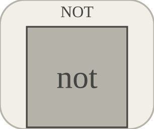

# not

Produit la negation logique d une entree.

## 📝 Syntaxe

- Block type: not

## 📥 Argument d'entrée

- input ports - 1 port(s) d entree declare(s).

## 📤 Argument de sortie

- output ports - 1 port(s) de sortie declare(s).

## 📄 Description

Produit la negation logique d une entree. 

| Champ | Valeur |
| --- | --- |
| Module | <code>nflow_blocks</code> | 
| Bibliotheque | Blocs logiques | 
| Type | <code>not</code> | 
| Libelle | NOT | 

  

<b>Description</b> 

Produit la negation logique d une entree. 

<b>Ports</b> 

<b>Entree(s)</b> 

| Port | Role | Cote | Position | 
| --- | --- | --- | --- | 
| Port\_1 | Signal numerique lu par le bloc. | left | x=0, y=40 | 

 

<b>Sortie(s)</b> 

| Port | Role | Cote | Position | 
| --- | --- | --- | --- | 
| Port\_1 | Signal numerique produit par le bloc. | right | x=80, y=40 | 

 

<b>Parametres</b> 

Aucun parametre de bloc n est declare dans le manifest. 

<b>Caracteristiques du bloc</b> 

| Champ | Valeur |
| --- | --- |
| Type de bloc | not | 
| Famille | Blocs logiques | 
| Taille graphique | 80 x 80 | 
| Phases | ALGEBRAIC | 
| Traversee directe | oui | 
| Etat ou historique interne | non observe dans le code documente | 
| Type de donnees signaux | valeurs numeriques double | 

 

<b>Algorithmes</b> 

- Bloc booleen algebrique. 
- Les valeurs numeriques non nulles sont vraies. 

<b>Equation ou regle</b> 
$$y = \neg\operatorname{bool}(u)$$
 

<b>Capacites et limites</b> 

La page decrit le comportement runtime natif observe dans les sources C++ du module. Les phases declarees indiquent quand le moteur de simulation appelle le bloc. 

Generation de code : prise en charge pour C et Rust. 

<b>Sources d implementation</b> 

**Manifest:** `modules/nflow_blocks/libraries/logic/library.json`
 

**Runtime:** `modules/nflow_blocks/src/cpp/logic/not.cpp`

## 🔗 Voir aussi

[and](../../nflow_blocks/logic/and.md), [or](../../nflow_blocks/logic/or.md), [xor](../../nflow_blocks/logic/xor.md).

## 🕔 Historique

| Version | 📄 Description     |
| ------- | --------------- |
| 1.0.0   | initial version |

<!--
## 👤 Auteur

Allan CORNET
-->
