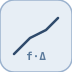

# interpolationPrelookup


<p align="center">

</p>
Interpole une Table statique a partir du couple [k, f] issu d un prelookup.

## 📝 Syntaxe

- Type de bloc : interpolationPrelookup

## 📥 Argument d'entrée

- ports d entree - 1 port(s) d entree declare(s).

## 📤 Argument de sortie

- ports de sortie - 1 port(s) de sortie declare(s).

## 📄 Description


Interpole une Table statique a partir du couple [k, f] issu d un prelookup. 

| Champ | Valeur |
| --- | --- |
| Module | <code>nflow_blocks</code> | 
| Bibliotheque | Tables de correspondance | 
| Type | <code>interpolationPrelookup</code> | 
| Libelle | Interpolation Using Prelookup | 

  

<b>Description</b> 

Interpole la <code>Table</code> statique a l'aide du couple indice/fraction produit par un bloc <code>prelookup</code>. Le port d'entree 0 est le vecteur a 2 elements <code>[k, f]</code> ; la sortie est <code>tbl[k] + f * (tbl[k+1] - tbl[k])</code>, soit une interpolation lineaire a l'intervalle partage. k est borne a un indice de table valide. Partager un seul <code>prelookup</code> entre plusieurs de ces blocs evite de refaire la recherche d'intervalle par table. 

Execution native (l'entree a 2 elements sera generee en code ulterieurement). 

<b>Ports</b> 

<b>Entree(s)</b> 

| Port | Role | Cote | Position | 
| --- | --- | --- | --- | 
| Port\_1 | Signal numerique lu par le bloc. | gauche | x=0, y=40 | 

 

<b>Sortie(s)</b> 

| Port | Role | Cote | Position | 
| --- | --- | --- | --- | 
| Port\_1 | Signal numerique produit par le bloc. | droite | x=90, y=40 | 

 

<b>Parametres</b> 

| Parametre | Valeur par defaut | 
| --- | --- | 
| <code>Table</code> | [0 1 4 9 16] | 

 

<b>Caracteristiques du bloc</b> 

| Champ | Valeur |
| --- | --- |
| Type de bloc | interpolationPrelookup | 
| Famille | Tables de correspondance | 
| Taille rendue | 90 x 80 | 
| Phases | ALGEBRAIC | 
| Etat interne ou historique | non | 
| Type de donnees du signal | valeurs numeriques double | 

 

<b>Algorithmes</b> 

- ALGEBRAIC : out = tbl[k] + f \* (tbl[k+1] - tbl[k]). 

<b>Equation ou regle</b> 
$$y = t_k + f\,(t_{k+1} - t_k)$$
 

<b>Capacites etendues</b> 

<b>Sources d implementation</b> 

Generation de code : prise en charge pour C et Rust. 

**Manifest:** `modules/nflow_blocks/libraries/lookup/library.json`
 

**Runtime:** `modules/nflow_blocks/src/cpp/lookup/interpolationPrelookup.cpp`


## 💡 Exemple

Voir l'exemple prelookup, qui cable prelookup vers ce bloc.

```matlab
% See the prelookup example for a complete Prelookup -> Interpolation wiring.
```


## 🔗 Voir aussi

[prelookup](../../nflow_blocks/lookup/prelookup.md), [lookup1D](../../nflow_blocks/lookup/lookup1D.md).

## 🕔 Historique

| Version | 📄 Description     |
| ------- | --------------- |
| 1.0.0   | initial version |

<!--
## 👤 Auteur

Allan CORNET
-->
