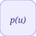

# polynomial


<p align="center">

</p>
Evalue un polynome de Coefficients constants (puissance la plus haute d abord).

## 📝 Syntaxe

- Type de bloc : polynomial

## 📥 Argument d'entrée

- ports d entree - 1 port(s) d entree declare(s).

## 📤 Argument de sortie

- ports de sortie - 1 port(s) de sortie declare(s).

## 📄 Description


Evalue un polynome de Coefficients constants (puissance la plus haute d abord). 

| Champ | Valeur |
| --- | --- |
| Module | <code>nflow_blocks</code> | 
| Bibliotheque | Operations mathematiques | 
| Type | <code>polynomial</code> | 
| Libelle | Polynomial | 

  

<b>Description</b> 

Evalue un polynome de <code>Coefficients</code> constants (puissance la plus haute d'abord, ordre polyval) a l'entree par la methode de Horner. Pour Coefficients = [a b c], out = a\*u^2 + b\*u + c. Retour algebrique pur, element par element ; la forme de Horner est deroulee sur les coefficients statiques dans le code genere. 

<b>Ports</b> 

<b>Entree(s)</b> 

| Port | Role | Cote | Position | 
| --- | --- | --- | --- | 
| Port\_1 | Signal numerique lu par le bloc. | gauche | x=0, y=40 | 

 

<b>Sortie(s)</b> 

| Port | Role | Cote | Position | 
| --- | --- | --- | --- | 
| Port\_1 | Signal numerique produit par le bloc. | droite | x=80, y=40 | 

 

<b>Parametres</b> 

| Parametre | Valeur par defaut | 
| --- | --- | 
| <code>Coefficients</code> | [1 0 0] | 

 

<b>Caracteristiques du bloc</b> 

| Champ | Valeur |
| --- | --- |
| Type de bloc | polynomial | 
| Famille | Operations mathematiques | 
| Taille rendue | 80 x 80 | 
| Phases | ALGEBRAIC | 
| Etat interne ou historique | non | 
| Type de donnees du signal | valeurs numeriques double | 

 

<b>Algorithmes</b> 

- ALGEBRAIC : evaluation de Horner acc = c[0] ; acc = acc\*u + c[k] pour k = 1..n-1. 

<b>Equation ou regle</b> 
$$y = \sum_{k=0}^{n-1} c_k\, u^{\,n-1-k}$$
 

<b>Capacites etendues</b> 

<b>Sources d implementation</b> 

Generation de code : prise en charge pour C et Rust. 

**Manifest:** `modules/nflow_blocks/libraries/math/library.json`
 

**Runtime:** `modules/nflow_blocks/src/cpp/math/polynomial.cpp`


## 💡 Exemple

Coefficients [1 -2 3] en u = 2 : 1*4 - 2*2 + 3 = 3.

```matlab
d.blocks={ struct('id','c','type','constant','inputs',0,'outputs',1,'params',struct('Value',2)), struct('id','g','type','polynomial','inputs',1,'outputs',1,'params',struct('Coefficients',[1 -2 3])), struct('id','w','type','toWorkspace','inputs',1,'outputs',0,'params',struct('VariableName','y','SaveFormat','Array')) };
d.connections={ struct('from','c','to','g','fromIndex',0,'toIndex',0), struct('from','g','to','w','fromIndex',0,'toIndex',0) };
d.sampleTime=0.1; d.duration=0.2; d.solver='discrete'; d.variables=struct();
r=jsondecode(__nflow_simulate__(jsonencode(d)));
```


## 🔗 Voir aussi

[gain](../../nflow_blocks/math/gain.md), [mathFunction](../../nflow_blocks/math/mathFunction.md).

## 🕔 Historique

| Version | 📄 Description     |
| ------- | --------------- |
| 1.0.0   | initial version |

<!--
## 👤 Auteur

Allan CORNET
-->
