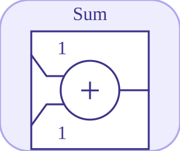

# sum

<p align="center">

</p>
Additionne les entrees connectees avec des signes configurables.

## 📝 Syntaxe

- Block type: sum

## 📥 Argument d'entrée

- input ports - 3 port(s) d entree declare(s).

## 📤 Argument de sortie

- output ports - 1 port(s) de sortie declare(s).

## 📄 Description

Additionne les entrees connectees avec des signes configurables.

| Champ        | Valeur                    |
| ------------ | ------------------------- |
| Module       | <code>nflow_blocks</code> |
| Bibliotheque | Blocs mathematiques       |
| Type         | <code>sum</code>          |
| Libelle      | Sum                       |

<b>Description</b>

Additionne les entrees connectees avec des signes configurables.

<b>Ports</b>

<b>Entree(s)</b>

| Port   | Role                             | Cote   | Position    |
| ------ | -------------------------------- | ------ | ----------- |
| Port_1 | Signal numerique lu par le bloc. | left   | x=-30, y=10 |
| Port_2 | Signal numerique lu par le bloc. | top    | x=10, y=-30 |
| Port_3 | Signal numerique lu par le bloc. | bottom | x=10, y=50  |

<b>Sortie(s)</b>

| Port   | Role                                  | Cote  | Position   |
| ------ | ------------------------------------- | ----- | ---------- |
| Port_1 | Signal numerique produit par le bloc. | right | x=50, y=10 |

<b>Parametres</b>

| Parametre          | Valeur par defaut |
| ------------------ | ----------------- |
| <code>signs</code> | [1, 1, 1]         |

<b>Cles de l inspecteur</b>

Ces cles serialisees sont exposees par l inspecteur du bloc.

- <code>signs</code>

<b>Caracteristiques du bloc</b>

| Champ                      | Valeur                             |
| -------------------------- | ---------------------------------- |
| Type de bloc               | sum                                |
| Famille                    | Blocs mathematiques                |
| Taille graphique           | 20 x 20                            |
| Phases                     | ALGEBRAIC                          |
| Traversee directe          | oui                                |
| Etat ou historique interne | non observe dans le code documente |
| Type de donnees signaux    | valeurs numeriques double          |

<b>Algorithmes</b>

- Bloc algebrique.
- signs fournit un signe par entree; les signes manquants valent +1 et les ports deconnectes sont ignores.

<b>Equation ou regle</b>
$$y = \sum_i sign_i\,u_i$$

<b>Capacites et limites</b>

La page decrit le comportement runtime natif observe dans les sources C++ du module. Les phases declarees indiquent quand le moteur de simulation appelle le bloc.

Generation de code : prise en charge pour C et Rust.

<b>Sources d implementation</b>

<details>
<summary>Manifest: <code>modules/nflow_blocks/libraries/math/library.json</code></summary>

```json
{
  "id": "builtin.math",
  "title": "Math",
  "version": "1.0.0",
  "format": "nflow-2",
  "metadata": {
    "author": "Allan CORNET",
    "created": "2026-03-21",
    "tool": "Nelson nflow"
  },
  "builtin": true,
  "comment": "Basic math blocks",
  "license": "LGPL-3.0",
  "blocks": [
    {
      "type": "matmul",
      "label": "MatMul",
      "icon": "matmul.svg",
      "phases": ["ALGEBRAIC"],
      "width": 60,
      "height": 60,
      "inputs": [
        {
          "x": 0,
          "y": 20,
          "side": "left"
        },
        {
          "x": 0,
          "y": 40,
          "side": "left"
        }
      ],
      "outputs": [
        {
          "x": 60,
          "y": 30,
          "side": "right"
        }
      ],
      "defaultParams": {
        "MultiplicationRule": "matrix"
      }
    },
    {
      "type": "sumElements",
      "label": "Sum of Elements",
      "icon": "sumElements.svg",
      "phases": ["ALGEBRAIC"],
      "width": 80,
      "height": 80,
      "inputs": [
        {
          "x": 0,
          "y": 40,
          "side": "left"
        }
      ],
      "outputs": [
        {
          "x": 80,
          "y": 40,
          "side": "right"
        }
      ],
      "defaultParams": {},
      "render": {
        "type": "image",
        "src": "exports/sumElements.svg",
        "svgMode": "element",
        "preserveAspectRatio": "none",
        "x": 0,
        "y": 0,
        "width": 80,
        "height": 80
      }
    },
    {
      "type": "productOfElements",
      "label": "Product of Elements",
      "icon": "productOfElements.svg",
      "phases": ["ALGEBRAIC"],
      "width": 80,
      "height": 80,
      "inputs": [
        {
          "x": 0,
          "y": 40,
          "side": "left"
        }
      ],
      "outputs": [
        {
          "x": 80,
          "y": 40,
          "side": "right"
        }
      ],
      "defaultParams": {},
      "render": {
        "type": "image",
        "src": "exports/productOfElements.svg",
        "svgMode": "element",
        "preserveAspectRatio": "none",
        "x": 0,
        "y": 0,
        "width": 80,
        "height": 80
      }
    },
    {
      "type": "dotProduct",
      "label": "Dot Product",
      "icon": "dotProduct.svg",
      "phases": ["ALGEBRAIC"],
      "width": 80,
      "height": 80,
      "inputs": [
        {
          "x": 0,
          "y": 30,
          "side": "left"
        },
        {
          "x": 0,
          "y": 50,
          "side": "left"
        }
      ],
      "outputs": [
        {
          "x": 80,
          "y": 40,
          "side": "right"
        }
      ],
      "defaultParams": {},
      "render": {
        "type": "image",
        "src": "exports/dotProduct.svg",
        "svgMode": "element",
        "preserveAspectRatio": "none",
        "x": 0,
        "y": 0,
        "width": 80,
        "height": 80
      }
    },
    {
      "type": "crossProduct",
      "label": "Cross Product",
      "icon": "crossProduct.svg",
      "phases": ["ALGEBRAIC"],
      "width": 80,
      "height": 80,
      "inputs": [
        {
          "x": 0,
          "y": 30,
          "side": "left"
        },
        {
          "x": 0,
          "y": 50,
          "side": "left"
        }
      ],
      "outputs": [
        {
          "x": 80,
          "y": 40,
          "side": "right"
        }
      ],
      "defaultParams": {},
      "render": {
        "type": "image",
        "src": "exports/crossProduct.svg",
        "svgMode": "element",
        "preserveAspectRatio": "none",
        "x": 0,
        "y": 0,
        "width": 80,
        "height": 80
      }
    },
    {
      "type": "gain",
      "label": "Gain",
      "icon": "gain.svg",
      "phases": ["ALGEBRAIC"],
      "width": 100,
      "height": 80,
      "inputs": [
        {
          "x": 0,
          "y": 40,
          "side": "left"
        }
      ],
      "outputs": [
        {
          "x": 100,
          "y": 40,
          "side": "right"
        }
      ],
      "defaultParams": {
        "Gain": 2
      },
      "render": {
        "type": "math",
        "formula": "{params.Gain}",
        "mathGroupClass": "gain-math",
        "textSize": "16px",
        "width": 100,
        "height": 80
      }
    },
    {
      "type": "sum",
      "label": "Sum",
      "icon": "sum.svg",
      "phases": ["ALGEBRAIC"],
      "width": 20,
      "height": 20,
      "inputs": [
        {
          "x": -30,
          "y": 10,
          "side": "left",
          "wireX": -10,
          "wireY": 10
        },
        {
          "x": 10,
          "y": -30,
          "side": "top",
          "wireX": 10,
          "wireY": -10
        },
        {
          "x": 10,
          "y": 50,
          "side": "bottom",
          "wireX": 10,
          "wireY": 30
        }
      ],
      "outputs": [
        {
          "x": 50,
          "y": 10,
          "side": "right",
          "wireX": 30,
          "wireY": 10
        }
      ],
      "defaultParams": {
        "Inputs": "+++"
      },
      "render": {
        "type": "math",
        "formula": "\\oplus",
        "mathGroupClass": "sum-math",
        "textSize": "16px",
        "width": 20,
        "height": 20
      }
    },
    {
      "type": "mult",
      "label": "Mult",
      "icon": "mult.svg",
      "phases": ["ALGEBRAIC"],
      "width": 20,
      "height": 20,
      "inputs": [
        {
          "x": -30,
          "y": 10,
          "side": "left",
          "wireX": -10,
          "wireY": 10
        },
        {
          "x": 10,
          "y": -30,
          "side": "top",
          "wireX": 10,
          "wireY": -10
        },
        {
          "x": 10,
          "y": 50,
          "side": "bottom",
          "wireX": 10,
          "wireY": 30
        }
      ],
      "outputs": [
        {
          "x": 50,
          "y": 10,
          "side": "right",
          "wireX": 30,
          "wireY": 10
        }
      ],
      "defaultParams": {},
      "render": {
        "type": "math",
        "formula": "\\otimes",
        "mathGroupClass": "mult-math",
        "textSize": "16px",
        "width": 20,
        "height": 20
      }
    },
    {
      "type": "abs",
      "label": "Abs",
      "icon": "abs.svg",
      "phases": ["ALGEBRAIC"],
      "width": 80,
      "height": 80,
      "inputs": [
        {
          "x": 0,
          "y": 40,
          "side": "left"
        }
      ],
      "outputs": [
        {
          "x": 80,
          "y": 40,
          "side": "right"
        }
      ],
      "defaultParams": {},
      "render": {
        "type": "math",
        "formula": "|x|",
        "mathGroupClass": "abs-math",
        "textSize": "16px",
        "width": 80,
        "height": 80
      }
    },
    {
      "type": "mathFunction",
      "label": "Math Function",
      "icon": "mathFunction.svg",
      "phases": ["ALGEBRAIC"],
      "width": 80,
      "height": 80,
      "inputs": [
        {
          "x": 0,
          "y": 40,
          "side": "left"
        }
      ],
      "outputs": [
        {
          "x": 80,
          "y": 40,
          "side": "right"
        }
      ],
      "defaultParams": {
        "Function": "exp"
      },
      "render": {
        "type": "image",
        "src": "exports/mathFunction.svg",
        "svgMode": "element",
        "preserveAspectRatio": "none",
        "x": 0,
        "y": 0,
        "width": 80,
        "height": 80
      }
    },
    {
      "type": "trigFunction",
      "label": "Trigonometric Function",
      "icon": "trigFunction.svg",
      "phases": ["ALGEBRAIC"],
      "width": 80,
      "height": 80,
      "inputs": [
        {
          "x": 0,
          "y": 40,
          "side": "left"
        }
      ],
      "outputs": [
        {
          "x": 80,
          "y": 40,
          "side": "right"
        }
      ],
      "defaultParams": {
        "Function": "sin"
      },
      "render": {
        "type": "image",
        "src": "exports/trigFunction.svg",
        "svgMode": "element",
        "preserveAspectRatio": "none",
        "x": 0,
        "y": 0,
        "width": 80,
        "height": 80
      }
    },
    {
      "type": "roundingFunction",
      "label": "Rounding Function",
      "icon": "roundingFunction.svg",
      "phases": ["ALGEBRAIC"],
      "width": 80,
      "height": 80,
      "inputs": [
        {
          "x": 0,
          "y": 40,
          "side": "left"
        }
      ],
      "outputs": [
        {
          "x": 80,
          "y": 40,
          "side": "right"
        }
      ],
      "defaultParams": {
        "Operator": "floor"
      },
      "render": {
        "type": "image",
        "src": "exports/roundingFunction.svg",
        "svgMode": "element",
        "preserveAspectRatio": "none",
        "x": 0,
        "y": 0,
        "width": 80,
        "height": 80
      }
    },
    {
      "type": "sign",
      "label": "Sign",
      "icon": "sign.svg",
      "phases": ["ALGEBRAIC"],
      "width": 80,
      "height": 80,
      "inputs": [
        {
          "x": 0,
          "y": 40,
          "side": "left"
        }
      ],
      "outputs": [
        {
          "x": 80,
          "y": 40,
          "side": "right"
        }
      ],
      "defaultParams": {},
      "render": {
        "type": "image",
        "src": "exports/sign.svg",
        "svgMode": "element",
        "preserveAspectRatio": "none",
        "x": 0,
        "y": 0,
        "width": 80,
        "height": 80
      }
    },
    {
      "type": "sqrt",
      "label": "Sqrt",
      "icon": "sqrt.svg",
      "phases": ["ALGEBRAIC"],
      "width": 80,
      "height": 80,
      "inputs": [
        {
          "x": 0,
          "y": 40,
          "side": "left"
        }
      ],
      "outputs": [
        {
          "x": 80,
          "y": 40,
          "side": "right"
        }
      ],
      "defaultParams": {
        "Function": "sqrt"
      },
      "render": {
        "type": "image",
        "src": "exports/sqrt.svg",
        "svgMode": "element",
        "preserveAspectRatio": "none",
        "x": 0,
        "y": 0,
        "width": 80,
        "height": 80
      }
    },
    {
      "type": "divide",
      "label": "Divide",
      "icon": "divide.svg",
      "phases": ["ALGEBRAIC"],
      "width": 80,
      "height": 80,
      "inputs": [
        {
          "x": 0,
          "y": 30,
          "side": "left"
        },
        {
          "x": 0,
          "y": 50,
          "side": "left"
        }
      ],
      "outputs": [
        {
          "x": 80,
          "y": 40,
          "side": "right"
        }
      ],
      "defaultParams": {},
      "render": {
        "type": "image",
        "src": "exports/divide.svg",
        "svgMode": "element",
        "preserveAspectRatio": "none",
        "x": 0,
        "y": 0,
        "width": 80,
        "height": 80
      }
    },
    {
      "type": "negate",
      "label": "Negate",
      "icon": "negate.svg",
      "phases": ["ALGEBRAIC"],
      "width": 80,
      "height": 80,
      "inputs": [
        {
          "x": 0,
          "y": 40,
          "side": "left"
        }
      ],
      "outputs": [
        {
          "x": 80,
          "y": 40,
          "side": "right"
        }
      ],
      "defaultParams": {},
      "render": {
        "type": "image",
        "src": "exports/negate.svg",
        "svgMode": "element",
        "preserveAspectRatio": "none",
        "x": 0,
        "y": 0,
        "width": 80,
        "height": 80
      }
    },
    {
      "type": "bias",
      "label": "Bias",
      "icon": "bias.svg",
      "phases": ["ALGEBRAIC"],
      "width": 80,
      "height": 80,
      "inputs": [
        {
          "x": 0,
          "y": 40,
          "side": "left"
        }
      ],
      "outputs": [
        {
          "x": 80,
          "y": 40,
          "side": "right"
        }
      ],
      "defaultParams": {
        "Bias": 1
      },
      "render": {
        "type": "image",
        "src": "exports/bias.svg",
        "svgMode": "element",
        "preserveAspectRatio": "none",
        "x": 0,
        "y": 0,
        "width": 80,
        "height": 80
      }
    },
    {
      "type": "min",
      "label": "Min",
      "icon": "min.svg",
      "phases": ["ALGEBRAIC"],
      "width": 80,
      "height": 80,
      "inputs": [
        {
          "x": 0,
          "y": 30,
          "side": "left"
        },
        {
          "x": 0,
          "y": 50,
          "side": "left"
        }
      ],
      "outputs": [
        {
          "x": 80,
          "y": 40,
          "side": "right"
        }
      ],
      "defaultParams": {},
      "render": {
        "type": "math",
        "formula": "min(x,y)",
        "mathGroupClass": "min-math",
        "textSize": "16px",
        "width": 80,
        "height": 80
      }
    },
    {
      "type": "max",
      "label": "Max",
      "icon": "max.svg",
      "phases": ["ALGEBRAIC"],
      "width": 80,
      "height": 80,
      "inputs": [
        {
          "x": 0,
          "y": 30,
          "side": "left"
        },
        {
          "x": 0,
          "y": 50,
          "side": "left"
        }
      ],
      "outputs": [
        {
          "x": 80,
          "y": 40,
          "side": "right"
        }
      ],
      "defaultParams": {},
      "render": {
        "type": "math",
        "formula": "max(x,y)",
        "mathGroupClass": "max-math",
        "textSize": "16px",
        "width": 80,
        "height": 80
      }
    },
    {
      "type": "realImagToComplex",
      "label": "Re-Im to Complex",
      "icon": "realImagToComplex.svg",
      "phases": ["ALGEBRAIC"],
      "width": 60,
      "height": 60,
      "inputs": [
        {
          "x": 0,
          "y": 20,
          "side": "left"
        },
        {
          "x": 0,
          "y": 40,
          "side": "left"
        }
      ],
      "outputs": [
        {
          "x": 60,
          "y": 30,
          "side": "right"
        }
      ],
      "defaultParams": {}
    },
    {
      "type": "complexToRealImag",
      "label": "Complex to Re-Im",
      "icon": "complexToRealImag.svg",
      "phases": ["ALGEBRAIC"],
      "width": 60,
      "height": 60,
      "inputs": [
        {
          "x": 0,
          "y": 30,
          "side": "left"
        }
      ],
      "outputs": [
        {
          "x": 60,
          "y": 20,
          "side": "right"
        },
        {
          "x": 60,
          "y": 40,
          "side": "right"
        }
      ],
      "defaultParams": {}
    },
    {
      "type": "magnitudeAngleToComplex",
      "label": "Mag-Angle to Complex",
      "icon": "magnitudeAngleToComplex.svg",
      "phases": ["ALGEBRAIC"],
      "width": 60,
      "height": 60,
      "inputs": [
        {
          "x": 0,
          "y": 20,
          "side": "left"
        },
        {
          "x": 0,
          "y": 40,
          "side": "left"
        }
      ],
      "outputs": [
        {
          "x": 60,
          "y": 30,
          "side": "right"
        }
      ],
      "defaultParams": {}
    },
    {
      "type": "complexToMagnitudeAngle",
      "label": "Complex to Mag-Angle",
      "icon": "complexToMagnitudeAngle.svg",
      "phases": ["ALGEBRAIC"],
      "width": 60,
      "height": 60,
      "inputs": [
        {
          "x": 0,
          "y": 30,
          "side": "left"
        }
      ],
      "outputs": [
        {
          "x": 60,
          "y": 20,
          "side": "right"
        },
        {
          "x": 60,
          "y": 40,
          "side": "right"
        }
      ],
      "defaultParams": {}
    },
    {
      "type": "conjugate",
      "label": "Conjugate",
      "icon": "conjugate.svg",
      "phases": ["ALGEBRAIC"],
      "width": 60,
      "height": 60,
      "inputs": [
        {
          "x": 0,
          "y": 30,
          "side": "left"
        }
      ],
      "outputs": [
        {
          "x": 60,
          "y": 30,
          "side": "right"
        }
      ],
      "defaultParams": {}
    },
    {
      "type": "atan2",
      "label": "Atan2",
      "icon": "atan2.svg",
      "phases": ["ALGEBRAIC"],
      "width": 60,
      "height": 60,
      "inputs": [
        {
          "x": 0,
          "y": 20,
          "side": "left"
        },
        {
          "x": 0,
          "y": 40,
          "side": "left"
        }
      ],
      "outputs": [
        {
          "x": 60,
          "y": 30,
          "side": "right"
        }
      ],
      "defaultParams": {}
    },
    {
      "type": "wrapToZero",
      "label": "Wrap To Zero",
      "icon": "wrapToZero.svg",
      "phases": ["ALGEBRAIC"],
      "width": 80,
      "height": 80,
      "inputs": [
        {
          "x": 0,
          "y": 40,
          "side": "left"
        }
      ],
      "outputs": [
        {
          "x": 80,
          "y": 40,
          "side": "right"
        }
      ],
      "defaultParams": {
        "Threshold": 255
      },
      "render": {
        "type": "image",
        "src": "exports/wrapToZero.svg",
        "svgMode": "element",
        "preserveAspectRatio": "none",
        "x": 0,
        "y": 0,
        "width": 80,
        "height": 80
      }
    },
    {
      "type": "polynomial",
      "label": "Polynomial",
      "icon": "polynomial.svg",
      "phases": ["ALGEBRAIC"],
      "width": 80,
      "height": 80,
      "inputs": [
        {
          "x": 0,
          "y": 40,
          "side": "left"
        }
      ],
      "outputs": [
        {
          "x": 80,
          "y": 40,
          "side": "right"
        }
      ],
      "defaultParams": {
        "Coefficients": [1, 0, 0]
      },
      "render": {
        "type": "image",
        "src": "exports/polynomial.svg",
        "svgMode": "element",
        "preserveAspectRatio": "none",
        "x": 0,
        "y": 0,
        "width": 80,
        "height": 80
      }
    }
  ]
}
```

</details>


<details>
<summary>Runtime: <code>modules/nflow_blocks/src/cpp/math/sum.cpp</code></summary>

```cpp
//=============================================================================
// Copyright (c) 2016-present Allan CORNET (Nelson)
//=============================================================================
// This file is part of Nelson.
//=============================================================================
// LICENCE_BLOCK_BEGIN
// SPDX-License-Identifier: LGPL-3.0-or-later
// LICENCE_BLOCK_END
//=============================================================================
#include "SimEngineTypes.hpp"
#include "BlockRegistry.hpp"
#include "FieldNames.hpp"
#include "NFlowBlockDescriptor.hpp"
#include "NFlowCodegenHelpers.hpp"
#include "NFlowCodegenTyped.hpp"
#include "math_blocks.hpp"
#include <cmath>
#include <algorithm>
//=============================================================================
namespace {
// Exact-64 sum emission shared by both languages: fold the connected inputs
// through saturating/wrapping add/sub per the signs string.
Nelson::NFlow::BlockCodegenEmitFn
sumTypedEmitter(bool cLang)
{
    using namespace Nelson::NFlow;
    return [cLang](const BlockCodegenArgs& a) {
        const bool uns = codegenIsU64(a.outType);
        const bool sat = codegenSaturates(a);
        std::string signs = nflow::jstr(*a.params, nflow::kSumInputs, "");
        std::string acc;
        bool first = true;
        for (int i = 0; i < static_cast<int>(a.inputIds.size()); ++i) {
            if (a.inputIds[i].empty()) {
                continue;
            }
            const std::string expr = (i < (int)a.in.size()) ? a.in[i] : "";
            const bool minus = (i < (int)signs.size() && signs[i] == '-');
            if (first) {
                if (minus) {
                    acc = codegenI64BinOp("sub",
                        cLang ? (uns ? "0ULL" : "0LL") : (uns ? "0_u64" : "0_i64"), expr, uns, sat,
                        cLang);
                } else {
                    acc = expr;
                }
                first = false;
                continue;
            }
            acc = codegenI64BinOp(minus ? "sub" : "add", acc, expr, uns, sat, cLang);
        }
        if (acc.empty()) {
            acc = cLang ? (uns ? "0ULL" : "0LL") : (uns ? "0_u64" : "0_i64");
        }
        a.line("out_" + a.id + " = " + acc + ";");
    };
}
} // namespace
//=============================================================================
bool
Nelson::NFlow::handleSum(SimCtx& ctx, const Block& b, Phase phase)
{
    if (phase != Phase::ALGEBRAIC) {
        return false;
    }
    int n = numInputs(ctx, b.nid);

    std::string signs;
    if (b.params.contains(nflow::kSumInputs) && b.params[nflow::kSumInputs].is_string()) {
        signs = b.params[nflow::kSumInputs].get<std::string>();
    }

    std::vector<SigView> ins(n);
    for (int i = 0; i < n; ++i) {
        ins[i] = getInputSig(ctx, b.nid, i);
    }
    if (const PortSig* ps = exact64OutPort(ctx, b.nid)) {
        const SigType ty = ps->type;
        const bool sat = blockSaturates(ctx, b.nid);
        return emitElementwiseI64(ctx, b.nid, [&](int k) {
            long long out = 0;
            for (int i = 0; i < n; ++i) {
                const long long v = sigAtI64(ins[i], k, ty);
                const bool minus = (i < (int)signs.size() && signs[i] == '-');
                out = minus ? i64ApplySub(out, v, ty, sat) : i64ApplyAdd(out, v, ty, sat);
            }
            return out;
        });
    }
    if (complexOutPort(ctx, b.nid)) {
        return emitElementwiseComplex(ctx, b.nid, [&](int k) {
            std::complex<double> out { 0.0, 0.0 };
            for (int i = 0; i < n; ++i) {
                const double sign = (i < (int)signs.size() && signs[i] == '-') ? -1.0 : 1.0;
                out += sigAtC(ins[i], k) * sign;
            }
            return out;
        });
    }
    return emitElementwise(ctx, b.nid, [&](int k) {
        double out = 0.0;
        for (int i = 0; i < n; ++i) {
            double sign = (i < (int)signs.size() && signs[i] == '-') ? -1.0 : 1.0;
            out += sigAt(ins[i], k) * sign;
        }
        return out;
    });
}
//=============================================================================
Nelson::NFlow::BlockCodegenTemplate
Nelson::NFlow::getCodeGenCSum()
{
    BlockCodegenTemplate t;
    // Variable-arity emission with per-input signs: needs a native emitter.
    t.emitStep = [](const BlockCodegenArgs& a) {
        std::string signs = nflow::jstr(*a.params, nflow::kSumInputs, "");
        std::vector<std::string> terms;
        for (int i = 0; i < static_cast<int>(a.inputIds.size()); ++i) {
            if (a.inputIds[i].empty()) {
                continue;
            }
            bool minus = (i < static_cast<int>(signs.size()) && signs[i] == '-');
            // a.in[i] is the per-port input expression (already wrapped).
            std::string expr = (i < static_cast<int>(a.in.size())) ? a.in[i] : "0.0";
            terms.push_back(minus ? "-" + expr : expr);
        }
        if (terms.empty()) {
            terms.push_back("0.0");
        }
        std::string joined;
        for (size_t i = 0; i < terms.size(); ++i) {
            if (i > 0) {
                joined += " + ";
            }
            joined += terms[i];
        }
        a.line("out_" + a.id + " = " + joined + ";");
    };
    t.emitStepTyped = sumTypedEmitter(true);
    return t;
}
//=============================================================================
Nelson::NFlow::BlockCodegenTemplate
Nelson::NFlow::getCodeGenRustSum()
{
    BlockCodegenTemplate t;
    t.emitStep = [](const BlockCodegenArgs& a) {
        std::vector<std::string> inList;
        for (size_t i = 0; i < a.inputIds.size(); ++i) {
            // a.in[i] is the per-port input expression.
            inList.push_back(a.inputIds[i].empty() || i >= a.in.size() ? "0.0_f64" : a.in[i]);
        }
        std::string expr = "0.0_f64";
        std::string signs = nflow::jstr(*a.params, nflow::kSumInputs, "");
        for (int i = 0; i < static_cast<int>(inList.size()); ++i) {
            char sign = (i < static_cast<int>(signs.size()) && signs[i] == '-') ? '-' : '+';
            expr = (i == 0 && sign == '+') ? inList[i] : expr + " " + sign + " " + inList[i];
        }
        if (inList.empty()) {
            expr = "0.0_f64";
        }
        a.line("out_" + a.id + " = " + expr + ";");
    };
    t.emitStepTyped = sumTypedEmitter(false);
    return t;
}
//=============================================================================

```

</details>

## 🔗 Voir aussi

[gain](../../nflow_blocks/math/gain.md), [bias](../../nflow_blocks/math/bias.md), [negate](../../nflow_blocks/math/negate.md).

## 🕔 Historique

| Version | 📄 Description  |
| ------- | --------------- |
| 1.0.0   | initial version |

<!--
## 👤 Auteur

Allan CORNET
-->
