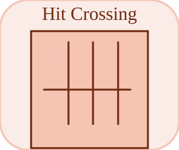

# hitCrossing

<p align="center">

</p>
Sort 1 au pas ou l entree franchit HitCrossingOffset.

## 📝 Syntaxe

- Type de bloc : hitCrossing

## 📥 Argument d'entrée

- ports d entree - 1 port(s) d entree declare(s).

## 📤 Argument de sortie

- ports de sortie - 1 port(s) de sortie declare(s).

## 📄 Description

Sort 1 au pas ou l entree franchit HitCrossingOffset.

| Champ        | Valeur                    |
| ------------ | ------------------------- |
| Module       | <code>nflow_blocks</code> |
| Bibliotheque | Non lineaire              |
| Type         | <code>hitCrossing</code>  |
| Libelle      | Hit Crossing              |

<b>Description</b>

Detecte quand l'entree scalaire atteint <code>HitCrossingOffset</code> dans la direction configuree et sort 1 au pas ou le franchissement se produit, sinon 0. <code>HitCrossingDirection</code> vaut "rising", "falling" ou "either". Avec etat : l'entree precedente (relative a l'offset) est memorisee pour detecter un chevauchement, et le premier pas est amorce pour ne jamais declencher a tort.

Comme l'entree est lue en phase OUTPUT, pilotez ce bloc depuis une source plutot qu'a travers un bloc ALGEBRAIC transparent (dont la sortie serait en retard d'un pas).

<b>Ports</b>

<b>Entree(s)</b>

| Port   | Role                             | Cote   | Position  |
| ------ | -------------------------------- | ------ | --------- |
| Port_1 | Signal numerique lu par le bloc. | gauche | x=0, y=40 |

<b>Sortie(s)</b>

| Port   | Role                                  | Cote   | Position   |
| ------ | ------------------------------------- | ------ | ---------- |
| Port_1 | Signal numerique produit par le bloc. | droite | x=80, y=40 |

<b>Parametres</b>

| Parametre                         | Valeur par defaut |
| --------------------------------- | ----------------- |
| <code>HitCrossingOffset</code>    | 0                 |
| <code>HitCrossingDirection</code> | either            |

<b>Caracteristiques du bloc</b>

| Champ                      | Valeur                    |
| -------------------------- | ------------------------- |
| Type de bloc               | hitCrossing               |
| Famille                    | Non lineaire              |
| Taille rendue              | 80 x 80                   |
| Phases                     | INIT, OUTPUT, UPDATE      |
| Etat interne ou historique | oui                       |
| Type de donnees du signal  | valeurs numeriques double |

<b>Algorithmes</b>

- OUTPUT : out = franchissement(prev - offset, u - offset, direction) ? 1 : 0. UPDATE : prev = u.

<b>Equation ou regle</b>
$$y_k = [\,(u_{k-1}-\text{off})\,\text{and}\,(u_k-\text{off})\ \text{straddle } 0\,]$$

<b>Capacites etendues</b>

<b>Sources d implementation</b>

Generation de code : prise en charge pour C et Rust.

<details>
<summary>Manifest: <code>modules/nflow_blocks/libraries/nonlinear/library.json</code></summary>

```json
{
  "id": "builtin.nonlinear",
  "title": "Non-Linear",
  "version": "1.0.0",
  "format": "nflow-2",
  "metadata": {
    "author": "Allan CORNET",
    "created": "2026-03-21",
    "tool": "Nelson nflow"
  },
  "comment": "Blocks for non-linearities",
  "license": "LGPL-3.0",
  "builtin": true,
  "blocks": [
    {
      "type": "saturation",
      "icon": "saturation.svg",
      "label": "Saturation",
      "phases": ["ALGEBRAIC"],
      "width": 80,
      "height": 80,
      "inputs": [
        {
          "x": 0,
          "y": 40,
          "side": "left"
        }
      ],
      "outputs": [
        {
          "x": 80,
          "y": 40,
          "side": "right"
        }
      ],
      "defaultParams": {
        "LowerLimit": -1,
        "UpperLimit": 1
      },
      "render": {
        "type": "image",
        "src": "saturation.svg"
      }
    },
    {
      "type": "hysteresis",
      "label": "Relay",
      "icon": "hysteresis.svg",
      "phases": ["INIT", "OUTPUT", "UPDATE"],
      "width": 80,
      "height": 80,
      "inputs": [
        {
          "x": 0,
          "y": 40,
          "side": "left"
        }
      ],
      "outputs": [
        {
          "x": 80,
          "y": 40,
          "side": "right"
        }
      ],
      "defaultParams": {
        "uHigh": 1,
        "uLow": -1,
        "yHigh": 1,
        "yLow": 0
      },
      "render": {
        "type": "image",
        "src": "hysteresis.svg"
      }
    },
    {
      "type": "rate",
      "label": "Rate Lim.",
      "icon": "rate.svg",
      "phases": ["INIT", "OUTPUT", "UPDATE"],
      "width": 80,
      "height": 80,
      "inputs": [
        {
          "x": 0,
          "y": 40,
          "side": "left"
        }
      ],
      "outputs": [
        {
          "x": 80,
          "y": 40,
          "side": "right"
        }
      ],
      "defaultParams": {
        "RisingSlewLimit": 1,
        "FallingSlewLimit": 1
      },
      "render": {
        "type": "image",
        "src": "rate.svg"
      }
    },
    {
      "type": "backlash",
      "label": "Backlash",
      "icon": "backlash.svg",
      "phases": ["INIT", "OUTPUT", "UPDATE"],
      "width": 80,
      "height": 80,
      "inputs": [
        {
          "x": 0,
          "y": 40,
          "side": "left"
        }
      ],
      "outputs": [
        {
          "x": 80,
          "y": 40,
          "side": "right"
        }
      ],
      "defaultParams": {
        "BacklashWidth": 1
      },
      "render": {
        "type": "image",
        "src": "backlash.svg"
      }
    },
    {
      "type": "deadZone",
      "label": "Dead Zone",
      "icon": "deadZone.svg",
      "phases": ["ALGEBRAIC"],
      "width": 80,
      "height": 80,
      "inputs": [
        {
          "x": 0,
          "y": 40,
          "side": "left"
        }
      ],
      "outputs": [
        {
          "x": 80,
          "y": 40,
          "side": "right"
        }
      ],
      "defaultParams": {
        "LowerValue": -1,
        "UpperValue": 1
      },
      "render": {
        "type": "image",
        "src": "deadZone.svg",
        "svgMode": "element",
        "preserveAspectRatio": "none",
        "x": 0,
        "y": 0,
        "width": 80,
        "height": 80
      }
    },
    {
      "type": "quantizer",
      "label": "Quantizer",
      "icon": "quantizer.svg",
      "phases": ["ALGEBRAIC"],
      "width": 80,
      "height": 80,
      "inputs": [
        {
          "x": 0,
          "y": 40,
          "side": "left"
        }
      ],
      "outputs": [
        {
          "x": 80,
          "y": 40,
          "side": "right"
        }
      ],
      "defaultParams": {
        "QuantizationInterval": 1
      },
      "render": {
        "type": "image",
        "src": "quantizer.svg",
        "svgMode": "element",
        "preserveAspectRatio": "none",
        "x": 0,
        "y": 0,
        "width": 80,
        "height": 80
      }
    },
    {
      "type": "hitCrossing",
      "icon": "hitCrossing.svg",
      "label": "Hit Crossing",
      "phases": ["INIT", "OUTPUT", "UPDATE"],
      "width": 80,
      "height": 80,
      "inputs": [
        {
          "x": 0,
          "y": 40,
          "side": "left"
        }
      ],
      "outputs": [
        {
          "x": 80,
          "y": 40,
          "side": "right"
        }
      ],
      "defaultParams": {
        "HitCrossingOffset": 0,
        "HitCrossingDirection": "either"
      },
      "render": {
        "type": "image",
        "src": "hitCrossing.svg"
      }
    },
    {
      "type": "coulombViscousFriction",
      "label": "Coulomb & Viscous Friction",
      "icon": "coulombViscousFriction.svg",
      "phases": ["ALGEBRAIC"],
      "width": 80,
      "height": 80,
      "inputs": [
        {
          "x": 0,
          "y": 40,
          "side": "left"
        }
      ],
      "outputs": [
        {
          "x": 80,
          "y": 40,
          "side": "right"
        }
      ],
      "defaultParams": {
        "Gain": 1,
        "Offset": 1
      },
      "render": {
        "type": "image",
        "src": "coulombViscousFriction.svg",
        "svgMode": "element",
        "preserveAspectRatio": "none",
        "x": 0,
        "y": 0,
        "width": 80,
        "height": 80
      }
    }
  ]
}
```

</details>


<details>
<summary>Runtime: <code>modules/nflow_blocks/src/cpp/nonlinear/hitCrossing.cpp</code></summary>

```cpp
//=============================================================================
// Copyright (c) 2016-present Allan CORNET (Nelson)
//=============================================================================
// This file is part of Nelson.
//=============================================================================
// LICENCE_BLOCK_BEGIN
// SPDX-License-Identifier: LGPL-3.0-or-later
// LICENCE_BLOCK_END
//=============================================================================
// hitCrossing: detects when the (scalar) input reaches HitCrossingOffset in the
// configured direction and outputs 1.0 on the step where the crossing happens,
// else 0.0. Direction is "rising", "falling" or "either" (default). Stateful:
// the previous input (relative to the offset) is held so a straddle can be
// detected. The first step has nothing to straddle, so it fires only when the
// input STARTS on the offset - which is a hit, and the only one that instant
// can report. C / Rust code generation.
//=============================================================================
#include "SimEngineTypes.hpp"
#include "BlockRegistry.hpp"
#include "FieldNames.hpp"
#include "NFlowBlockDescriptor.hpp"
#include <cmath>
#include <string>
#include "nonlinear_blocks.hpp"
//=============================================================================
namespace Nelson {
namespace NFlow {
    //=============================================================================
    // Direction codes: 0 = either, 1 = rising, 2 = falling.
    static int
    hcDirection(const nflow::BlockDescriptor& bd)
    {
        const std::string d = bd.paramStr("HitCrossingDirection", "either");
        if (d == "rising") {
            return 1;
        }
        if (d == "falling") {
            return 2;
        }
        return 0;
    }
    //=============================================================================
    static bool
    hcHit(double prev, double cur, int dir)
    {
        const bool rising = (prev < 0.0 && cur >= 0.0);
        const bool falling = (prev > 0.0 && cur <= 0.0);
        if (dir == 1) {
            return rising;
        }
        if (dir == 2) {
            return falling;
        }
        return rising || falling;
    }
    //=============================================================================
    bool
    handleHitCrossing(SimCtx& ctx, const Block& b, Phase phase)
    {
        auto& st = getState(ctx, b.nid);
        if (phase == Phase::INIT) {
            st.scalar = 0.0; // previous input relative to the offset
            st.scalar2 = 0.0; // primed flag (0 until the first step is seen)
            st.output = 0.0;
            return false;
        }
        nflow::BlockDescriptor bd(b, ctx.variables);
        const double off = bd.paramDouble("HitCrossingOffset", 0.0);
        if (phase == Phase::OUTPUT) {
            const double cur = getInput(ctx, b.nid, 0, 0.0) - off;
            double out = 0.0;
            if (st.scalar2 != 0.0) {
                out = hcHit(st.scalar, cur, hcDirection(bd)) ? 1.0 : 0.0;
            } else if (cur == 0.0) {
                // Starts on the offset: a hit, whatever direction was asked for
                // (there is no previous sample to give the crossing a sign).
                out = 1.0;
            }
            setOutput(ctx, b.nid, out);
            return false;
        }
        if (phase == Phase::UPDATE) {
            st.scalar = getInput(ctx, b.nid, 0, 0.0) - off;
            st.scalar2 = 1.0;
            return false;
        }
        return false;
    }
    //=============================================================================
    static std::string
    hcCondC(const BlockCodegenArgs& a, const std::string& c, int dir)
    {
        const std::string p = "s->hc_prev_" + a.id;
        const std::string rising = "(" + p + " < 0.0 && " + c + " >= 0.0)";
        const std::string falling = "(" + p + " > 0.0 && " + c + " <= 0.0)";
        if (dir == 1) {
            return rising;
        }
        if (dir == 2) {
            return falling;
        }
        return "(" + rising + " || " + falling + ")";
    }
    //=============================================================================
    BlockCodegenTemplate
    getCodeGenCHitCrossing()
    {
        BlockCodegenTemplate t;
        t.emitState = [](const BlockCodegenStateArgs& a) {
            a.addState("hc_prev_" + a.id, "0.0", "");
            a.addState("hc_primed_" + a.id, "0.0", "");
        };
        t.emitStep = [](const BlockCodegenArgs& a) {
            nflow::BlockDescriptor bd(*a.block, *a.variables);
            const std::string off = a.fmt(bd.paramDouble("HitCrossingOffset", 0.0));
            const int dir = hcDirection(bd);
            const std::string c = "(" + a.in[0] + " - " + off + ")";
            // Before the first latch, a hit is the input STARTING on the offset.
            a.line("out_" + a.id + " = (s->hc_primed_" + a.id + " != 0.0) ? ((" + hcCondC(a, c, dir)
                + ") ? 1.0 : 0.0) : ((" + c + " == 0.0) ? 1.0 : 0.0);");
            a.line("s->hc_prev_" + a.id + " = " + c + ";");
            a.line("s->hc_primed_" + a.id + " = 1.0;");
        };
        return t;
    }
    //=============================================================================
    static std::string
    hcCondRust(const BlockCodegenArgs& a, const std::string& c, int dir)
    {
        const std::string p = "s.hc_prev_" + a.id;
        const std::string rising = "(" + p + " < 0.0_f64 && " + c + " >= 0.0_f64)";
        const std::string falling = "(" + p + " > 0.0_f64 && " + c + " <= 0.0_f64)";
        if (dir == 1) {
            return rising;
        }
        if (dir == 2) {
            return falling;
        }
        return "(" + rising + " || " + falling + ")";
    }
    //=============================================================================
    BlockCodegenTemplate
    getCodeGenRustHitCrossing()
    {
        BlockCodegenTemplate t;
        t.emitState = [](const BlockCodegenStateArgs& a) {
            a.addState("hc_prev_" + a.id, "0.0_f64", "");
            a.addState("hc_primed_" + a.id, "0.0_f64", "");
        };
        t.emitStep = [](const BlockCodegenArgs& a) {
            nflow::BlockDescriptor bd(*a.block, *a.variables);
            const std::string off = a.fmt(bd.paramDouble("HitCrossingOffset", 0.0));
            const int dir = hcDirection(bd);
            const std::string c = "(" + a.in[0] + " - " + off + ")";
            // Before the first latch, a hit is the input STARTING on the offset.
            a.line("out_" + a.id + " = if s.hc_primed_" + a.id + " != 0.0_f64 { if "
                + hcCondRust(a, c, dir) + " { 1.0_f64 } else { 0.0_f64 } } else if " + c
                + " == 0.0_f64 { 1.0_f64 } else { 0.0_f64 };");
            a.line("s.hc_prev_" + a.id + " = " + c + ";");
            a.line("s.hc_primed_" + a.id + " = 1.0_f64;");
        };
        return t;
    }
    //=============================================================================
} // namespace NFlow
} // namespace Nelson
//=============================================================================

```

</details>

## 💡 Exemple

Detecter un franchissement montant de 0.5 par une source echelon.

```matlab
d.blocks={ struct('id','s','type','step','inputs',0,'outputs',1,'params',struct('Time',0.45)), struct('id','hc','type','hitCrossing','inputs',1,'outputs',1,'params',struct('HitCrossingOffset',0.5,'HitCrossingDirection','rising')), struct('id','w','type','toWorkspace','inputs',1,'outputs',0,'params',struct('VariableName','y','SaveFormat','Array')) };
d.connections={ struct('from','s','to','hc','fromIndex',0,'toIndex',0), struct('from','hc','to','w','fromIndex',0,'toIndex',0) };
d.sampleTime=0.1; d.duration=1.0; d.solver='discrete'; d.variables=struct();
r=jsondecode(__nflow_simulate__(jsonencode(d)));
```

## 🔗 Voir aussi

[detectChange](../../nflow_blocks/discrete/detectChange.md), [intervalTest](../../nflow_blocks/logic/intervalTest.md).

## 🕔 Historique

| Version | 📄 Description  |
| ------- | --------------- |
| 1.0.0   | initial version |

<!--
## 👤 Auteur

Allan CORNET
-->
