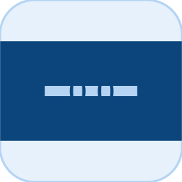

# display

<p align="center">

</p>
Stocke la derniere valeur d entree pour affichage.

## 📝 Syntaxe

- Block type: display

## 📥 Argument d'entrée

- input ports - 1 port(s) d entree declare(s).

## 📄 Description

Stocke la derniere valeur d entree pour affichage.

| Champ        | Valeur                    |
| ------------ | ------------------------- |
| Module       | <code>nflow_blocks</code> |
| Bibliotheque | Blocs puits               |
| Type         | <code>display</code>      |
| Libelle      | Display                   |

<b>Description</b>

Stocke la derniere valeur d entree pour affichage.

<b>Ports</b>

<b>Entree(s)</b>

| Port   | Role                             | Cote | Position  |
| ------ | -------------------------------- | ---- | --------- |
| Port_1 | Signal numerique lu par le bloc. | left | x=0, y=30 |

<b>Sortie(s)</b>

Ce bloc ne declare aucune sortie.

<b>Parametres</b>

| Parametre                    | Valeur par defaut |
| ---------------------------- | ----------------- |
| <code>label</code>           | Display           |
| <code>format</code>          | short             |
| <code>decimation</code>      | 1                 |
| <code>floatingDisplay</code> | false             |

<b>Cles de l inspecteur</b>

Ces cles serialisees sont exposees par l inspecteur du bloc.

- <code>label</code>
- <code>format</code>
- <code>decimation</code>
- <code>floatingDisplay</code>

<b>Caracteristiques du bloc</b>

| Champ                      | Valeur                    |
| -------------------------- | ------------------------- |
| Type de bloc               | display                   |
| Famille                    | Blocs puits               |
| Taille graphique           | 120 x 60                  |
| Phases                     | INIT, AFTER_STEP          |
| Traversee directe          | voir Algorithmes          |
| Etat ou historique interne | oui                       |
| Type de donnees signaux    | valeurs numeriques double |

<b>Algorithmes</b>

- INIT efface le scalaire memorise.
- AFTER_STEP echantillonne l entree 1 selon decimation; les valeurs sous 1 valent 1.
- Le bloc n a pas de port de sortie.

<b>Capacites et limites</b>

La page decrit le comportement runtime natif observe dans les sources C++ du module. Les phases declarees indiquent quand le moteur de simulation appelle le bloc.

Generation de code : prise en charge pour C et Rust.

<b>Sources d implementation</b>

<details>
<summary>Manifest: <code>modules/nflow_blocks/libraries/sink/library.json</code></summary>

```json
{
  "id": "builtin.sink",
  "title": "Sinks",
  "version": "1.0.0",
  "format": "nflow-2",
  "metadata": {
    "author": "Allan CORNET",
    "created": "2026-03-21",
    "tool": "Nelson nflow"
  },
  "comment": "Blocks for visualizing or exporting simulation results",
  "license": "LGPL-3.0",
  "builtin": true,
  "blocks": [
    {
      "type": "scope",
      "label": "Scope",
      "icon": "scope.svg",
      "phases": ["INIT", "AFTER_STEP"],
      "width": 220,
      "height": 160,
      "inputs": [
        {
          "x": 0,
          "y": 40,
          "side": "left"
        },
        {
          "x": 0,
          "y": 80,
          "side": "left"
        },
        {
          "x": 0,
          "y": 120,
          "side": "left"
        }
      ],
      "outputs": [],
      "defaultParams": {
        "TMin": "",
        "TMax": "",
        "YMin": "",
        "YMax": "",
        "width": 220,
        "height": 160,
        "ShowTickLabels": false
      },
      "render": {
        "type": "plot",
        "path": "M{axisX} {axisTop} L{axisX} {axisY} L{axisRight-2} {axisY}"
      }
    },
    {
      "type": "xyScope",
      "icon": "xyScope.svg",
      "label": "XY Scope",
      "phases": ["INIT", "AFTER_STEP"],
      "width": 220,
      "height": 160,
      "inputs": [
        {
          "x": 0,
          "y": 50,
          "side": "left"
        },
        {
          "x": 0,
          "y": 110,
          "side": "left"
        }
      ],
      "outputs": [],
      "defaultParams": {
        "XMin": "",
        "XMax": "",
        "YMin": "",
        "YMax": "",
        "width": 220,
        "height": 160,
        "ShowTickLabels": false
      },
      "render": {
        "type": "plot",
        "path": "M{axisX} {axisY} L{axisRight-2} {axisTop+8}"
      }
    },
    {
      "type": "xyzScope",
      "label": "XYZ Scope",
      "icon": "xyzScope.svg",
      "phases": ["INIT", "AFTER_STEP"],
      "width": 220,
      "height": 180,
      "inputs": [
        {
          "x": 0,
          "y": 50,
          "side": "left"
        },
        {
          "x": 0,
          "y": 90,
          "side": "left"
        },
        {
          "x": 0,
          "y": 130,
          "side": "left"
        }
      ],
      "outputs": [],
      "defaultParams": {
        "XMin": "",
        "XMax": "",
        "YMin": "",
        "YMax": "",
        "ZMin": "",
        "ZMax": "",
        "width": 220,
        "height": 180,
        "RotationX": 30,
        "RotationY": 45
      },
      "render": {
        "type": "plot",
        "path": "M{axisX} {axisY} L{axisRight-2} {axisY-20}"
      }
    },
    {
      "type": "fileSink",
      "icon": "fileSink.svg",
      "label": "Output File",
      "phases": [],
      "width": 80,
      "height": 80,
      "inputs": [
        {
          "x": 0,
          "y": 40,
          "side": "left"
        }
      ],
      "outputs": [],
      "defaultParams": {
        "FileName": "output.csv"
      },
      "render": {
        "type": "image",
        "src": "fileSink.svg"
      }
    },
    {
      "type": "labelSink",
      "icon": "labelSink.svg",
      "label": "Label Sink",
      "phases": [],
      "width": 40,
      "height": 40,
      "inputs": [
        {
          "x": 0,
          "y": 20,
          "side": "left"
        }
      ],
      "outputs": [],
      "defaultParams": {
        "GotoTag": "x",
        "ShowNode": true
      },
      "render": {
        "type": "math",
        "bodyClass": "block-body",
        "mathGroupClass": "label-sink-math",
        "formula": "{params.GotoTag}"
      }
    },
    {
      "type": "display",
      "icon": "display.svg",
      "label": "Display",
      "phases": ["INIT", "AFTER_STEP"],
      "width": 120,
      "height": 60,
      "inputs": [
        {
          "x": 0,
          "y": 30,
          "side": "left"
        }
      ],
      "outputs": [],
      "defaultParams": {
        "Label": "Display",
        "Format": "short",
        "Decimation": 1,
        "Floating": false
      },
      "render": {
        "type": "math",
        "bodyClass": "block-body",
        "mathGroupClass": "display-math",
        "formula": "\\mathsf{Disp}"
      }
    },
    {
      "type": "toWorkspace",
      "label": "To Workspace",
      "icon": "toWorkspace.svg",
      "phases": ["INIT", "AFTER_STEP"],
      "width": 80,
      "height": 48,
      "inputs": [
        {
          "x": 0,
          "y": 24,
          "side": "left"
        }
      ],
      "outputs": [],
      "defaultParams": {
        "VariableName": "simout",
        "MaxDataPoints": "inf",
        "Decimation": 1,
        "SaveFormat": "Structure With Time",
        "SampleTime": "-1"
      },
      "render": {
        "type": "math",
        "formula": "\\mathtt{{params.VariableName}}",
        "textSize": 14
      }
    },
    {
      "type": "terminator",
      "label": "Terminator",
      "icon": "terminator.svg",
      "phases": [],
      "width": 40,
      "height": 40,
      "inputs": [
        {
          "x": 0,
          "y": 20,
          "side": "left"
        }
      ],
      "outputs": [],
      "defaultParams": {},
      "render": {
        "type": "image",
        "src": "exports/terminator.svg",
        "svgMode": "element",
        "preserveAspectRatio": "none",
        "x": 0,
        "y": 0,
        "width": 40,
        "height": 40
      }
    },
    {
      "type": "stopSimulation",
      "label": "Stop",
      "icon": "stopSimulation.svg",
      "phases": ["AFTER_STEP"],
      "width": 40,
      "height": 40,
      "inputs": [
        {
          "x": 0,
          "y": 20,
          "side": "left"
        }
      ],
      "outputs": [],
      "defaultParams": {}
    }
  ]
}
```

</details>


<details>
<summary>Runtime: <code>modules/nflow_blocks/src/cpp/sink/display.cpp</code></summary>

```cpp
//=============================================================================
// Copyright (c) 2016-present Allan CORNET (Nelson)
//=============================================================================
// This file is part of Nelson.
//=============================================================================
// LICENCE_BLOCK_BEGIN
// SPDX-License-Identifier: LGPL-3.0-or-later
// LICENCE_BLOCK_END
//=============================================================================
#include "SimEngineTypes.hpp"
#include "BlockRegistry.hpp"
#include "FieldNames.hpp"
#include "NFlowBlockDescriptor.hpp"
#include <cmath>
#include <algorithm>
#include "sink_blocks.hpp"
//=============================================================================
bool
Nelson::NFlow::handleDisplay(SimCtx& ctx, const Block& b, Phase phase)
{
    auto& st = getState(ctx, b.nid);
    if (phase == Phase::INIT) {
        st.scalar = std::numeric_limits<double>::quiet_NaN();
        st.scalar2 = 0.0; // decimation step counter
        return false;
    }
    if (phase == Phase::AFTER_STEP) {
        nflow::BlockDescriptor bd(b, ctx.variables);
        int decimation = static_cast<int>(bd.paramDouble(nflow::kDecimation, 1.0));
        if (decimation < 1) {
            decimation = 1;
        }
        st.scalar2 += 1.0;
        if (static_cast<int>(st.scalar2) % decimation == 0) {
            SigView v = getInputSig(ctx, b.nid, 0);
            if (v.width > 1) {
                st.displayValues.assign(v.data, v.data + v.width);
                st.scalar = v.data[0];
            } else {
                st.displayValues.clear();
                st.scalar = hasInput(ctx, b.nid, 0) ? getInput(ctx, b.nid, 0, 0.0)
                                                    : std::numeric_limits<double>::quiet_NaN();
            }
        }
        return false;
    }
    return false;
}
//=============================================================================
Nelson::NFlow::BlockCodegenTemplate
Nelson::NFlow::getCodeGenCDisplay()
{
    BlockCodegenTemplate t;
    t.step = "out_{id} = {in0};";
    return t;
}
//=============================================================================
Nelson::NFlow::BlockCodegenTemplate
Nelson::NFlow::getCodeGenRustDisplay()
{
    BlockCodegenTemplate t;
    t.step = "out_{id} = {in0};";
    return t;
}
//=============================================================================

```

</details>

## 🔗 Voir aussi

[scope](../../nflow_blocks/sink/scope.md), [terminator](../../nflow_blocks/sink/terminator.md), [fileSink](../../nflow_blocks/sink/fileSink.md).

## 🕔 Historique

| Version | 📄 Description  |
| ------- | --------------- |
| 1.0.0   | initial version |

<!--
## 👤 Auteur

Allan CORNET
-->
