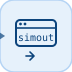

# toWorkspace


<p align="center">

</p>
Écrit le signal d'entrée dans une variable du workspace Nelson.

## 📝 Syntaxe

- Type de bloc : toWorkspace

## 📥 Argument d'entrée

- ports d'entrée - 1 port d'entrée (scalaire ou vecteur, tout type de signal).

## 📄 Description


Accumule son signal d'entrée aux pas majeurs de la simulation et, à l'arrêt de celle-ci, l'écrit dans la variable <code>VariableName</code> du workspace de base.  

<code>Decimation</code> conserve un échantillon sur k (en commençant par le premier). <code>MaxDataPoints</code> ne garde que les N derniers échantillons décimés (<code>inf</code> = tout garder). <code>SaveFormat</code> choisit la forme de la variable : 

- <code>Structure With Time</code> : champs <code>time</code>, <code>signals.values</code> (NxW), <code>signals.dimensions</code>, <code>signals.label</code>, <code>blockName</code> ; 
- <code>Structure</code> : idem avec un champ <code>time</code> vide ; 
- <code>Array</code> : matrice NxW des échantillons (le temps est celui de la grille de simulation). 

Dans le code généré, le bloc est neutre (l'écriture workspace n'y a pas de sens). 

<b>Paramètres</b> 

| Paramètre | Valeur par défaut | 
| --- | --- | 
| <code>VariableName</code> | simout | 
| <code>MaxDataPoints</code> | inf | 
| <code>Decimation</code> | 1 | 
| <code>SaveFormat</code> | Structure With Time | 
| <code>SampleTime</code> | -1 | 

 

<b>Caractéristiques du bloc</b> 

| Champ | Valeur |
| --- | --- |
| Type de bloc | toWorkspace | 
| Famille | Blocs sorties | 
| Phases | INIT, AFTER\_STEP | 
| Type de signal | tous (enregistré en double) | 
| Génération de code | neutre (no-op) | 

 

Generation de code : prise en charge pour C et Rust. 

**Manifeste:** `modules/nflow_blocks/libraries/sink/library.json`
 

**Runtime:** `modules/nflow_blocks/src/cpp/sink/toWorkspace.cpp`


## 💡 Exemple

Ouvrir la démo To Workspace (journalise une sinusoïde dans 'simout')

```matlab
open_system([modulepath('nflow_blocks'), '/examples/workspace/To_Workspace_Demo.nflow']);
```


## 🔗 Voir aussi

[fromWorkspace](../../nflow_blocks/source/fromWorkspace.md), [scope](../../nflow_blocks/sink/scope.md).

## 🕔 Historique

| Version | 📄 Description     |
| ------- | --------------- |
| 1.0.0   | version initiale |

<!--
## 👤 Auteur

Allan CORNET
-->
