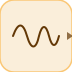

# chirp

Genere un chirp sinusoidal de f0 a f1.

## 📝 Syntaxe

- Block type: chirp

## 📤 Argument de sortie

- output ports - 1 port(s) de sortie declare(s).

## 📄 Description

Genere un chirp sinusoidal de f0 a f1. 

| Champ | Valeur |
| --- | --- |
| Module | <code>nflow_blocks</code> | 
| Bibliotheque | Blocs sources | 
| Type | <code>chirp</code> | 
| Libelle | Chirp | 

  

<b>Description</b> 

Genere un chirp sinusoidal de f0 a f1. 

<b>Ports</b> 

<b>Entree(s)</b> 

Ce bloc ne declare aucune entree. 

<b>Sortie(s)</b> 

| Port | Role | Cote | Position | 
| --- | --- | --- | --- | 
| Port\_1 | Signal numerique produit par le bloc. | right | x=80, y=40 | 

 

<b>Parametres</b> 

| Parametre | Valeur par defaut | 
| --- | --- | 
| <code>f0</code> | 1 | 
| <code>f1</code> | 10 | 
| <code>k</code> | 1 | 
| <code>phase</code> | 0 | 

 

<b>Cles de l inspecteur</b> 

Ces cles serialisees sont exposees par l inspecteur du bloc. 

- <code>f0</code> 
- <code>f1</code> 
- <code>k</code> 
- <code>phase</code> 

<b>Caracteristiques du bloc</b> 

| Champ | Valeur |
| --- | --- |
| Type de bloc | chirp | 
| Famille | Blocs sources | 
| Taille graphique | 80 x 80 | 
| Phases | OUTPUT | 
| Traversee directe | voir Algorithmes | 
| Etat ou historique interne | non observe dans le code documente | 
| Type de donnees signaux | valeurs numeriques double | 

 

<b>Algorithmes</b> 

- Bloc OUTPUT sans entree. 
- Le runtime natif derive k depuis f0, f1 et max(t1, 0.001). 
- Le parametre k du manifest est une metadonnee visuelle/configuration; le handler natif calcule la vitesse de balayage. 

<b>Equation ou regle</b> 
$$y = amp\,\sin\left(2\pi\left(f_0 t + \frac{1}{2} k t^2\right)\right)$$
 

<b>Capacites et limites</b> 

La page decrit le comportement runtime natif observe dans les sources C++ du module. Les phases declarees indiquent quand le moteur de simulation appelle le bloc. 

Generation de code : prise en charge pour C et Rust. 

<b>Sources d implementation</b> 

**Manifest:** `modules/nflow_blocks/libraries/source/library.json`
 

**Runtime:** `modules/nflow_blocks/src/cpp/source/chirp.cpp`

## 🔗 Voir aussi

[sine](../../nflow_blocks/source/sine.md), [noise](../../nflow_blocks/source/noise.md).

## 🕔 Historique

| Version | 📄 Description     |
| ------- | --------------- |
| 1.0.0   | initial version |

<!--
## 👤 Auteur

Allan CORNET
-->
