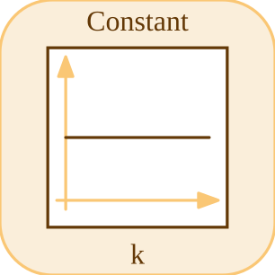

# constant

<p align="center">

</p>
Produit une valeur numerique constante.

## 📝 Syntaxe

- Block type: constant

## 📤 Argument de sortie

- output ports - 1 port(s) de sortie declare(s).

## 📄 Description

Produit une valeur numerique constante.

| Champ        | Valeur                    |
| ------------ | ------------------------- |
| Module       | <code>nflow_blocks</code> |
| Bibliotheque | Blocs sources             |
| Type         | <code>constant</code>     |
| Libelle      | Constant                  |

<b>Description</b>

Produit une valeur numerique constante.

<b>Ports</b>

<b>Entree(s)</b>

Ce bloc ne declare aucune entree.

<b>Sortie(s)</b>

| Port   | Role                                  | Cote  | Position   |
| ------ | ------------------------------------- | ----- | ---------- |
| Port_1 | Signal numerique produit par le bloc. | right | x=80, y=40 |

<b>Parametres</b>

| Parametre          | Valeur par defaut |
| ------------------ | ----------------- |
| <code>value</code> | 1                 |

<b>Cles de l inspecteur</b>

Ces cles serialisees sont exposees par l inspecteur du bloc.

- <code>value</code>

<b>Caracteristiques du bloc</b>

| Champ                      | Valeur                             |
| -------------------------- | ---------------------------------- |
| Type de bloc               | constant                           |
| Famille                    | Blocs sources                      |
| Taille graphique           | 80 x 80                            |
| Phases                     | OUTPUT                             |
| Traversee directe          | voir Algorithmes                   |
| Etat ou historique interne | non observe dans le code documente |
| Type de donnees signaux    | valeurs numeriques double          |

<b>Algorithmes</b>

- Bloc OUTPUT sans entree.
- value est resolu numeriquement et ecrit a chaque phase de sortie.

<b>Equation ou regle</b>
$$y = value$$

<b>Capacites et limites</b>

La page decrit le comportement runtime natif observe dans les sources C++ du module. Les phases declarees indiquent quand le moteur de simulation appelle le bloc.

Generation de code : prise en charge pour C et Rust.

<b>Sources d implementation</b>

<details>
<summary>Manifest: <code>modules/nflow_blocks/libraries/source/library.json</code></summary>

```json
{
  "id": "builtin.source",
  "title": "Source",
  "version": "1.0.0",
  "format": "nflow-2",
  "metadata": {
    "author": "Allan CORNET",
    "created": "2026-03-21",
    "tool": "Nelson nflow"
  },
  "comment": "Basic source blocks",
  "license": "LGPL-3.0",
  "builtin": true,
  "blocks": [
    {
      "type": "constant",
      "label": "Constant",
      "icon": "constant.svg",
      "phases": ["OUTPUT"],
      "width": 80,
      "height": 80,
      "inputs": [],
      "outputs": [
        {
          "x": 80,
          "y": 40,
          "side": "right"
        }
      ],
      "defaultParams": {
        "Value": 1,
        "OutDataType": "double"
      },
      "render": {
        "type": "math",
        "bodyClass": "block-body",
        "mathGroupClass": "constant-math",
        "formula": "{params.Value}"
      }
    },
    {
      "type": "step",
      "label": "Step",
      "icon": "step.svg",
      "phases": ["OUTPUT"],
      "width": 80,
      "height": 80,
      "inputs": [],
      "outputs": [
        {
          "x": 80,
          "y": 40,
          "side": "right"
        }
      ],
      "defaultParams": {
        "Time": 0
      },
      "render": {
        "type": "image",
        "src": "step.svg"
      }
    },
    {
      "type": "ramp",
      "label": "Ramp",
      "icon": "ramp.svg",
      "phases": ["OUTPUT"],
      "width": 80,
      "height": 80,
      "inputs": [],
      "outputs": [
        {
          "x": 80,
          "y": 40,
          "side": "right"
        }
      ],
      "defaultParams": {
        "slope": 1,
        "start": 0
      },
      "render": {
        "type": "image",
        "src": "ramp.svg"
      }
    },
    {
      "type": "counterFreeRunning",
      "label": "Counter Free-Running",
      "icon": "counterFreeRunning.svg",
      "phases": ["INIT", "OUTPUT", "UPDATE"],
      "width": 80,
      "height": 80,
      "inputs": [],
      "outputs": [
        {
          "x": 80,
          "y": 40,
          "side": "right"
        }
      ],
      "defaultParams": {
        "NumBits": 16
      },
      "render": {
        "type": "image",
        "src": "counterFreeRunning.svg"
      }
    },
    {
      "type": "counterLimited",
      "label": "Counter Limited",
      "icon": "counterLimited.svg",
      "phases": ["INIT", "OUTPUT", "UPDATE"],
      "width": 80,
      "height": 80,
      "inputs": [],
      "outputs": [
        {
          "x": 80,
          "y": 40,
          "side": "right"
        }
      ],
      "defaultParams": {
        "UpperLimit": 7
      },
      "render": {
        "type": "image",
        "src": "counterLimited.svg"
      }
    },
    {
      "type": "repeatingSequenceStair",
      "label": "Repeating Sequence Stair",
      "icon": "repeatingSequenceStair.svg",
      "phases": ["INIT", "OUTPUT", "UPDATE"],
      "width": 80,
      "height": 80,
      "inputs": [],
      "outputs": [
        {
          "x": 80,
          "y": 40,
          "side": "right"
        }
      ],
      "defaultParams": {
        "OutValues": [0, 1, 2, 3, 2, 1]
      },
      "render": {
        "type": "image",
        "src": "repeatingSequenceStair.svg"
      }
    },
    {
      "type": "repeatingSequenceInterpolated",
      "label": "Repeating Sequence Interpolated",
      "icon": "repeatingSequenceInterpolated.svg",
      "phases": ["OUTPUT"],
      "width": 80,
      "height": 80,
      "inputs": [],
      "outputs": [
        {
          "x": 80,
          "y": 40,
          "side": "right"
        }
      ],
      "defaultParams": {
        "TimeValues": [0, 1, 2],
        "OutValues": [0, 2, 0]
      },
      "render": {
        "type": "image",
        "src": "repeatingSequenceInterpolated.svg"
      }
    },
    {
      "type": "signalGenerator",
      "label": "Signal Generator",
      "icon": "signalGenerator.svg",
      "phases": ["OUTPUT"],
      "width": 80,
      "height": 80,
      "inputs": [],
      "outputs": [
        {
          "x": 80,
          "y": 40,
          "side": "right"
        }
      ],
      "defaultParams": {
        "Waveform": "sine",
        "Amplitude": 1,
        "Frequency": 1
      },
      "render": {
        "type": "image",
        "src": "signalGenerator.svg"
      }
    },
    {
      "type": "pulse",
      "label": "Pulse Generator",
      "icon": "pulse.svg",
      "phases": ["OUTPUT"],
      "width": 80,
      "height": 80,
      "inputs": [],
      "outputs": [
        {
          "x": 80,
          "y": 40,
          "side": "right"
        }
      ],
      "defaultParams": {
        "Amplitude": 1,
        "Period": 1,
        "Width": 50,
        "StartTime": 0,
        "Offset": 0
      },
      "render": {
        "type": "image",
        "src": "pulse.svg"
      }
    },
    {
      "type": "impulse",
      "label": "Impulse",
      "icon": "impulse.svg",
      "phases": ["OUTPUT"],
      "width": 80,
      "height": 80,
      "inputs": [],
      "outputs": [
        {
          "x": 80,
          "y": 40,
          "side": "right"
        }
      ],
      "defaultParams": {
        "Time": 0,
        "Amplitude": 1
      },
      "render": {
        "type": "image",
        "src": "impulse.svg"
      }
    },
    {
      "type": "sine",
      "label": "Sine",
      "icon": "sine.svg",
      "phases": ["OUTPUT"],
      "width": 80,
      "height": 80,
      "inputs": [],
      "outputs": [
        {
          "x": 80,
          "y": 40,
          "side": "right"
        }
      ],
      "defaultParams": {
        "Amplitude": 1,
        "Frequency": 1,
        "Phase": 0
      },
      "render": {
        "type": "image",
        "src": "sine.svg"
      }
    },
    {
      "type": "chirp",
      "label": "Chirp",
      "icon": "chirp.svg",
      "phases": ["OUTPUT"],
      "width": 80,
      "height": 80,
      "inputs": [],
      "outputs": [
        {
          "x": 80,
          "y": 40,
          "side": "right"
        }
      ],
      "defaultParams": {
        "Amplitude": 1,
        "f1": 1,
        "f2": 10,
        "T": 10
      },
      "render": {
        "type": "image",
        "src": "chirp.svg"
      }
    },
    {
      "type": "fileSource",
      "label": "File",
      "icon": "fileSource.svg",
      "phases": ["OUTPUT"],
      "width": 80,
      "height": 80,
      "inputs": [],
      "outputs": [
        {
          "x": 80,
          "y": 40,
          "side": "right"
        }
      ],
      "defaultParams": {
        "FileName": ""
      },
      "render": {
        "type": "image",
        "src": "fileSource.svg"
      }
    },
    {
      "type": "fromWorkspace",
      "label": "From Workspace",
      "icon": "fromWorkspace.svg",
      "phases": ["OUTPUT"],
      "width": 80,
      "height": 48,
      "inputs": [],
      "outputs": [
        {
          "x": 80,
          "y": 24,
          "side": "right"
        }
      ],
      "defaultParams": {
        "VariableName": "simin",
        "SampleTime": "0",
        "Interpolate": "on",
        "OutputAfterFinalValue": "Extrapolation"
      },
      "render": {
        "type": "math",
        "formula": "\\mathtt{{params.VariableName}}",
        "textSize": 14
      }
    },
    {
      "type": "labelSource",
      "label": "Label",
      "icon": "labelSource.svg",
      "phases": ["OUTPUT"],
      "width": 40,
      "height": 40,
      "inputs": [],
      "outputs": [
        {
          "x": 40,
          "y": 20,
          "side": "right"
        }
      ],
      "defaultParams": {
        "GotoTag": "x"
      },
      "render": {
        "type": "image",
        "src": "labelSource.svg"
      }
    },
    {
      "type": "noise",
      "label": "Noise",
      "icon": "noise.svg",
      "phases": ["OUTPUT"],
      "width": 80,
      "height": 80,
      "inputs": [],
      "outputs": [
        {
          "x": 80,
          "y": 40,
          "side": "right"
        }
      ],
      "defaultParams": {
        "Amplitude": 1
      },
      "render": {
        "type": "image",
        "src": "noise.svg"
      }
    },
    {
      "type": "clock",
      "label": "Clock",
      "icon": "clock.svg",
      "phases": ["OUTPUT"],
      "width": 80,
      "height": 80,
      "inputs": [],
      "outputs": [
        {
          "x": 80,
          "y": 40,
          "side": "right"
        }
      ],
      "defaultParams": {
        "DisplayTime": false,
        "Decimation": 10
      },
      "render": {
        "type": "image",
        "src": "clock.svg",
        "svgMode": "element",
        "preserveAspectRatio": "none",
        "x": 0,
        "y": 0,
        "width": 80,
        "height": 80
      }
    },
    {
      "type": "enumeratedConstant",
      "label": "Enumerated Constant",
      "icon": "enumeratedConstant.svg",
      "phases": ["OUTPUT"],
      "width": 90,
      "height": 50,
      "inputs": [],
      "outputs": [
        {
          "x": 90,
          "y": 25,
          "side": "right"
        }
      ],
      "defaultParams": {
        "EnumClass": "",
        "Value": 0
      }
    }
  ]
}
```

</details>


<details>
<summary>Runtime: <code>modules/nflow_blocks/src/cpp/source/constant.cpp</code></summary>

```cpp
//=============================================================================
// Copyright (c) 2016-present Allan CORNET (Nelson)
//=============================================================================
// This file is part of Nelson.
//=============================================================================
// LICENCE_BLOCK_BEGIN
// SPDX-License-Identifier: LGPL-3.0-or-later
// LICENCE_BLOCK_END
//=============================================================================
#include "SimEngineTypes.hpp"
#include "BlockRegistry.hpp"
#include "FieldNames.hpp"
#include "NFlowBlockDescriptor.hpp"
#include "NFlowCodegenTyped.hpp"
#include <cmath>
#include <algorithm>
#include "source_blocks.hpp"
//=============================================================================
bool
Nelson::NFlow::handleConstant(SimCtx& ctx, const Block& b, Phase phase)
{
    if (phase != Phase::OUTPUT) {
        return false;
    }
    nflow::BlockDescriptor bd(b, ctx.variables);
    const PortSig* ps = portSigOf(ctx, b.nid, 0);
    const int w = ps ? ps->width() : 1;
    const SigType ty = ps ? ps->type : SigType::Double;
    if (ps && portUsesI64(*ps)) {
        // Exact-64 constant: read the Value entries straight from the JSON
        // (integer literals stay exact, no double round-trip) and fill both
        // lanes.
        auto exactAt = [&](size_t i) -> long long {
            const json* v = nullptr;
            if (b.params.contains(nflow::kValue)) {
                const json& jv = b.params[nflow::kValue];
                if (jv.is_array()) {
                    if (jv.empty()) {
                        return 0;
                    }
                    v = (i < jv.size()) ? &jv[i] : &jv.back();
                } else {
                    v = &jv;
                }
            }
            if (!v) {
                return 0;
            }
            if (v->is_number_unsigned()) {
                return static_cast<long long>(v->get<unsigned long long>());
            }
            if (v->is_number_integer()) {
                return v->get<long long>();
            }
            if (v->is_number_float()) {
                return quantizeDoubleToI64(v->get<double>(), ty);
            }
            return quantizeDoubleToI64(bd.paramDouble(nflow::kValue, 0.0), ty);
        };
        long long* di = outputSliceI64(ctx, b.nid, 0);
        double* y = outputSlice(ctx, b.nid, 0);
        for (int i = 0; i < w; ++i) {
            const long long v = exactAt((size_t)i);
            if (di) {
                di[i] = v;
            }
            y[i] = i64ToDouble(v, ty);
        }
        return false;
    }
    if (w <= 1) {
        double v = bd.paramDouble(nflow::kValue, 0.0);
        if (ty != SigType::Double) {
            v = quantizeToType(v, ty);
        }
        setOutput(ctx, b.nid, v);
        return false;
    }
    // Vector constant: the Value parameter is a list; the port was sized to
    // its length by the dimension-propagation pass.
    std::vector<double> lst = bd.paramList(nflow::kValue);
    double* y = outputSlice(ctx, b.nid, 0);
    for (int i = 0; i < w; ++i) {
        double v = (i < (int)lst.size()) ? lst[i] : (lst.empty() ? 0.0 : lst.back());
        y[i] = (ty != SigType::Double) ? quantizeToType(v, ty) : v;
    }
    return false;
}
//=============================================================================
namespace {
// Exact-64 constant emission: read the Value entry straight from the JSON
// (integer literals stay exact, no double round-trip).
Nelson::NFlow::BlockCodegenEmitFn
constantTypedEmitter(bool cLang)
{
    using namespace Nelson::NFlow;
    return [cLang](const BlockCodegenArgs& a) {
        const bool uns = codegenIsU64(a.outType);
        long long v = 0;
        if (a.params && a.params->contains(nflow::kValue)) {
            const json& jv = (*a.params)[nflow::kValue];
            const json* e = jv.is_array() ? (jv.empty() ? nullptr : &jv[0]) : &jv;
            if (e) {
                if (e->is_number_unsigned()) {
                    v = static_cast<long long>(e->get<unsigned long long>());
                } else if (e->is_number_integer()) {
                    v = e->get<long long>();
                } else if (e->is_number_float()) {
                    v = quantizeDoubleToI64(
                        e->get<double>(), uns ? SigType::UInt64 : SigType::Int64);
                }
            }
        }
        a.line("out_" + a.id + " = " + codegenI64Literal(v, uns, cLang) + ";");
    };
}
} // namespace
//=============================================================================
Nelson::NFlow::BlockCodegenTemplate
Nelson::NFlow::getCodeGenCConstant()
{
    BlockCodegenTemplate t;
    t.step = "out_{id} = {param:Value:0.0};";
    t.emitStepTyped = constantTypedEmitter(true);
    return t;
}
//=============================================================================
Nelson::NFlow::BlockCodegenTemplate
Nelson::NFlow::getCodeGenRustConstant()
{
    BlockCodegenTemplate t;
    t.step = "out_{id} = {param:Value:0.0};";
    t.emitStepTyped = constantTypedEmitter(false);
    return t;
}
//=============================================================================

```

</details>

## 🔗 Voir aussi

[step](../../nflow_blocks/source/step.md), [ramp](../../nflow_blocks/source/ramp.md), [sine](../../nflow_blocks/source/sine.md).

## 🕔 Historique

| Version | 📄 Description  |
| ------- | --------------- |
| 1.0.0   | initial version |

<!--
## 👤 Auteur

Allan CORNET
-->
