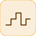

# repeatingSequenceStair

<p align="center">

</p>
Escalier periodique : une entree de OutValues par echantillon, en boucle.

## 📝 Syntaxe

- Type de bloc : repeatingSequenceStair

## 📥 Argument d'entrée

- ports d entree - Aucun port d entree (ce bloc n en a aucun).

## 📤 Argument de sortie

- ports de sortie - 1 port(s) de sortie declare(s).

## 📄 Description

Escalier periodique : une entree de OutValues par echantillon, en boucle.

| Champ        | Valeur                              |
| ------------ | ----------------------------------- |
| Module       | <code>nflow_blocks</code>           |
| Bibliotheque | Source                              |
| Type         | <code>repeatingSequenceStair</code> |
| Libelle      | Repeating Sequence Stair            |

<b>Description</b>

Une source en escalier periodique sans entree. Emet une valeur du vecteur <code>OutValues</code> par echantillon, chacune maintenue un pas, et reboucle depuis le debut une fois la fin atteinte. Un vecteur vide sort 0 ; une seule valeur agit comme une constante.

<b>Ports</b>

Ce bloc n'a aucun port d'entree.

<b>Sortie(s)</b>

| Port   | Role                                  | Cote   | Position   |
| ------ | ------------------------------------- | ------ | ---------- |
| Port_1 | Signal numerique produit par le bloc. | droite | x=80, y=40 |

<b>Parametres</b>

| Parametre              | Valeur par defaut |
| ---------------------- | ----------------- |
| <code>OutValues</code> | [0 1 2 3 2 1]     |

<b>Caracteristiques du bloc</b>

| Champ                      | Valeur                    |
| -------------------------- | ------------------------- |
| Type de bloc               | repeatingSequenceStair    |
| Famille                    | Source                    |
| Taille rendue              | 80 x 80                   |
| Phases                     | INIT, OUTPUT, UPDATE      |
| Etat interne ou historique | oui                       |
| Type de donnees du signal  | valeurs numeriques double |

<b>Algorithmes</b>

- OUTPUT : out = OutValues[index]. UPDATE : index = (index + 1) mod N.

<b>Equation ou regle</b>
$$y_k = \text{OutValues}[k \bmod N]$$

<b>Capacites etendues</b>

<b>Sources d implementation</b>

Generation de code : prise en charge pour C et Rust.

<details>
<summary>Manifest: <code>modules/nflow_blocks/libraries/source/library.json</code></summary>

```json
{
  "id": "builtin.source",
  "title": "Source",
  "version": "1.0.0",
  "format": "nflow-2",
  "metadata": {
    "author": "Allan CORNET",
    "created": "2026-03-21",
    "tool": "Nelson nflow"
  },
  "comment": "Basic source blocks",
  "license": "LGPL-3.0",
  "builtin": true,
  "blocks": [
    {
      "type": "constant",
      "label": "Constant",
      "icon": "constant.svg",
      "phases": ["OUTPUT"],
      "width": 80,
      "height": 80,
      "inputs": [],
      "outputs": [
        {
          "x": 80,
          "y": 40,
          "side": "right"
        }
      ],
      "defaultParams": {
        "Value": 1,
        "OutDataType": "double"
      },
      "render": {
        "type": "math",
        "bodyClass": "block-body",
        "mathGroupClass": "constant-math",
        "formula": "{params.Value}"
      }
    },
    {
      "type": "step",
      "label": "Step",
      "icon": "step.svg",
      "phases": ["OUTPUT"],
      "width": 80,
      "height": 80,
      "inputs": [],
      "outputs": [
        {
          "x": 80,
          "y": 40,
          "side": "right"
        }
      ],
      "defaultParams": {
        "Time": 0
      },
      "render": {
        "type": "image",
        "src": "step.svg"
      }
    },
    {
      "type": "ramp",
      "label": "Ramp",
      "icon": "ramp.svg",
      "phases": ["OUTPUT"],
      "width": 80,
      "height": 80,
      "inputs": [],
      "outputs": [
        {
          "x": 80,
          "y": 40,
          "side": "right"
        }
      ],
      "defaultParams": {
        "slope": 1,
        "start": 0
      },
      "render": {
        "type": "image",
        "src": "ramp.svg"
      }
    },
    {
      "type": "counterFreeRunning",
      "label": "Counter Free-Running",
      "icon": "counterFreeRunning.svg",
      "phases": ["INIT", "OUTPUT", "UPDATE"],
      "width": 80,
      "height": 80,
      "inputs": [],
      "outputs": [
        {
          "x": 80,
          "y": 40,
          "side": "right"
        }
      ],
      "defaultParams": {
        "NumBits": 16
      },
      "render": {
        "type": "image",
        "src": "counterFreeRunning.svg"
      }
    },
    {
      "type": "counterLimited",
      "label": "Counter Limited",
      "icon": "counterLimited.svg",
      "phases": ["INIT", "OUTPUT", "UPDATE"],
      "width": 80,
      "height": 80,
      "inputs": [],
      "outputs": [
        {
          "x": 80,
          "y": 40,
          "side": "right"
        }
      ],
      "defaultParams": {
        "UpperLimit": 7
      },
      "render": {
        "type": "image",
        "src": "counterLimited.svg"
      }
    },
    {
      "type": "repeatingSequenceStair",
      "label": "Repeating Sequence Stair",
      "icon": "repeatingSequenceStair.svg",
      "phases": ["INIT", "OUTPUT", "UPDATE"],
      "width": 80,
      "height": 80,
      "inputs": [],
      "outputs": [
        {
          "x": 80,
          "y": 40,
          "side": "right"
        }
      ],
      "defaultParams": {
        "OutValues": [0, 1, 2, 3, 2, 1]
      },
      "render": {
        "type": "image",
        "src": "repeatingSequenceStair.svg"
      }
    },
    {
      "type": "repeatingSequenceInterpolated",
      "label": "Repeating Sequence Interpolated",
      "icon": "repeatingSequenceInterpolated.svg",
      "phases": ["OUTPUT"],
      "width": 80,
      "height": 80,
      "inputs": [],
      "outputs": [
        {
          "x": 80,
          "y": 40,
          "side": "right"
        }
      ],
      "defaultParams": {
        "TimeValues": [0, 1, 2],
        "OutValues": [0, 2, 0]
      },
      "render": {
        "type": "image",
        "src": "repeatingSequenceInterpolated.svg"
      }
    },
    {
      "type": "signalGenerator",
      "label": "Signal Generator",
      "icon": "signalGenerator.svg",
      "phases": ["OUTPUT"],
      "width": 80,
      "height": 80,
      "inputs": [],
      "outputs": [
        {
          "x": 80,
          "y": 40,
          "side": "right"
        }
      ],
      "defaultParams": {
        "Waveform": "sine",
        "Amplitude": 1,
        "Frequency": 1
      },
      "render": {
        "type": "image",
        "src": "signalGenerator.svg"
      }
    },
    {
      "type": "pulse",
      "label": "Pulse Generator",
      "icon": "pulse.svg",
      "phases": ["OUTPUT"],
      "width": 80,
      "height": 80,
      "inputs": [],
      "outputs": [
        {
          "x": 80,
          "y": 40,
          "side": "right"
        }
      ],
      "defaultParams": {
        "Amplitude": 1,
        "Period": 1,
        "Width": 50,
        "StartTime": 0,
        "Offset": 0
      },
      "render": {
        "type": "image",
        "src": "pulse.svg"
      }
    },
    {
      "type": "impulse",
      "label": "Impulse",
      "icon": "impulse.svg",
      "phases": ["OUTPUT"],
      "width": 80,
      "height": 80,
      "inputs": [],
      "outputs": [
        {
          "x": 80,
          "y": 40,
          "side": "right"
        }
      ],
      "defaultParams": {
        "Time": 0,
        "Amplitude": 1
      },
      "render": {
        "type": "image",
        "src": "impulse.svg"
      }
    },
    {
      "type": "sine",
      "label": "Sine",
      "icon": "sine.svg",
      "phases": ["OUTPUT"],
      "width": 80,
      "height": 80,
      "inputs": [],
      "outputs": [
        {
          "x": 80,
          "y": 40,
          "side": "right"
        }
      ],
      "defaultParams": {
        "Amplitude": 1,
        "Frequency": 1,
        "Phase": 0
      },
      "render": {
        "type": "image",
        "src": "sine.svg"
      }
    },
    {
      "type": "chirp",
      "label": "Chirp",
      "icon": "chirp.svg",
      "phases": ["OUTPUT"],
      "width": 80,
      "height": 80,
      "inputs": [],
      "outputs": [
        {
          "x": 80,
          "y": 40,
          "side": "right"
        }
      ],
      "defaultParams": {
        "Amplitude": 1,
        "f1": 1,
        "f2": 10,
        "T": 10
      },
      "render": {
        "type": "image",
        "src": "chirp.svg"
      }
    },
    {
      "type": "fileSource",
      "label": "File",
      "icon": "fileSource.svg",
      "phases": ["OUTPUT"],
      "width": 80,
      "height": 80,
      "inputs": [],
      "outputs": [
        {
          "x": 80,
          "y": 40,
          "side": "right"
        }
      ],
      "defaultParams": {
        "FileName": ""
      },
      "render": {
        "type": "image",
        "src": "fileSource.svg"
      }
    },
    {
      "type": "fromWorkspace",
      "label": "From Workspace",
      "icon": "fromWorkspace.svg",
      "phases": ["OUTPUT"],
      "width": 80,
      "height": 48,
      "inputs": [],
      "outputs": [
        {
          "x": 80,
          "y": 24,
          "side": "right"
        }
      ],
      "defaultParams": {
        "VariableName": "simin",
        "SampleTime": "0",
        "Interpolate": "on",
        "OutputAfterFinalValue": "Extrapolation"
      },
      "render": {
        "type": "math",
        "formula": "\\mathtt{{params.VariableName}}",
        "textSize": 14
      }
    },
    {
      "type": "labelSource",
      "label": "Label",
      "icon": "labelSource.svg",
      "phases": ["OUTPUT"],
      "width": 40,
      "height": 40,
      "inputs": [],
      "outputs": [
        {
          "x": 40,
          "y": 20,
          "side": "right"
        }
      ],
      "defaultParams": {
        "GotoTag": "x"
      },
      "render": {
        "type": "image",
        "src": "labelSource.svg"
      }
    },
    {
      "type": "noise",
      "label": "Noise",
      "icon": "noise.svg",
      "phases": ["OUTPUT"],
      "width": 80,
      "height": 80,
      "inputs": [],
      "outputs": [
        {
          "x": 80,
          "y": 40,
          "side": "right"
        }
      ],
      "defaultParams": {
        "Amplitude": 1
      },
      "render": {
        "type": "image",
        "src": "noise.svg"
      }
    },
    {
      "type": "clock",
      "label": "Clock",
      "icon": "clock.svg",
      "phases": ["OUTPUT"],
      "width": 80,
      "height": 80,
      "inputs": [],
      "outputs": [
        {
          "x": 80,
          "y": 40,
          "side": "right"
        }
      ],
      "defaultParams": {
        "DisplayTime": false,
        "Decimation": 10
      },
      "render": {
        "type": "image",
        "src": "clock.svg",
        "svgMode": "element",
        "preserveAspectRatio": "none",
        "x": 0,
        "y": 0,
        "width": 80,
        "height": 80
      }
    },
    {
      "type": "enumeratedConstant",
      "label": "Enumerated Constant",
      "icon": "enumeratedConstant.svg",
      "phases": ["OUTPUT"],
      "width": 90,
      "height": 50,
      "inputs": [],
      "outputs": [
        {
          "x": 90,
          "y": 25,
          "side": "right"
        }
      ],
      "defaultParams": {
        "EnumClass": "",
        "Value": 0
      }
    }
  ]
}
```

</details>


<details>
<summary>Runtime: <code>modules/nflow_blocks/src/cpp/source/repeatingSequenceStair.cpp</code></summary>

```cpp
//=============================================================================
// Copyright (c) 2016-present Allan CORNET (Nelson)
//=============================================================================
// This file is part of Nelson.
//=============================================================================
// LICENCE_BLOCK_BEGIN
// SPDX-License-Identifier: LGPL-3.0-or-later
// LICENCE_BLOCK_END
//=============================================================================
// repeatingSequenceStair: a periodic staircase source (Repeating Sequence
// Stair). Steps through the OutValues vector one entry per sample, holding each
// value for a step, and repeats from the start once the end is reached. No
// input; scalar output. If OutValues is empty the output is 0.
//=============================================================================
#include "SimEngineTypes.hpp"
#include "BlockRegistry.hpp"
#include "FieldNames.hpp"
#include "NFlowBlockDescriptor.hpp"
#include <cmath>
#include <vector>
#include <string>
#include "source_blocks.hpp"
//=============================================================================
namespace Nelson {
namespace NFlow {
    //=============================================================================
    bool
    handleRepeatingSequenceStair(SimCtx& ctx, const Block& b, Phase phase)
    {
        auto& st = getState(ctx, b.nid);
        if (phase == Phase::INIT) {
            st.scalar = 0.0; // current index into OutValues
            st.output = 0.0;
            return false;
        }
        nflow::BlockDescriptor bd(b, ctx.variables);
        const std::vector<double> vals = bd.paramList("OutValues");
        const int n = static_cast<int>(vals.size());
        if (phase == Phase::OUTPUT) {
            double out = 0.0;
            if (n > 0) {
                int idx = static_cast<int>(st.scalar + 0.5);
                if (idx < 0) {
                    idx = 0;
                }
                if (idx >= n) {
                    idx = idx % n;
                }
                out = vals[idx];
            }
            setOutput(ctx, b.nid, out);
            return false;
        }
        if (phase == Phase::UPDATE) {
            if (n > 0) {
                st.scalar = std::fmod(st.scalar + 1.0, static_cast<double>(n));
            }
            return false;
        }
        return false;
    }
    //=============================================================================
    static std::string
    rssTableLiteralC(const std::vector<double>& vals)
    {
        std::string s = "{ ";
        for (size_t i = 0; i < vals.size(); ++i) {
            s += nflow::formatNumber(vals[i]);
            if (i + 1 < vals.size()) {
                s += ", ";
            }
        }
        s += " }";
        return s;
    }
    //=============================================================================
    BlockCodegenTemplate
    getCodeGenCRepeatingSequenceStair()
    {
        BlockCodegenTemplate t;
        t.emitState
            = [](const BlockCodegenStateArgs& a) { a.addState("rss_idx_" + a.id, "0.0", ""); };
        t.emitStep = [](const BlockCodegenArgs& a) {
            nflow::BlockDescriptor bd(*a.block, *a.variables);
            const std::vector<double> vals = bd.paramList("OutValues");
            const int n = static_cast<int>(vals.size());
            if (n <= 0) {
                a.line("out_" + a.id + " = 0.0;");
                return;
            }
            const std::string ns = std::to_string(n);
            a.line("static const double rss_tbl_" + a.id + "[" + ns
                + "] = " + rssTableLiteralC(vals) + ";");
            a.line("out_" + a.id + " = rss_tbl_" + a.id + "[((int)(s->rss_idx_" + a.id
                + " + 0.5)) % " + ns + "];");
            a.line("s->rss_idx_" + a.id + " = fmod(s->rss_idx_" + a.id + " + 1.0, " + ns + ".0);");
        };
        return t;
    }
    //=============================================================================
    static std::string
    rssTableLiteralRust(const BlockCodegenArgs& a, const std::vector<double>& vals)
    {
        std::string s = "[";
        for (size_t i = 0; i < vals.size(); ++i) {
            s += a.fmt(vals[i]);
            if (i + 1 < vals.size()) {
                s += ", ";
            }
        }
        s += "]";
        return s;
    }
    //=============================================================================
    BlockCodegenTemplate
    getCodeGenRustRepeatingSequenceStair()
    {
        BlockCodegenTemplate t;
        t.emitState
            = [](const BlockCodegenStateArgs& a) { a.addState("rss_idx_" + a.id, "0.0_f64", ""); };
        t.emitStep = [](const BlockCodegenArgs& a) {
            nflow::BlockDescriptor bd(*a.block, *a.variables);
            const std::vector<double> vals = bd.paramList("OutValues");
            const int n = static_cast<int>(vals.size());
            if (n <= 0) {
                a.line("out_" + a.id + " = 0.0_f64;");
                return;
            }
            const std::string ns = std::to_string(n);
            a.line("let rss_tbl_" + a.id + ": [f64; " + ns + "] = " + rssTableLiteralRust(a, vals)
                + ";");
            a.line("out_" + a.id + " = rss_tbl_" + a.id + "[(s.rss_idx_" + a.id + " as usize) % "
                + ns + "];");
            a.line(
                "s.rss_idx_" + a.id + " = (s.rss_idx_" + a.id + " + 1.0_f64) % " + ns + ".0_f64;");
        };
        return t;
    }
    //=============================================================================
} // namespace NFlow
} // namespace Nelson
//=============================================================================

```

</details>

## 💡 Exemple

Repeter la sequence 10, 20, 30.

```matlab
d.blocks={ struct('id','r','type','repeatingSequenceStair','inputs',0,'outputs',1,'params',struct('OutValues',[10 20 30])), struct('id','w','type','toWorkspace','inputs',1,'outputs',0,'params',struct('VariableName','y','SaveFormat','Array')) };
d.connections={ struct('from','r','to','w','fromIndex',0,'toIndex',0) };
d.sampleTime=0.1; d.duration=1.0; d.solver='discrete'; d.variables=struct();
r=jsondecode(__nflow_simulate__(jsonencode(d)));
```

## 🔗 Voir aussi

[repeatingSequenceInterpolated](../../nflow_blocks/source/repeatingSequenceInterpolated.md), [counterLimited](../../nflow_blocks/source/counterLimited.md).

## 🕔 Historique

| Version | 📄 Description  |
| ------- | --------------- |
| 1.0.0   | initial version |

<!--
## 👤 Auteur

Allan CORNET
-->
