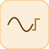

# signalGenerator

<p align="center">

</p>
Source periodique configurable : sinus, carre ou dent de scie (Amplitude, Frequency).

## 📝 Syntaxe

- Type de bloc : signalGenerator

## 📥 Argument d'entrée

- ports d entree - Aucun port d entree (ce bloc n en a aucun).

## 📤 Argument de sortie

- ports de sortie - 1 port(s) de sortie declare(s).

## 📄 Description

Source periodique configurable : sinus, carre ou dent de scie (Amplitude, Frequency).

| Champ        | Valeur                       |
| ------------ | ---------------------------- |
| Module       | <code>nflow_blocks</code>    |
| Bibliotheque | Source                       |
| Type         | <code>signalGenerator</code> |
| Libelle      | Signal Generator             |

<b>Description</b>

Une source periodique configurable sans entree. <code>Waveform</code> vaut "sine", "square" ou "sawtooth", mise a l'echelle par <code>Amplitude</code>, avec <code>Frequency</code> en Hz. sine = A\*sin(2\*pi\*f\*t) ; square = A\*signe(sin(2\*pi\*f\*t)) ; sawtooth monte lineairement de -A a +A sur chaque periode. Sans etat (fonction pure du temps).

<b>Ports</b>

Ce bloc n'a aucun port d'entree.

<b>Sortie(s)</b>

| Port   | Role                                  | Cote   | Position   |
| ------ | ------------------------------------- | ------ | ---------- |
| Port_1 | Signal numerique produit par le bloc. | droite | x=80, y=40 |

<b>Parametres</b>

| Parametre              | Valeur par defaut |
| ---------------------- | ----------------- |
| <code>Waveform</code>  | sine              |
| <code>Amplitude</code> | 1                 |
| <code>Frequency</code> | 1                 |

<b>Caracteristiques du bloc</b>

| Champ                      | Valeur                    |
| -------------------------- | ------------------------- |
| Type de bloc               | signalGenerator           |
| Famille                    | Source                    |
| Taille rendue              | 80 x 80                   |
| Phases                     | OUTPUT                    |
| Etat interne ou historique | non                       |
| Type de donnees du signal  | valeurs numeriques double |

<b>Algorithmes</b>

- OUTPUT : evalue la forme d'onde choisie au temps courant.

<b>Equation ou regle</b>
$$y(t) = A\,\sin(2\pi f t) \quad(\text{sine})$$

<b>Capacites etendues</b>

<b>Sources d implementation</b>

Generation de code : prise en charge pour C et Rust.

<details>
<summary>Manifest: <code>modules/nflow_blocks/libraries/source/library.json</code></summary>

```json
{
  "id": "builtin.source",
  "title": "Source",
  "version": "1.0.0",
  "format": "nflow-2",
  "metadata": {
    "author": "Allan CORNET",
    "created": "2026-03-21",
    "tool": "Nelson nflow"
  },
  "comment": "Basic source blocks",
  "license": "LGPL-3.0",
  "builtin": true,
  "blocks": [
    {
      "type": "constant",
      "label": "Constant",
      "icon": "constant.svg",
      "phases": ["OUTPUT"],
      "width": 80,
      "height": 80,
      "inputs": [],
      "outputs": [
        {
          "x": 80,
          "y": 40,
          "side": "right"
        }
      ],
      "defaultParams": {
        "Value": 1,
        "OutDataType": "double"
      },
      "render": {
        "type": "math",
        "bodyClass": "block-body",
        "mathGroupClass": "constant-math",
        "formula": "{params.Value}"
      }
    },
    {
      "type": "step",
      "label": "Step",
      "icon": "step.svg",
      "phases": ["OUTPUT"],
      "width": 80,
      "height": 80,
      "inputs": [],
      "outputs": [
        {
          "x": 80,
          "y": 40,
          "side": "right"
        }
      ],
      "defaultParams": {
        "Time": 0
      },
      "render": {
        "type": "image",
        "src": "step.svg"
      }
    },
    {
      "type": "ramp",
      "label": "Ramp",
      "icon": "ramp.svg",
      "phases": ["OUTPUT"],
      "width": 80,
      "height": 80,
      "inputs": [],
      "outputs": [
        {
          "x": 80,
          "y": 40,
          "side": "right"
        }
      ],
      "defaultParams": {
        "slope": 1,
        "start": 0
      },
      "render": {
        "type": "image",
        "src": "ramp.svg"
      }
    },
    {
      "type": "counterFreeRunning",
      "label": "Counter Free-Running",
      "icon": "counterFreeRunning.svg",
      "phases": ["INIT", "OUTPUT", "UPDATE"],
      "width": 80,
      "height": 80,
      "inputs": [],
      "outputs": [
        {
          "x": 80,
          "y": 40,
          "side": "right"
        }
      ],
      "defaultParams": {
        "NumBits": 16
      },
      "render": {
        "type": "image",
        "src": "counterFreeRunning.svg"
      }
    },
    {
      "type": "counterLimited",
      "label": "Counter Limited",
      "icon": "counterLimited.svg",
      "phases": ["INIT", "OUTPUT", "UPDATE"],
      "width": 80,
      "height": 80,
      "inputs": [],
      "outputs": [
        {
          "x": 80,
          "y": 40,
          "side": "right"
        }
      ],
      "defaultParams": {
        "UpperLimit": 7
      },
      "render": {
        "type": "image",
        "src": "counterLimited.svg"
      }
    },
    {
      "type": "repeatingSequenceStair",
      "label": "Repeating Sequence Stair",
      "icon": "repeatingSequenceStair.svg",
      "phases": ["INIT", "OUTPUT", "UPDATE"],
      "width": 80,
      "height": 80,
      "inputs": [],
      "outputs": [
        {
          "x": 80,
          "y": 40,
          "side": "right"
        }
      ],
      "defaultParams": {
        "OutValues": [0, 1, 2, 3, 2, 1]
      },
      "render": {
        "type": "image",
        "src": "repeatingSequenceStair.svg"
      }
    },
    {
      "type": "repeatingSequenceInterpolated",
      "label": "Repeating Sequence Interpolated",
      "icon": "repeatingSequenceInterpolated.svg",
      "phases": ["OUTPUT"],
      "width": 80,
      "height": 80,
      "inputs": [],
      "outputs": [
        {
          "x": 80,
          "y": 40,
          "side": "right"
        }
      ],
      "defaultParams": {
        "TimeValues": [0, 1, 2],
        "OutValues": [0, 2, 0]
      },
      "render": {
        "type": "image",
        "src": "repeatingSequenceInterpolated.svg"
      }
    },
    {
      "type": "signalGenerator",
      "label": "Signal Generator",
      "icon": "signalGenerator.svg",
      "phases": ["OUTPUT"],
      "width": 80,
      "height": 80,
      "inputs": [],
      "outputs": [
        {
          "x": 80,
          "y": 40,
          "side": "right"
        }
      ],
      "defaultParams": {
        "Waveform": "sine",
        "Amplitude": 1,
        "Frequency": 1
      },
      "render": {
        "type": "image",
        "src": "signalGenerator.svg"
      }
    },
    {
      "type": "pulse",
      "label": "Pulse Generator",
      "icon": "pulse.svg",
      "phases": ["OUTPUT"],
      "width": 80,
      "height": 80,
      "inputs": [],
      "outputs": [
        {
          "x": 80,
          "y": 40,
          "side": "right"
        }
      ],
      "defaultParams": {
        "Amplitude": 1,
        "Period": 1,
        "Width": 50,
        "StartTime": 0,
        "Offset": 0
      },
      "render": {
        "type": "image",
        "src": "pulse.svg"
      }
    },
    {
      "type": "impulse",
      "label": "Impulse",
      "icon": "impulse.svg",
      "phases": ["OUTPUT"],
      "width": 80,
      "height": 80,
      "inputs": [],
      "outputs": [
        {
          "x": 80,
          "y": 40,
          "side": "right"
        }
      ],
      "defaultParams": {
        "Time": 0,
        "Amplitude": 1
      },
      "render": {
        "type": "image",
        "src": "impulse.svg"
      }
    },
    {
      "type": "sine",
      "label": "Sine",
      "icon": "sine.svg",
      "phases": ["OUTPUT"],
      "width": 80,
      "height": 80,
      "inputs": [],
      "outputs": [
        {
          "x": 80,
          "y": 40,
          "side": "right"
        }
      ],
      "defaultParams": {
        "Amplitude": 1,
        "Frequency": 1,
        "Phase": 0
      },
      "render": {
        "type": "image",
        "src": "sine.svg"
      }
    },
    {
      "type": "chirp",
      "label": "Chirp",
      "icon": "chirp.svg",
      "phases": ["OUTPUT"],
      "width": 80,
      "height": 80,
      "inputs": [],
      "outputs": [
        {
          "x": 80,
          "y": 40,
          "side": "right"
        }
      ],
      "defaultParams": {
        "Amplitude": 1,
        "f1": 1,
        "f2": 10,
        "T": 10
      },
      "render": {
        "type": "image",
        "src": "chirp.svg"
      }
    },
    {
      "type": "fileSource",
      "label": "File",
      "icon": "fileSource.svg",
      "phases": ["OUTPUT"],
      "width": 80,
      "height": 80,
      "inputs": [],
      "outputs": [
        {
          "x": 80,
          "y": 40,
          "side": "right"
        }
      ],
      "defaultParams": {
        "FileName": ""
      },
      "render": {
        "type": "image",
        "src": "fileSource.svg"
      }
    },
    {
      "type": "fromWorkspace",
      "label": "From Workspace",
      "icon": "fromWorkspace.svg",
      "phases": ["OUTPUT"],
      "width": 80,
      "height": 48,
      "inputs": [],
      "outputs": [
        {
          "x": 80,
          "y": 24,
          "side": "right"
        }
      ],
      "defaultParams": {
        "VariableName": "simin",
        "SampleTime": "0",
        "Interpolate": "on",
        "OutputAfterFinalValue": "Extrapolation"
      },
      "render": {
        "type": "math",
        "formula": "\\mathtt{{params.VariableName}}",
        "textSize": 14
      }
    },
    {
      "type": "labelSource",
      "label": "Label",
      "icon": "labelSource.svg",
      "phases": ["OUTPUT"],
      "width": 40,
      "height": 40,
      "inputs": [],
      "outputs": [
        {
          "x": 40,
          "y": 20,
          "side": "right"
        }
      ],
      "defaultParams": {
        "GotoTag": "x"
      },
      "render": {
        "type": "image",
        "src": "labelSource.svg"
      }
    },
    {
      "type": "noise",
      "label": "Noise",
      "icon": "noise.svg",
      "phases": ["OUTPUT"],
      "width": 80,
      "height": 80,
      "inputs": [],
      "outputs": [
        {
          "x": 80,
          "y": 40,
          "side": "right"
        }
      ],
      "defaultParams": {
        "Amplitude": 1
      },
      "render": {
        "type": "image",
        "src": "noise.svg"
      }
    },
    {
      "type": "clock",
      "label": "Clock",
      "icon": "clock.svg",
      "phases": ["OUTPUT"],
      "width": 80,
      "height": 80,
      "inputs": [],
      "outputs": [
        {
          "x": 80,
          "y": 40,
          "side": "right"
        }
      ],
      "defaultParams": {
        "DisplayTime": false,
        "Decimation": 10
      },
      "render": {
        "type": "image",
        "src": "clock.svg",
        "svgMode": "element",
        "preserveAspectRatio": "none",
        "x": 0,
        "y": 0,
        "width": 80,
        "height": 80
      }
    },
    {
      "type": "enumeratedConstant",
      "label": "Enumerated Constant",
      "icon": "enumeratedConstant.svg",
      "phases": ["OUTPUT"],
      "width": 90,
      "height": 50,
      "inputs": [],
      "outputs": [
        {
          "x": 90,
          "y": 25,
          "side": "right"
        }
      ],
      "defaultParams": {
        "EnumClass": "",
        "Value": 0
      }
    }
  ]
}
```

</details>


<details>
<summary>Runtime: <code>modules/nflow_blocks/src/cpp/source/signalGenerator.cpp</code></summary>

```cpp
//=============================================================================
// Copyright (c) 2016-present Allan CORNET (Nelson)
//=============================================================================
// This file is part of Nelson.
//=============================================================================
// LICENCE_BLOCK_BEGIN
// SPDX-License-Identifier: LGPL-3.0-or-later
// LICENCE_BLOCK_END
//=============================================================================
// signalGenerator: a configurable periodic source (Signal Generator). Waveform
// is "sine", "square" or "sawtooth"; Amplitude scales it and Frequency is in Hz.
// sine = A*sin(2*pi*f*t); square starts LOW, i.e. -A*sign(sin(2*pi*f*t));
// sawtooth ramps linearly DOWN from +A to -A over each period. No input;
// scalar output; stateless (a pure function of time). C / Rust code generation.
//=============================================================================
#include "SimEngineTypes.hpp"
#include "BlockRegistry.hpp"
#include "FieldNames.hpp"
#include "NFlowBlockDescriptor.hpp"
#include <cmath>
#include <string>
#include "source_blocks.hpp"
//=============================================================================
namespace Nelson {
namespace NFlow {
    //=============================================================================
    // Waveform codes: 0 sine, 1 square, 2 sawtooth.
    static int
    sigGenWave(const nflow::BlockDescriptor& bd)
    {
        const std::string w = bd.paramStr("Waveform", "sine");
        if (w == "square") {
            return 1;
        }
        if (w == "sawtooth") {
            return 2;
        }
        return 0;
    }
    //=============================================================================
    bool
    handleSignalGenerator(SimCtx& ctx, const Block& b, Phase phase)
    {
        if (phase != Phase::OUTPUT) {
            return false;
        }
        nflow::BlockDescriptor bd(b, ctx.variables);
        const double amp = bd.paramDouble("Amplitude", 1.0);
        const double freq = bd.paramDouble("Frequency", 1.0);
        const int wave = sigGenWave(bd);
        const double t = ctx.t;
        double v = 0.0;
        if (wave == 1) {
            // A period opens on the LOW half and turns at the half-period. Read
            // from the phase, not from sin(): sin(pi) is a small POSITIVE
            // residue in binary, so the turn landed one sample late.
            const double ph = freq * t;
            v = ((ph - std::floor(ph)) < 0.5) ? -1.0 : 1.0;
        } else if (wave == 2) {
            // A period opens at +A and ramps down to -A.
            const double ph = freq * t;
            v = 1.0 - 2.0 * (ph - std::floor(ph));
        } else {
            v = std::sin(2.0 * M_PI * freq * t);
        }
        setOutput(ctx, b.nid, amp * v);
        return false;
    }
    //=============================================================================
    BlockCodegenTemplate
    getCodeGenCSignalGenerator()
    {
        BlockCodegenTemplate t;
        t.emitStep = [](const BlockCodegenArgs& a) {
            nflow::BlockDescriptor bd(*a.block, *a.variables);
            const double amp = bd.paramDouble("Amplitude", 1.0);
            const double freq = bd.paramDouble("Frequency", 1.0);
            const int wave = sigGenWave(bd);
            const std::string A = nflow::formatNumber(amp);
            const std::string omega = nflow::formatNumber(2.0 * M_PI * freq);
            const std::string f = nflow::formatNumber(freq);
            std::string expr;
            if (wave == 1) {
                expr = A + " * (((" + f + " * t - floor(" + f + " * t)) < 0.5) ? -1.0 : 1.0)";
            } else if (wave == 2) {
                expr = A + " * (1.0 - 2.0 * (" + f + " * t - floor(" + f + " * t)))";
            } else {
                expr = A + " * sin(" + omega + " * t)";
            }
            a.line("out_" + a.id + " = " + expr + ";");
        };
        return t;
    }
    //=============================================================================
    BlockCodegenTemplate
    getCodeGenRustSignalGenerator()
    {
        BlockCodegenTemplate t;
        t.emitStep = [](const BlockCodegenArgs& a) {
            nflow::BlockDescriptor bd(*a.block, *a.variables);
            const double amp = bd.paramDouble("Amplitude", 1.0);
            const double freq = bd.paramDouble("Frequency", 1.0);
            const int wave = sigGenWave(bd);
            const std::string A = a.fmt(amp);
            const std::string omega = a.fmt(2.0 * M_PI * freq);
            const std::string f = a.fmt(freq);
            std::string expr;
            if (wave == 1) {
                expr = A + " * (if (" + f + " * t - (" + f
                    + " * t).floor()) < 0.5_f64 { -1.0_f64 } else { 1.0_f64 })";
            } else if (wave == 2) {
                expr = A + " * (1.0_f64 - 2.0_f64 * (" + f + " * t - (" + f + " * t).floor()))";
            } else {
                expr = A + " * (" + omega + " * t).sin()";
            }
            a.line("out_" + a.id + " = " + expr + ";");
        };
        return t;
    }
    //=============================================================================
} // namespace NFlow
} // namespace Nelson
//=============================================================================

```

</details>

## 💡 Exemple

Generer un sinus 1 Hz d'amplitude 2.

```matlab
d.blocks={ struct('id','g','type','signalGenerator','inputs',0,'outputs',1,'params',struct('Waveform','sine','Amplitude',2,'Frequency',1)), struct('id','w','type','toWorkspace','inputs',1,'outputs',0,'params',struct('VariableName','y','SaveFormat','Array')) };
d.connections={ struct('from','g','to','w','fromIndex',0,'toIndex',0) };
d.sampleTime=0.1; d.duration=1.0; d.solver='discrete'; d.variables=struct();
r=jsondecode(__nflow_simulate__(jsonencode(d)));
```

## 🔗 Voir aussi

[sine](../../nflow_blocks/source/sine.md), [repeatingSequenceInterpolated](../../nflow_blocks/source/repeatingSequenceInterpolated.md).

## 🕔 Historique

| Version | 📄 Description  |
| ------- | --------------- |
| 1.0.0   | initial version |

<!--
## 👤 Auteur

Allan CORNET
-->
