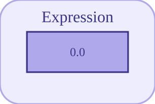

# expression


<p align="center">

</p>
Évalue une expression mathématique restreinte de u, en simulation et dans le code généré.

## 📝 Syntaxe

- Type de bloc : expression

## 📥 Argument d'entrée

- ports d'entrée - 1 port d'entrée (u, double scalaire).

## 📤 Argument de sortie

- ports de sortie - 1 port de sortie (double scalaire).

## 📄 Description


Évalue l'expression mathématique <code>Expr</code> avec <code>u</code> (entrée du bloc), <code>t</code> (temps courant), <code>dt</code> (pas) et les variables du diagramme. Le même moteur d'expression sert à la simulation et à la génération de code C/Rust : les comportements simulé et généré coïncident.  

Grammaire supportée : constantes <code>pi</code>, <code>e</code>, <code>inf</code> ; fonctions unaires <code>abs, ceil, floor, round, sign, sqrt, exp, log, log10, log2, acos, asin, atan, cos, cosh, sin, sinh, tan, tanh, sinc</code> ; binaires <code>pow, atan2, min, max</code> ; ternaire <code>clamp</code> ; opérateurs <code>+ - * / ^</code>. Les constructions non mathématiques sont rejetées à la génération de code. 

Pour du code Nelson arbitraire (toute fonction, handles), utilisez le bloc <code>nelsonFunction</code> (simulation uniquement). 

<b>Paramètres</b> 

| Paramètre | Valeur par défaut | 
| --- | --- | 
| <code>Expr</code> | u | 

 

<b>Caractéristiques du bloc</b> 

| Champ | Valeur |
| --- | --- |
| Type de bloc | expression | 
| Famille | Blocs fonctions utilisateur | 
| Phases | INIT, ALGEBRAIC | 
| Transfert direct | oui | 
| Type de signal | double, scalaire | 
| Génération de code | oui (C et Rust) | 

 

Generation de code : prise en charge pour C et Rust. 

**Manifeste:** `modules/nflow_blocks/libraries/userdefined/library.json`
 

**Runtime:** `modules/nflow_blocks/src/cpp/userdefined/expression.cpp`


## 💡 Exemple

Ouvrir la démo des blocs fonction utilisateur (Expression + Nelson Function)

```matlab
open_system([modulepath('nflow_blocks'), '/examples/workspace/Nelson_Function_Demo.nflow']);
```


## 🔗 Voir aussi

[nelsonFunction](../../nflow_blocks/userdefined/nelsonFunction.md), [gain](../../nflow_blocks/math/gain.md).

## 🕔 Historique

| Version | 📄 Description     |
| ------- | --------------- |
| 1.0.0   | version initiale (remplace le bloc userFunc, limité à la génération de code ; le bloc expression simule aussi) |

<!--
## 👤 Auteur

Allan CORNET
-->
