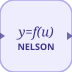

# nelsonFunction

<p align="center">

</p>
Évalue une fonction Nelson à chaque pas de simulation.

## 📝 Syntaxe

- Type de bloc : nelsonFunction

## 📥 Argument d'entrée

- ports d'entrée - 1 port d'entrée (u, double scalaire ou vecteur). Une entrée non connectée vaut 0.

## 📤 Argument de sortie

- ports de sortie - 1 port de sortie (double scalaire ou vecteur).

## 📄 Description

Appelle l'interpréteur Nelson à chaque pas de simulation pour évaluer <code>Fcn</code> avec l'entrée <code>u</code> du bloc. <code>Fcn</code> est un nom de fonction (<code>sin</code>), une fonction anonyme (<code>@(u) 2\*u</code>) ou une expression utilisant <code>u</code> (<code>atan2(u(1), u(2))</code>).

<code>OutputDimensions</code> : -1 hérite de la largeur d'entrée (hypothèse élément par élément) ; donnez une valeur explicite quand la fonction change la largeur du signal. La fonction est sondée une fois à l'initialisation ; une largeur incohérente arrête la simulation avec un diagnostic clair, de même que toute erreur levée par la fonction.

L'interpréteur étant invoqué à chaque pas, ce bloc est plus lent que les blocs natifs. Pour une expression purement mathématique, préférez le bloc <code>expression</code>, qui génère aussi du code.

<b>Paramètres</b>

| Paramètre                     | Valeur par défaut |
| ----------------------------- | ----------------- |
| <code>Fcn</code>              | sin               |
| <code>OutputDimensions</code> | -1                |
| <code>SampleTime</code>       | -1                |

<b>Caractéristiques du bloc</b>

| Champ              | Valeur                                                   |
| ------------------ | -------------------------------------------------------- |
| Type de bloc       | nelsonFunction                                           |
| Famille            | Blocs fonctions utilisateur                              |
| Phases             | INIT, ALGEBRAIC                                          |
| Transfert direct   | oui                                                      |
| Type de signal     | double, scalaire ou vecteur                              |
| Génération de code | non (rejet explicite ; remplacez par le bloc expression) |

<details>
<summary>Manifeste: <code>modules/nflow_blocks/libraries/userdefined/library.json</code></summary>

```json
{
  "id": "builtin.userdefined",
  "title": "User-Defined Functions",
  "version": "1.0.0",
  "format": "nflow-2",
  "metadata": {
    "author": "Allan CORNET",
    "created": "2026-08-02",
    "tool": "Nelson nflow"
  },
  "builtin": true,
  "comment": "User-defined function blocks",
  "license": "LGPL-3.0",
  "blocks": [
    {
      "type": "expression",
      "label": "Expression",
      "icon": "expression.svg",
      "phases": ["INIT", "ALGEBRAIC"],
      "width": 80,
      "height": 80,
      "inputs": [
        {
          "x": 0,
          "y": 40,
          "side": "left"
        }
      ],
      "outputs": [
        {
          "x": 80,
          "y": 40,
          "side": "right"
        }
      ],
      "defaultParams": {
        "Expr": "u"
      },
      "render": {
        "type": "math",
        "formula": "{params.Expr}",
        "mathGroupClass": "userfunc-math",
        "textSize": "16px",
        "width": 80,
        "height": 80
      }
    },
    {
      "type": "nelsonFunction",
      "label": "Nelson Function",
      "icon": "nelsonFunction.svg",
      "phases": ["INIT", "ALGEBRAIC"],
      "width": 96,
      "height": 48,
      "inputs": [
        {
          "x": 0,
          "y": 24,
          "side": "left"
        }
      ],
      "outputs": [
        {
          "x": 96,
          "y": 24,
          "side": "right"
        }
      ],
      "defaultParams": {
        "Fcn": "sin",
        "OutputDimensions": "-1",
        "SampleTime": "-1"
      },
      "render": {
        "type": "math",
        "formula": "\\mathtt{{params.Fcn}}",
        "textSize": 14
      }
    }
  ]
}
```

</details>


<details>
<summary>Runtime: <code>modules/nflow_blocks/src/cpp/userdefined/nelsonFunction.cpp</code></summary>

```cpp
//=============================================================================
// Copyright (c) 2016-present Allan CORNET (Nelson)
//=============================================================================
// This file is part of Nelson.
//=============================================================================
// LICENCE_BLOCK_BEGIN
// SPDX-License-Identifier: LGPL-3.0-or-later
// LICENCE_BLOCK_END
//=============================================================================
#include "SimEngineTypes.hpp"
#include "BlockRegistry.hpp"
#include "FieldNames.hpp"
#include "NFlowBlockDescriptor.hpp"
#include "NelsonWorkspaceBridge.hpp"
#include <cmath>
#include <algorithm>
#include "userdefined_blocks.hpp"
//=============================================================================
// nelsonFunction: evaluates a Nelson function at every simulation step,
// through the NelsonWorkspaceBridge (the interpreter is never called from
// this module directly).
//
// Fcn is a function name ("sin"), an anonymous function source ("@(u) 2*u")
// or an expression using u ("atan2(u(1), u(2))"). One input port u
// (scalar/vector double), one output port, direct feedthrough.
//
// The output width is fixed by the signal-layout pass: OutputDimensions -1
// inherits the INPUT width (element-wise assumption); set an explicit value
// when the function changes the width. INIT probes the function once with
// the initial input and fails with a clear diagnostic when the produced
// width disagrees with the layout.
//=============================================================================
namespace {
//=============================================================================
std::vector<double>
gatherInput(Nelson::NFlow::SimCtx& ctx, const Nelson::NFlow::Block& b)
{
    using namespace Nelson::NFlow;
    SigView v = getInputSig(ctx, b.nid, 0);
    const int w = std::max(1, v.width);
    std::vector<double> u((size_t)w, 0.0);
    if (hasInput(ctx, b.nid, 0)) {
        for (int i = 0; i < w; ++i) {
            u[i] = sigAt(v, i);
        }
    }
    return u;
}
//=============================================================================
} // namespace
//=============================================================================
bool
Nelson::NFlow::handleNelsonFunction(SimCtx& ctx, const Block& b, Phase phase)
{
    if (phase != Phase::INIT && phase != Phase::ALGEBRAIC) {
        return false;
    }
    nflow::BlockDescriptor bd(b, ctx.variables);
    const std::string fcn = bd.paramStr(nflow::kFcn, "sin");
    const PortSig* ps = portSigOf(ctx, b.nid, 0);
    const int outW = ps ? ps->width() : 1;

    if (phase == Phase::INIT) {
        if (!hasNelsonWorkspaceBridge()) {
            if (ctx.diag) {
                SimDiagnostic d;
                d.code = "nelsonfunction_no_bridge";
                d.blockId = b.id;
                d.message = "nelsonFunction block requires the Nelson interpreter "
                            "(workspace bridge not installed).";
                d.time = ctx.t;
                ctx.diag->fail(d);
            }
            return false;
        }
        // Probe once with the initial input to validate the function and the
        // output width chosen by the signal-layout pass.
        std::vector<double> u = gatherInput(ctx, b);
        NelsonCallResult probe = callNelsonFunction(fcn, u);
        if (!probe.ok) {
            if (ctx.diag) {
                SimDiagnostic d;
                d.code = "nelsonfunction_probe_failed";
                d.blockId = b.id;
                d.message = "nelsonFunction block '" + fcn + "': " + probe.errorMessage;
                d.time = ctx.t;
                ctx.diag->fail(d);
            }
            return false;
        }
        if ((int)probe.y.size() != outW) {
            if (ctx.diag) {
                SimDiagnostic d;
                d.code = "nelsonfunction_width_mismatch";
                d.blockId = b.id;
                d.message = "nelsonFunction block '" + fcn + "': the width of the result was "
                    + std::to_string(probe.y.size()) + " when a width of " + std::to_string(outW)
                    + " was expected (set OutputDimensions accordingly).";
                d.time = ctx.t;
                ctx.diag->fail(d);
            }
        }
        return false;
    }

    // ALGEBRAIC: direct feedthrough evaluation. A complex input passes both
    // lanes; a complex result fills the imaginary lane (the output port is
    // complex whenever the input is, by OR-propagation).
    std::vector<double> u = gatherInput(ctx, b);
    std::vector<double> uImag;
    {
        SigView v = getInputSig(ctx, b.nid, 0);
        if (v.isComplex && v.imag && v.width > 0) {
            uImag.resize(u.size(), 0.0);
            for (size_t i = 0; i < u.size(); ++i) {
                uImag[i] = (v.width == 1) ? v.imag[0] : v.imag[(int)i];
            }
        }
    }
    NelsonCallResult res = callNelsonFunction(fcn, u, uImag.empty() ? nullptr : &uImag);
    if (!res.ok || (int)res.y.size() != outW) {
        if (ctx.diag) {
            SimDiagnostic d;
            d.code = res.ok ? "nelsonfunction_width_mismatch" : "nelsonfunction_call_failed";
            d.blockId = b.id;
            d.message = res.ok ? ("nelsonFunction block '" + fcn + "': the width of the result was "
                                     + std::to_string(res.y.size()) + " when a width of "
                                     + std::to_string(outW) + " was expected.")
                               : ("nelsonFunction block '" + fcn + "': " + res.errorMessage);
            d.time = ctx.t;
            ctx.diag->fail(d);
        }
        return false;
    }
    if (ps && ps->isComplex) {
        return emitElementwiseComplex(ctx, b.nid, [&](int i) {
            const double im
                = (res.isComplex && (size_t)i < res.yImag.size()) ? res.yImag[(size_t)i] : 0.0;
            return std::complex<double> { res.y[(size_t)i], im };
        });
    }
    if (res.isComplex && ctx.diag) {
        SimDiagnostic d;
        d.code = "nelsonfunction_complex_result";
        d.blockId = b.id;
        d.message = "nelsonFunction block '" + fcn
            + "' returned a complex result on a real output port (feed the block a complex "
              "input so the port is declared complex).";
        d.time = ctx.t;
        ctx.diag->fail(d);
        return false;
    }
    return emitElementwise(ctx, b.nid, [&](int i) { return res.y[(size_t)i]; });
}
//=============================================================================

```

</details>

## 💡 Exemple

Ouvrir la démo des blocs fonction utilisateur (Nelson Function + Expression)

```matlab
open_system([modulepath('nflow_blocks'), '/examples/workspace/Nelson_Function_Demo.nflow']);
```

## 🔗 Voir aussi

[expression](../../nflow_blocks/userdefined/expression.md), [fromWorkspace](../../nflow_blocks/source/fromWorkspace.md).

## 🕔 Historique

| Version | 📄 Description   |
| ------- | ---------------- |
| 1.0.0   | version initiale |

<!--
## 👤 Auteur

Allan CORNET
-->
