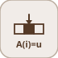

# assignment


<p align="center">

</p>
Ecrit des elements dans un signal : out = base avec out[Indices] = valeurs.

## 📝 Syntaxe

- Type de bloc : assignment

## 📥 Argument d'entrée

- ports d entree - 2 port(s) d entree declare(s).

## 📤 Argument de sortie

- ports de sortie - 1 port(s) de sortie declare(s).

## 📄 Description


Ecrit des elements dans un signal : out = base avec out[Indices] = valeurs. 

| Champ | Valeur |
| --- | --- |
| Module | <code>nflow_blocks</code> | 
| Bibliotheque | Utilitaires | 
| Type | <code>assignment</code> | 
| Libelle | Assignment | 

  

<b>Description</b> 

Ecrit des elements dans un signal (Assignment). Le port 0 est le signal de base ; sa largeur fixe la largeur de sortie ; le port 1 porte les valeurs de remplacement. <code>Indices</code> (base 1) choisit quels elements de base sont ecrases par les valeurs successives : <code>out = base</code>, puis <code>out[Indices[k]] = values[k]</code>. Les elements non listes passent inchanges. Simulation seule (routage a forme vectorielle, comme reshape / selector) : pas de chemin de generation de code scalaire. 

<b>Ports</b> 

<b>Entree(s)</b> 

| Port | Role | Cote | Position | 
| --- | --- | --- | --- | 
| Port\_1 | Signal numerique lu par le bloc. | gauche | x=0, y=20 | 
| Port\_2 | Signal numerique lu par le bloc. | gauche | x=0, y=40 | 

 

<b>Sortie(s)</b> 

| Port | Role | Cote | Position | 
| --- | --- | --- | --- | 
| Port\_1 | Signal numerique produit par le bloc. | droite | x=90, y=30 | 

 

<b>Parametres</b> 

| Parametre | Valeur par defaut | 
| --- | --- | 
| <code>Indices</code> | [1] | 

 

<b>Caracteristiques du bloc</b> 

| Champ | Valeur |
| --- | --- |
| Type de bloc | assignment | 
| Famille | Utilitaires | 
| Taille rendue | 90 x 60 | 
| Phases | ALGEBRAIC | 
| Etat interne ou historique | non | 
| Type de donnees du signal | valeurs numeriques double | 

 

<b>Algorithmes</b> 

- ALGEBRAIC : out = base ; pour chaque k, out[Indices[k]-1] = values[k]. 

<b>Capacites etendues</b> 

Execution native seulement (ce bloc n'est pas genere en code). 

<b>Sources d implementation</b> 

Generation de code : prise en charge pour C et Rust. 

**Manifest:** `modules/nflow_blocks/libraries/utility/library.json`
 

**Runtime:** `modules/nflow_blocks/src/cpp/routing/assignment.cpp`


## 💡 Exemple

base [1 2 3 4], valeurs [90 70], Indices [2 4] -> [1 90 3 70].

```matlab
d.blocks={ struct('id','b','type','constant','inputs',0,'outputs',1,'params',struct('Value',[1 2 3 4])), struct('id','v','type','constant','inputs',0,'outputs',1,'params',struct('Value',[90 70])), struct('id','a','type','assignment','inputs',2,'outputs',1,'params',struct('Indices',[2 4])), struct('id','w','type','toWorkspace','inputs',1,'outputs',0,'params',struct('VariableName','y','SaveFormat','Array')) };
d.connections={ struct('from','b','to','a','fromIndex',0,'toIndex',0), struct('from','v','to','a','fromIndex',0,'toIndex',1), struct('from','a','to','w','fromIndex',0,'toIndex',0) };
d.sampleTime=0.1; d.duration=0.1; d.solver='discrete'; d.variables=struct();
r=jsondecode(__nflow_simulate__(jsonencode(d)));
```


## 🔗 Voir aussi

[selector](../../nflow_blocks/utility/selector.md), [reshape](../../nflow_blocks/utility/reshape.md).

## 🕔 Historique

| Version | 📄 Description     |
| ------- | --------------- |
| 1.0.0   | initial version |

<!--
## 👤 Auteur

Allan CORNET
-->
