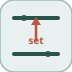

# busAssignment


<p align="center">

</p>
Remplace des membres choisis d un bus et laisse passer le reste inchange.

## 📝 Syntaxe

- Type de bloc : busAssignment

## 📥 Argument d'entrée

- ports d entree - 2 port(s) d entree declare(s).

## 📤 Argument de sortie

- ports de sortie - 1 port(s) de sortie declare(s).

## 📄 Description


Remplace des membres choisis d un bus et laisse passer le reste inchange. 

| Champ | Valeur |
| --- | --- |
| Module | <code>nflow_blocks</code> | 
| Bibliotheque | Utilitaires | 
| Type | <code>busAssignment</code> | 
| Libelle | Bus Assignment | 

  

<b>Description</b> 

Remplace des membres choisis d'un bus et laisse passer le reste (Bus Assignment). Le port 0 est le bus de base ; son type fixe le type du bus de sortie ; les ports 1..N portent les signaux de remplacement, un par chemin dans <code>AssignedSignals</code>. La sortie est un bus du meme type : une copie complete de la base ou la region empaquetee de chaque membre assigne est ecrasee par l'entree de remplacement correspondante. Le miroir de busSelector ; toutes les voies de stockage (reel / imaginaire / int64) sont preservees. Simulation seule, comme les autres blocs de routage de bus. 

<b>Ports</b> 

<b>Entree(s)</b> 

| Port | Role | Cote | Position | 
| --- | --- | --- | --- | 
| Port\_1 | Signal numerique lu par le bloc. | gauche | x=0, y=20 | 
| Port\_2 | Signal numerique lu par le bloc. | gauche | x=0, y=40 | 

 

<b>Sortie(s)</b> 

| Port | Role | Cote | Position | 
| --- | --- | --- | --- | 
| Port\_1 | Signal numerique produit par le bloc. | droite | x=90, y=30 | 

 

<b>Parametres</b> 

| Parametre | Valeur par defaut | 
| --- | --- | 
| <code>AssignedSignals</code> | [] | 

 

<b>Caracteristiques du bloc</b> 

| Champ | Valeur |
| --- | --- |
| Type de bloc | busAssignment | 
| Famille | Utilitaires | 
| Taille rendue | 90 x 60 | 
| Phases | ALGEBRAIC | 
| Etat interne ou historique | non | 
| Type de donnees du signal | valeurs numeriques double | 

 

<b>Algorithmes</b> 

- ALGEBRAIC : out = copie du bus de base ; pour chaque chemin assigne k, ecraser sa region empaquetee par l'entree de remplacement k. 

<b>Capacites etendues</b> 

<b>Sources d implementation</b> 

Generation de code : prise en charge pour C et Rust. 

**Manifest:** `modules/nflow_blocks/libraries/utility/library.json`
 

**Runtime:** `modules/nflow_blocks/src/cpp/routing/busAssignment.cpp`


## 💡 Exemple

Un bus {pos=[1 2], count=7} ; assigner 'count' a 99 donne {pos=[1 2], count=99}.

```matlab
d.blocks={ struct('id','pos','type','constant','inputs',0,'outputs',1,'params',struct('Value',[1 2])), struct('id','cnt','type','constant','inputs',0,'outputs',1,'params',struct('Value',7)), struct('id','nc','type','constant','inputs',0,'outputs',1,'params',struct('Value',99)), struct('id','bc','type','busCreator','inputs',2,'outputs',1,'params',struct('MemberNames',{{'pos','count'}})), struct('id','ba','type','busAssignment','inputs',2,'outputs',1,'params',struct('AssignedSignals',{{'count'}})), struct('id','sel','type','busSelector','inputs',1,'outputs',1,'params',struct('SelectedSignals',{{'count'}})), struct('id','w','type','toWorkspace','inputs',1,'outputs',0,'params',struct('VariableName','y','SaveFormat','Array')) };
d.connections={ struct('from','pos','to','bc','fromIndex',0,'toIndex',0), struct('from','cnt','to','bc','fromIndex',0,'toIndex',1), struct('from','bc','to','ba','fromIndex',0,'toIndex',0), struct('from','nc','to','ba','fromIndex',0,'toIndex',1), struct('from','ba','to','sel','fromIndex',0,'toIndex',0), struct('from','sel','to','w','fromIndex',0,'toIndex',0) };
d.sampleTime=0.1; d.duration=0.1; d.solver='discrete'; d.variables=struct();
r=jsondecode(__nflow_simulate__(jsonencode(d)));
```


## 🔗 Voir aussi

[busCreator](../../nflow_blocks/utility/busCreator.md), [busSelector](../../nflow_blocks/utility/busSelector.md).

## 🕔 Historique

| Version | 📄 Description     |
| ------- | --------------- |
| 1.0.0   | initial version |

<!--
## 👤 Auteur

Allan CORNET
-->
