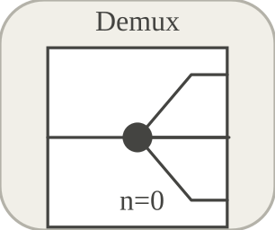

# demux

Route une entree vers plusieurs ports de sortie.

## 📝 Syntaxe

- Block type: demux

## 📥 Argument d'entrée

- input ports - 1 port(s) d entree declare(s).

## 📤 Argument de sortie

- output ports - 2 port(s) de sortie declare(s).

## 📄 Description

Route une entree vers plusieurs ports de sortie. 

| Champ | Valeur |
| --- | --- |
| Module | <code>nflow_blocks</code> | 
| Bibliotheque | Blocs utilitaires | 
| Type | <code>demux</code> | 
| Libelle | Demux | 

  

<b>Description</b> 

Route une entree vers plusieurs ports de sortie. 

<b>Ports</b> 

<b>Entree(s)</b> 

| Port | Role | Cote | Position | 
| --- | --- | --- | --- | 
| Port\_1 | Signal numerique lu par le bloc. | left | x=0, y=20 | 

 

<b>Sortie(s)</b> 

| Port | Role | Cote | Position | 
| --- | --- | --- | --- | 
| Port\_1 | Signal numerique produit par le bloc. | right | x=8, y=10 | 
| Port\_2 | Signal numerique produit par le bloc. | right | x=8, y=30 | 

 

<b>Parametres</b> 

| Parametre | Valeur par defaut | 
| --- | --- | 
| <code>outputs</code> | 2 | 

 

<b>Cles de l inspecteur</b> 

Ces cles serialisees sont exposees par l inspecteur du bloc. 

- <code>outputs</code> 

<b>Caracteristiques du bloc</b> 

| Champ | Valeur |
| --- | --- |
| Type de bloc | demux | 
| Famille | Blocs utilitaires | 
| Taille graphique | 8 x 40 | 
| Phases | OUTPUT | 
| Traversee directe | voir Algorithmes | 
| Etat ou historique interne | non observe dans le code documente | 
| Type de donnees signaux | valeurs numeriques double | 

 

<b>Algorithmes</b> 

- Le manifest controle le nombre de sorties. 
- Le bloc est un utilitaire de routage de graphe plutot qu une transformation numerique avec etat. 

<b>Equation ou regle</b> 
$$y_i = u$$
 

<b>Capacites et limites</b> 

La page decrit le comportement runtime natif observe dans les sources C++ du module. Les phases declarees indiquent quand le moteur de simulation appelle le bloc. 

Generation de code : prise en charge pour C et Rust. 

<b>Sources d implementation</b> 

**Manifest:** `modules/nflow_blocks/libraries/utility/library.json`
 

Runtime: registre de famille, chemin UI ou codegen; aucun fichier runtime natif dedie trouve.

## 🔗 Voir aussi

[mux](../../nflow_blocks/utility/mux.md), [subsystem](../../nflow_blocks/utility/subsystem.md).

## 🕔 Historique

| Version | 📄 Description     |
| ------- | --------------- |
| 1.0.0   | initial version |

<!--
## 👤 Auteur

Allan CORNET
-->
