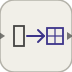

# reshape

Modifie les dimensions d'un signal sans changer ses valeurs.

## 📝 Syntaxe

- Type de bloc : reshape

## 📄 Description

Le bloc <b>Reshape</b> conserve l'ordre des éléments et applique les dimensions définies par <b>OutputDimensions</b>. 

L'entrée et la sortie doivent contenir le même nombre d'éléments. Une différence est signalée dans les diagnostics de simulation.  

<b>Extended Capabilities</b> 

<b>Implementation Sources</b> 

Generation de code : prise en charge pour C et Rust. 

**Manifest:** `modules/nflow_blocks/libraries/utility/library.json`
 

**Runtime:** `modules/nflow_blocks/src/cpp/routing/reshape.cpp`

