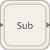

# subsystem

<p align="center">

</p>
Execute un diagramme imbrique comme un seul bloc.

## 📝 Syntaxe

- Block type: subsystem

## 📥 Argument d'entrée

- input ports - 1 port(s) d entree declare(s).

## 📤 Argument de sortie

- output ports - 1 port(s) de sortie declare(s).

## 📄 Description

Execute un diagramme imbrique comme un seul bloc.

| Champ        | Valeur                    |
| ------------ | ------------------------- |
| Module       | <code>nflow_blocks</code> |
| Bibliotheque | Blocs utilitaires         |
| Type         | <code>subsystem</code>    |
| Libelle      | Subsystem                 |

<b>Description</b>

Execute un diagramme imbrique comme un seul bloc.

<b>For-each</b>

Avec un parametre <code>forEach</code> <code>{"numIterations": N, "partition": [ports]}</code> le sous-systeme execute son corps <code>N</code> fois par pas : une entree partitionnee de largeur <code>N _ w</code> fournit a l'iteration <code>i</code> sa tranche de largeur <code>w</code> d'indice <code>i</code>, une entree non partitionnee est diffusee a chaque iteration, et chaque sortie interne de largeur <code>w_out</code> est concatenee en une sortie externe de largeur <code>N _ w_out</code>. Cela applique un meme sous-diagramme reutilisable element par element sur un vecteur ou un banc de canaux. Le corps peut porter un etat par iteration, discret (un retard unitaire ou un filtre discret) ou continu (un integrateur ou une fonction de transfert integre par le solveur) : chaque iteration garde un historique independant / integre son propre canal.

<b>Ports</b>

<b>Entree(s)</b>

| Port   | Role                             | Cote | Position  |
| ------ | -------------------------------- | ---- | --------- |
| Port_1 | Signal numerique lu par le bloc. | left | x=0, y=40 |

<b>Sortie(s)</b>

| Port   | Role                                  | Cote  | Position    |
| ------ | ------------------------------------- | ----- | ----------- |
| Port_1 | Signal numerique produit par le bloc. | right | x=120, y=40 |

<b>Parametres</b>

| Parametre                    | Valeur par defaut    |
| ---------------------------- | -------------------- |
| <code>name</code>            | Subsystem            |
| <code>externalInputs</code>  | []                   |
| <code>externalOutputs</code> | []                   |
| <code>subsystem</code>       |                      |
| <code>forEach</code>         | [] (pas d iteration) |

<b>Cles de l inspecteur</b>

Ces cles serialisees sont exposees par l inspecteur du bloc.

- <code>name</code>
- <code>externalInputs</code>
- <code>externalOutputs</code>
- <code>subsystem</code>

<b>Caracteristiques du bloc</b>

| Champ                      | Valeur                             |
| -------------------------- | ---------------------------------- |
| Type de bloc               | subsystem                          |
| Famille                    | Blocs utilitaires                  |
| Taille graphique           | 120 x 80                           |
| Phases                     | INIT, OUTPUT, ALGEBRAIC, UPDATE    |
| Traversee directe          | oui                                |
| Etat ou historique interne | non observe dans le code documente |
| Type de donnees signaux    | valeurs numeriques double          |

<b>Algorithmes</b>

- INIT construit l etat interne depuis la specification subsystem et ordonnance les blocs internes par phase.
- OUTPUT route les entrees externes, execute les sorties internes et recopie les sorties externes.
- ALGEBRAIC evalue les blocs algebriques internes; UPDATE avance les blocs internes de mise a jour.

<b>Equation ou regle</b>

nested model execution

<b>Capacites et limites</b>

La page decrit le comportement runtime natif observe dans les sources C++ du module. Les phases declarees indiquent quand le moteur de simulation appelle le bloc.

Generation de code : prise en charge pour C et Rust.

<b>Sources d implementation</b>

<details>
<summary>Manifest: <code>modules/nflow_blocks/libraries/utility/library.json</code></summary>

```json
{
  "id": "builtin.utility",
  "title": "Utility",
  "version": "1.0.0",
  "format": "nflow-2",
  "metadata": {
    "author": "Allan CORNET",
    "created": "2026-03-21",
    "tool": "Nelson nflow"
  },
  "comment": "Utility blocks such as switches, comments, and subsystems",
  "license": "LGPL-3.0",
  "builtin": true,
  "blocks": [
    {
      "type": "comment",
      "label": "Comment",
      "icon": "comment.svg",
      "phases": [],
      "width": 220,
      "height": 120,
      "inputs": [],
      "outputs": [],
      "defaultParams": {
        "CommentText": "",
        "ShowBorder": true
      },
      "render": {
        "type": "comment",
        "bodyClass": "block-body"
      }
    },
    {
      "type": "switch",
      "label": "Switch",
      "icon": "switch.svg",
      "phases": ["ALGEBRAIC"],
      "width": 80,
      "height": 80,
      "inputs": [
        {
          "x": 0,
          "y": 0,
          "side": "left"
        },
        {
          "x": 0,
          "y": 40,
          "side": "left"
        },
        {
          "x": 0,
          "y": 80,
          "side": "left"
        }
      ],
      "outputs": [
        {
          "x": 80,
          "y": 40,
          "side": "right"
        }
      ],
      "defaultParams": {
        "Criteria": "ge",
        "Threshold": 0
      },
      "render": {
        "type": "math",
        "bodyClass": "block-body",
        "mathGroupClass": "switch-math"
      }
    },
    {
      "type": "multiportSwitch",
      "label": "Multiport Switch",
      "icon": "multiportSwitch.svg",
      "phases": ["ALGEBRAIC"],
      "width": 40,
      "height": 80,
      "inputs": [
        {
          "x": 20,
          "y": 0,
          "side": "top"
        },
        {
          "x": 0,
          "y": 20,
          "side": "left"
        },
        {
          "x": 0,
          "y": 40,
          "side": "left"
        },
        {
          "x": 0,
          "y": 60,
          "side": "left"
        }
      ],
      "outputs": [
        {
          "x": 40,
          "y": 40,
          "side": "right"
        }
      ],
      "defaultParams": {
        "DataPortCount": 3
      },
      "render": {
        "type": "image",
        "src": "exports/multiportSwitch.svg",
        "svgMode": "element",
        "preserveAspectRatio": "none",
        "x": 0,
        "y": 0,
        "width": 40,
        "height": 90
      }
    },
    {
      "type": "toggleSwitch",
      "label": "Toggle Switch",
      "icon": "toggleSwitch.svg",
      "phases": ["OUTPUT"],
      "width": 80,
      "height": 50,
      "inputs": [],
      "outputs": [
        {
          "x": 80,
          "y": 25,
          "side": "right"
        }
      ],
      "defaultParams": {
        "State": 0,
        "OnLabel": "ON",
        "OffLabel": "OFF",
        "OnValue": 1,
        "OffValue": 0
      },
      "render": {
        "type": "toggle"
      }
    },
    {
      "type": "subsystem",
      "icon": "subsystem.svg",
      "label": "Subsystem",
      "phases": ["INIT", "OUTPUT", "ALGEBRAIC", "UPDATE"],
      "width": 120,
      "height": 80,
      "inputs": [
        {
          "x": 0,
          "y": 40,
          "side": "left"
        }
      ],
      "outputs": [
        {
          "x": 120,
          "y": 40,
          "side": "right"
        }
      ],
      "defaultParams": {
        "name": "Subsystem",
        "externalInputs": [],
        "externalOutputs": [],
        "subsystem": null
      },
      "render": {
        "type": "math",
        "bodyClass": "block-body",
        "mathGroupClass": "subsystem-math",
        "formula": "\\mathsf{Sub}"
      }
    },
    {
      "type": "mux",
      "label": "Mux",
      "icon": "mux.svg",
      "phases": ["OUTPUT"],
      "width": 8,
      "height": 40,
      "inputs": [
        {
          "x": 0,
          "y": 10,
          "side": "left"
        },
        {
          "x": 0,
          "y": 30,
          "side": "left"
        }
      ],
      "outputs": [
        {
          "x": 8,
          "y": 20,
          "side": "right"
        }
      ],
      "defaultParams": {
        "Inputs": 2
      }
    },
    {
      "type": "demux",
      "label": "Demux",
      "icon": "demux.svg",
      "phases": ["OUTPUT"],
      "width": 8,
      "height": 40,
      "inputs": [
        {
          "x": 0,
          "y": 20,
          "side": "left"
        }
      ],
      "outputs": [
        {
          "x": 8,
          "y": 10,
          "side": "right"
        },
        {
          "x": 8,
          "y": 30,
          "side": "right"
        }
      ],
      "defaultParams": {
        "Outputs": 2
      }
    },
    {
      "type": "convert",
      "label": "Convert",
      "icon": "convert.svg",
      "phases": ["ALGEBRAIC"],
      "width": 90,
      "height": 50,
      "inputs": [
        {
          "x": 0,
          "y": 25,
          "side": "left"
        }
      ],
      "outputs": [
        {
          "x": 90,
          "y": 25,
          "side": "right"
        }
      ],
      "defaultParams": {
        "OutDataType": "double",
        "SaturateOnOverflow": true,
        "Rounding": "nearest"
      }
    },
    {
      "type": "initialCondition",
      "label": "IC",
      "icon": "initialCondition.svg",
      "phases": ["ALGEBRAIC"],
      "width": 90,
      "height": 50,
      "inputs": [
        {
          "x": 0,
          "y": 25,
          "side": "left"
        }
      ],
      "outputs": [
        {
          "x": 90,
          "y": 25,
          "side": "right"
        }
      ],
      "defaultParams": {
        "InitialValue": 0
      }
    },
    {
      "type": "dataStoreMemory",
      "label": "Data Store Memory",
      "icon": "dataStoreMemory.svg",
      "phases": ["INIT"],
      "width": 70,
      "height": 60,
      "inputs": [],
      "outputs": [],
      "defaultParams": {
        "DataStoreName": "A",
        "InitialValue": 0
      },
      "render": {
        "type": "image",
        "src": "exports/dataStoreMemory.svg",
        "svgMode": "element",
        "preserveAspectRatio": "none",
        "x": 0,
        "y": 0,
        "width": 70,
        "height": 60
      }
    },
    {
      "type": "dataStoreWrite",
      "label": "Data Store Write",
      "icon": "dataStoreWrite.svg",
      "phases": ["INIT", "UPDATE"],
      "width": 70,
      "height": 60,
      "inputs": [
        {
          "x": 0,
          "y": 30,
          "side": "left"
        }
      ],
      "outputs": [],
      "defaultParams": {
        "DataStoreName": "A"
      },
      "render": {
        "type": "image",
        "src": "exports/dataStoreWrite.svg",
        "svgMode": "element",
        "preserveAspectRatio": "none",
        "x": 0,
        "y": 0,
        "width": 70,
        "height": 60
      }
    },
    {
      "type": "dataStoreRead",
      "label": "Data Store Read",
      "icon": "dataStoreRead.svg",
      "phases": ["OUTPUT"],
      "width": 70,
      "height": 60,
      "inputs": [],
      "outputs": [
        {
          "x": 70,
          "y": 30,
          "side": "right"
        }
      ],
      "defaultParams": {
        "DataStoreName": "A"
      },
      "render": {
        "type": "image",
        "src": "exports/dataStoreRead.svg",
        "svgMode": "element",
        "preserveAspectRatio": "none",
        "x": 0,
        "y": 0,
        "width": 70,
        "height": 60
      }
    },
    {
      "type": "selector",
      "label": "Selector",
      "icon": "selector.svg",
      "phases": ["ALGEBRAIC"],
      "width": 80,
      "height": 50,
      "inputs": [
        {
          "x": 0,
          "y": 25,
          "side": "left"
        }
      ],
      "outputs": [
        {
          "x": 80,
          "y": 25,
          "side": "right"
        }
      ],
      "defaultParams": {
        "Indices": "1"
      }
    },
    {
      "type": "reshape",
      "label": "Reshape",
      "icon": "reshape.svg",
      "phases": ["INIT", "ALGEBRAIC"],
      "width": 80,
      "height": 50,
      "inputs": [
        {
          "x": 0,
          "y": 25,
          "side": "left"
        }
      ],
      "outputs": [
        {
          "x": 80,
          "y": 25,
          "side": "right"
        }
      ],
      "defaultParams": {
        "OutputDimensions": ""
      }
    },
    {
      "type": "concatenate",
      "label": "Concatenate",
      "icon": "concatenate.svg",
      "phases": ["ALGEBRAIC"],
      "width": 60,
      "height": 60,
      "inputs": [
        {
          "x": 0,
          "y": 20,
          "side": "left"
        },
        {
          "x": 0,
          "y": 40,
          "side": "left"
        }
      ],
      "outputs": [
        {
          "x": 60,
          "y": 30,
          "side": "right"
        }
      ],
      "defaultParams": {
        "ConcatenateDimension": 1
      }
    },
    {
      "type": "busCreator",
      "label": "Bus Creator",
      "icon": "busCreator.svg",
      "phases": ["ALGEBRAIC"],
      "width": 80,
      "height": 70,
      "inputs": [
        {
          "x": 0,
          "y": 25,
          "side": "left"
        },
        {
          "x": 0,
          "y": 45,
          "side": "left"
        }
      ],
      "outputs": [
        {
          "x": 80,
          "y": 35,
          "side": "right"
        }
      ],
      "defaultParams": {
        "BusType": "",
        "NonVirtual": false,
        "MemberNames": []
      }
    },
    {
      "type": "busSelector",
      "label": "Bus Selector",
      "icon": "busSelector.svg",
      "phases": ["ALGEBRAIC"],
      "width": 85,
      "height": 70,
      "inputs": [
        {
          "x": 0,
          "y": 35,
          "side": "left"
        }
      ],
      "outputs": [
        {
          "x": 85,
          "y": 25,
          "side": "right"
        },
        {
          "x": 85,
          "y": 45,
          "side": "right"
        }
      ],
      "defaultParams": {
        "SelectedSignals": [],
        "OutputAsBus": false
      }
    },
    {
      "type": "merge",
      "label": "Merge",
      "icon": "merge.svg",
      "phases": ["INIT", "ALGEBRAIC"],
      "width": 40,
      "height": 80,
      "inputs": [
        {
          "x": 0,
          "y": 30,
          "side": "left"
        },
        {
          "x": 0,
          "y": 50,
          "side": "left"
        }
      ],
      "outputs": [
        {
          "x": 40,
          "y": 40,
          "side": "right"
        }
      ],
      "defaultParams": {
        "InitialOutput": 0
      },
      "render": {
        "type": "image",
        "src": "exports/merge.svg",
        "svgMode": "element",
        "preserveAspectRatio": "none",
        "x": 0,
        "y": 0,
        "width": 40,
        "height": 80
      }
    },
    {
      "type": "functionCallGenerator",
      "label": "Function-Call Generator",
      "icon": "functionCallGenerator.svg",
      "phases": ["ALGEBRAIC"],
      "width": 90,
      "height": 60,
      "inputs": [],
      "outputs": [
        {
          "x": 90,
          "y": 30,
          "side": "right"
        }
      ],
      "defaultParams": {
        "NumberOfIterations": 1
      },
      "render": {
        "type": "image",
        "src": "exports/functionCallGenerator.svg",
        "svgMode": "element",
        "preserveAspectRatio": "none",
        "x": 0,
        "y": 0,
        "width": 90,
        "height": 60
      }
    },
    {
      "type": "functionCallSplit",
      "label": "Function-Call Split",
      "icon": "functionCallSplit.svg",
      "phases": [],
      "width": 60,
      "height": 80,
      "inputs": [
        {
          "x": 0,
          "y": 40,
          "side": "left"
        }
      ],
      "outputs": [
        {
          "x": 60,
          "y": 30,
          "side": "right"
        },
        {
          "x": 60,
          "y": 50,
          "side": "right"
        }
      ],
      "defaultParams": {},
      "render": {
        "type": "image",
        "src": "exports/functionCallSplit.svg",
        "svgMode": "element",
        "preserveAspectRatio": "none",
        "x": 0,
        "y": 0,
        "width": 60,
        "height": 80
      }
    },
    {
      "type": "iteratorNumber",
      "label": "Iterator Number",
      "icon": "iteratorNumber.svg",
      "phases": ["OUTPUT"],
      "width": 70,
      "height": 50,
      "inputs": [],
      "outputs": [
        {
          "x": 70,
          "y": 25,
          "side": "right"
        }
      ],
      "defaultParams": {},
      "render": {
        "type": "image",
        "src": "exports/iteratorNumber.svg",
        "svgMode": "element",
        "preserveAspectRatio": "none",
        "x": 0,
        "y": 0,
        "width": 70,
        "height": 50
      }
    },
    {
      "type": "iteratorCondition",
      "label": "Iterator Condition",
      "icon": "iteratorCondition.svg",
      "phases": ["ALGEBRAIC"],
      "width": 70,
      "height": 50,
      "inputs": [
        {
          "x": 0,
          "y": 25,
          "side": "left"
        }
      ],
      "outputs": [
        {
          "x": 70,
          "y": 25,
          "side": "right"
        }
      ],
      "defaultParams": {},
      "render": {
        "type": "image",
        "src": "exports/iteratorCondition.svg",
        "svgMode": "element",
        "preserveAspectRatio": "none",
        "x": 0,
        "y": 0,
        "width": 70,
        "height": 50
      }
    },
    {
      "type": "width",
      "label": "Width",
      "icon": "width.svg",
      "phases": ["ALGEBRAIC"],
      "width": 80,
      "height": 50,
      "inputs": [
        {
          "x": 0,
          "y": 25,
          "side": "left"
        }
      ],
      "outputs": [
        {
          "x": 80,
          "y": 25,
          "side": "right"
        }
      ],
      "defaultParams": {}
    },
    {
      "type": "signalConversion",
      "label": "Signal Conversion",
      "icon": "signalConversion.svg",
      "phases": ["ALGEBRAIC"],
      "width": 90,
      "height": 50,
      "inputs": [
        {
          "x": 0,
          "y": 25,
          "side": "left"
        }
      ],
      "outputs": [
        {
          "x": 90,
          "y": 25,
          "side": "right"
        }
      ],
      "defaultParams": {}
    },
    {
      "type": "assignment",
      "label": "Assignment",
      "icon": "assignment.svg",
      "phases": ["ALGEBRAIC"],
      "width": 90,
      "height": 60,
      "inputs": [
        {
          "x": 0,
          "y": 20,
          "side": "left"
        },
        {
          "x": 0,
          "y": 40,
          "side": "left"
        }
      ],
      "outputs": [
        {
          "x": 90,
          "y": 30,
          "side": "right"
        }
      ],
      "defaultParams": {
        "Indices": [1]
      }
    },
    {
      "type": "busAssignment",
      "label": "Bus Assignment",
      "icon": "busAssignment.svg",
      "phases": ["ALGEBRAIC"],
      "width": 100,
      "height": 60,
      "inputs": [
        {
          "x": 0,
          "y": 20,
          "side": "left"
        },
        {
          "x": 0,
          "y": 40,
          "side": "left"
        }
      ],
      "outputs": [
        {
          "x": 100,
          "y": 30,
          "side": "right"
        }
      ],
      "defaultParams": {
        "AssignedSignals": []
      }
    }
  ]
}
```

</details>


Runtime: registre de famille, chemin UI ou codegen; aucun fichier runtime natif dedie trouve.

## 🔗 Voir aussi

[mux](../../nflow_blocks/utility/mux.md), [demux](../../nflow_blocks/utility/demux.md), [comment](../../nflow_blocks/utility/comment.md).

## 🕔 Historique

| Version | 📄 Description  |
| ------- | --------------- |
| 1.0.0   | initial version |

<!--
## 👤 Auteur

Allan CORNET
-->
