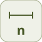

# width


<p align="center">

</p>
Sort le nombre d elements (largeur) de son signal d entree, sous forme scalaire.

## 📝 Syntaxe

- Type de bloc : width

## 📥 Argument d'entrée

- ports d entree - 1 port(s) d entree declare(s).

## 📤 Argument de sortie

- ports de sortie - 1 port(s) de sortie declare(s).

## 📄 Description


Sort le nombre d elements (largeur) de son signal d entree, sous forme scalaire. 

| Champ | Valeur |
| --- | --- |
| Module | <code>nflow_blocks</code> | 
| Bibliotheque | Utilitaires | 
| Type | <code>width</code> | 
| Libelle | Width | 

  

<b>Description</b> 

Sort le nombre d'elements du signal d'entree sous forme de constante scalaire (Width). Aide a la modelisation / introspection, p. ex. piloter un gain ou une borne de boucle par la largeur d'un bus ou d'un vecteur. La sortie est toujours scalaire quelle que soit la largeur d'entree. Interpreteur seul : le generateur de code aplatit les signaux vectoriels en fils scalaires avant l'emission par bloc, donc un modele contenant un bloc width est signale comme non generable. 

<b>Ports</b> 

<b>Entree(s)</b> 

| Port | Role | Cote | Position | 
| --- | --- | --- | --- | 
| Port\_1 | Signal numerique lu par le bloc. | gauche | x=0, y=25 | 

 

<b>Sortie(s)</b> 

| Port | Role | Cote | Position | 
| --- | --- | --- | --- | 
| Port\_1 | Signal numerique produit par le bloc. | droite | x=80, y=25 | 

 

<b>Parametres</b> 

| Parametre | Valeur par defaut | 
| --- | --- | 
| *aucun* |  | 

 

<b>Caracteristiques du bloc</b> 

| Champ | Valeur |
| --- | --- |
| Type de bloc | width | 
| Famille | Utilitaires | 
| Taille rendue | 80 x 50 | 
| Phases | ALGEBRAIC | 
| Etat interne ou historique | non | 
| Type de donnees du signal | valeurs numeriques double | 

 

<b>Algorithmes</b> 

- ALGEBRAIC : out = nombre d'elements du signal d'entree (scalaire). 

<b>Capacites etendues</b> 

Execution native seulement (ce bloc n'est pas genere en code). 

<b>Sources d implementation</b> 

Generation de code : prise en charge pour C et Rust. 

**Manifest:** `modules/nflow_blocks/libraries/utility/library.json`
 

**Runtime:** `modules/nflow_blocks/src/cpp/routing/width.cpp`


## 💡 Exemple

Une constante [10 20 30] (largeur 3) vers un bloc width sort 3.

```matlab
d.blocks={ struct('id','c','type','constant','inputs',0,'outputs',1,'params',struct('Value',[10 20 30])), struct('id','wd','type','width','inputs',1,'outputs',1,'params',struct()), struct('id','w','type','toWorkspace','inputs',1,'outputs',0,'params',struct('VariableName','y','SaveFormat','Array')) };
d.connections={ struct('from','c','to','wd','fromIndex',0,'toIndex',0), struct('from','wd','to','w','fromIndex',0,'toIndex',0) };
d.sampleTime=0.1; d.duration=0.2; d.solver='discrete'; d.variables=struct();
r=jsondecode(__nflow_simulate__(jsonencode(d)));
```


## 🔗 Voir aussi

[mux](../../nflow_blocks/utility/mux.md), [demux](../../nflow_blocks/utility/demux.md).

## 🕔 Historique

| Version | 📄 Description     |
| ------- | --------------- |
| 1.0.0   | initial version |

<!--
## 👤 Auteur

Allan CORNET
-->
