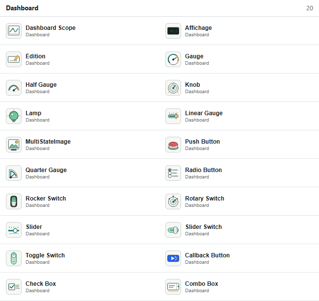
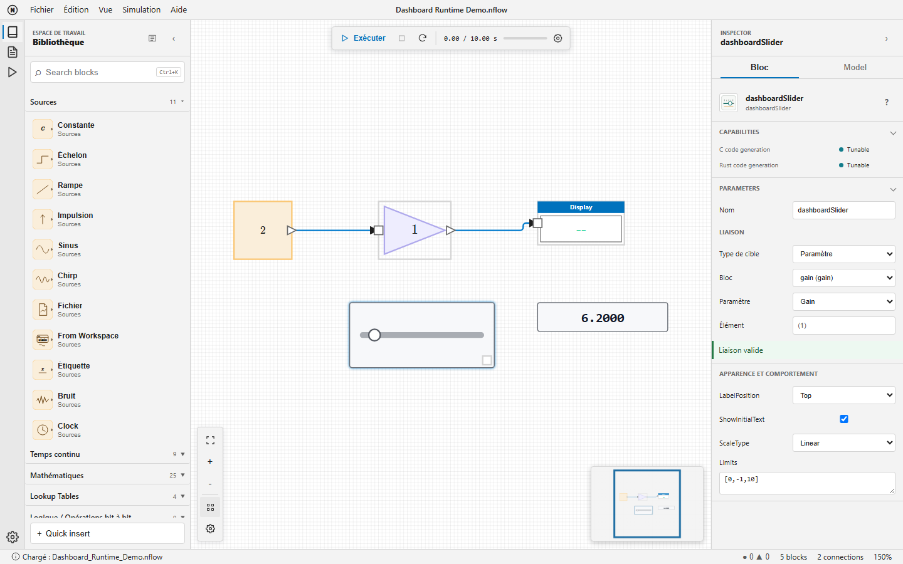

# nflow_dashboard

Surveiller et régler les simulations NFlow avec des blocs Dashboard interactifs.

## 📝 Syntaxe

- Bibliothèque Dashboard : affichages, contrôles, liaisons et actions de rappel

## 📄 Description

Les blocs Dashboard fournissent des contrôles et des affichages directement sur un diagramme NFlow. Ils n'ont pas de ports d'entrée ou de sortie ordinaires : chaque bloc lit ou modifie une cible choisie dans la section <b>Binding</b> de l'inspecteur.

<b>Blocs disponibles</b>

| Famille              | Blocs                                                                                                       | Rôle                                                                              |
| -------------------- | ----------------------------------------------------------------------------------------------------------- | --------------------------------------------------------------------------------- |
| Affichage de signaux | Dashboard Scope, Display                                                                                    | Tracer les échantillons horodatés ou afficher la dernière valeur typée.           |
| Jauges               | Gauge, Half Gauge, Quarter Gauge, Linear Gauge                                                              | Afficher une valeur scalaire avec des limites et des zones colorées facultatives. |
| Affichage d'états    | Lamp, MultiStateImage                                                                                       | Associer les valeurs d'un signal à des couleurs ou à des images.                  |
| Contrôles continus   | Edit, Knob, Slider                                                                                          | Régler un paramètre ou une variable scalaire par saisie ou par pointeur.          |
| Contrôles à états    | Push Button, Rotary Switch, Radio Button, Combo Box, Check Box, Rocker Switch, Slider Switch, Toggle Switch | Sélectionner l'un des états numériques configurés.                                |
| Action               | Callback Button                                                                                             | Évaluer du code Nelson lors d'un clic ou d'un appui, sans liaison.                |




<b>Créer une liaison</b>

Sélectionnez un bloc Dashboard, puis choisissez sa cible dans l'inspecteur. L'état sous le sélecteur indique <b>Liaison valide</b>, <b>Non connecté</b> ou une erreur précise. Les liaisons utilisent des identifiants de blocs stables : l'enregistrement, le rechargement, le renommage, la copie et les sous-systèmes imbriqués ne dépendent pas des libellés affichés.

| Cible     | Blocs concernés                         | Configuration et application                                                                                                                           |
| --------- | --------------------------------------- | ------------------------------------------------------------------------------------------------------------------------------------------------------ |
| Signal    | Tous les blocs d'affichage              | Choisissez une sortie de bloc, son port à base un et le traitement Sample ou Frame. La valeur est lue après chaque pas majeur.                         |
| Paramètre | Tous les contrôles sauf Callback Button | Choisissez un bloc, un paramètre numérique réglable et éventuellement un élément scalaire. Une modification validée est visible au pas majeur suivant. |
| Variable  | Tous les contrôles sauf Callback Button | Choisissez l'espace Diagram, Base ou Global, une variable numérique et éventuellement un élément scalaire.                                             |

Utilisez une notation d'élément à base un, par exemple <b>(2)</b> ou <b>(2,3)</b>. Un champ d'élément vide sélectionne la cible complète et n'est valide que si elle est scalaire. Les blocs, ports, variables ou éléments absents, les valeurs non numériques et les cibles non réglables sont rejetés avant la simulation.




<b>Manipuler les contrôles</b>

Les contrôles restent utilisables lorsque la simulation est en cours, en pause ou arrêtée. Un geste commencé sur un contrôle lui reste attribué jusqu'au relâchement, même si la simulation se termine pendant le geste. Faites glisser le corps du bloc en dehors du contrôle pour déplacer le bloc. Slider et Knob acceptent le déplacement au pointeur, les flèches pour les petits incréments et Origine ou Fin pour atteindre leurs limites. Les contrôles natifs Edit et Combo Box perdent le focus lorsque l'arrière-plan du diagramme est sélectionné.

<b>Apparence et comportement</b>

| Blocs                    | Propriétés principales                                                                                                                           |
| ------------------------ | ------------------------------------------------------------------------------------------------------------------------------------------------ |
| Tous les blocs concernés | **LabelPosition**, **ShowInitialText**, **Opacity** et **Binding**.                                                                              |
| Dashboard Scope          | **TimeSpan**, **UpdateMode**, **YLimits**, **NormalizeYAxis**, **ScaleAtStop**, légende, grille, graduations, marqueurs, bordure et couleurs.    |
| Jauges, Slider, Knob     | **Limits** ; les jauges proposent aussi **ScaleColors** et **ScaleDirection**. Slider et Knob proposent une échelle **ScaleType** Linear ou Log. |
| Display et Edit          | Alignement et opacité. Display propose aussi **Format**, **FormatString**, la disposition, l'affichage de la grille et sa couleur.               |
| Contrôles à états        | **States** ou **Values**, libellés, type énuméré facultatif, type de bouton, texte et propriétés d'icône selon le bloc.                          |
| Lamp et MultiStateImage  | Couleurs par défaut et par état, ou images d'état avec **ScaleMode**.                                                                            |

Les limites et les états sont validés par l'inspecteur. Une échelle logarithmique requiert des limites utilisables strictement positives. L'opacité est comprise entre 0 et 1. Dashboard Scope limite son tracé à l'intérieur du bloc et aux limites Y configurées.

<b>Callback Button</b>

Un clic court évalue <b>ClickFcn</b>. Un maintien de <b>PressDelay</b> millisecondes évalue <b>PressFcn</b> ; une valeur positive de <b>RepeatInterval</b> répète cette action pendant le maintien. Le délai d'appui par défaut est de 500 ms. Les erreurs de rappel sont affichées dans la Console sans arrêter la simulation.

<b>Génération de code C et Rust</b>

| Capacité           | Comportement Dashboard                                                                                                                                            |
| ------------------ | ----------------------------------------------------------------------------------------------------------------------------------------------------------------- |
| Instrumentation    | Les blocs d'affichage sont validés puis retirés du code généré sans modifier les résultats numériques.                                                            |
| Réglable           | Une cible scalaire compatible devient un champ typé de **ModelState** avec un setter stable. Une modification entre deux appels de pas s'applique au pas suivant. |
| Non pris en charge | Le code de Callback Button n'est jamais généré. Les cibles structurelles, composites ou non prises en charge sont rejetées avant l'écriture des fichiers.         |

## 💡 Exemples

Ouvrir un exemple exécutable avec affichage de signal et liaison Slider.

```matlab
open_system([modulepath('nflow_blocks'), '/examples/Dashboard_Runtime_Demo.nflow']);
```

Ouvrir la galerie contenant les 20 blocs Dashboard.

```matlab
open_system([modulepath('nflow_blocks'), '/examples/Dashboard_Gallery_Demo.nflow']);
```

## 🔗 Voir aussi

[nflow_workspace](../nflow_gui/nflow_workspace.md), [nflow_solvers](../nflow_gui/nflow_solvers.md), [open_system](../nflow_gui/open_system.md).

## 🕔 Historique

| Version | 📄 Description   |
| ------- | ---------------- |
| 2.0.0   | version initiale |

<!--
## 👤 Auteur

Allan CORNET
-->
