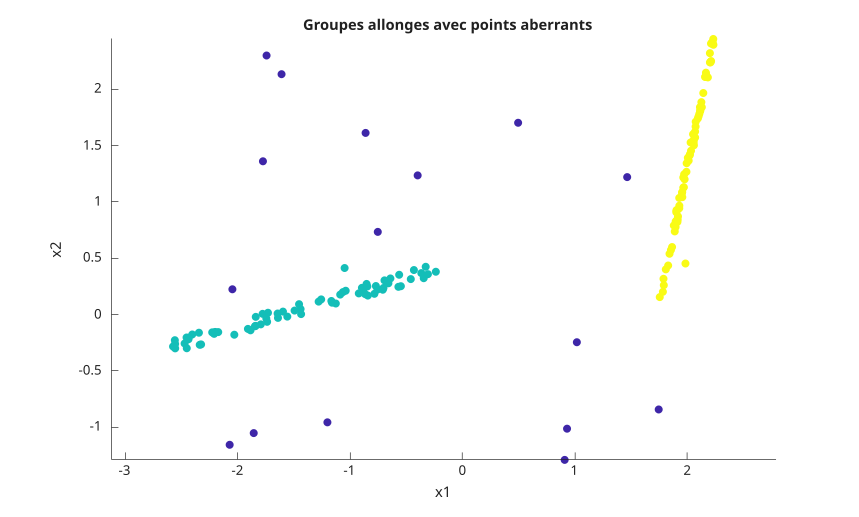
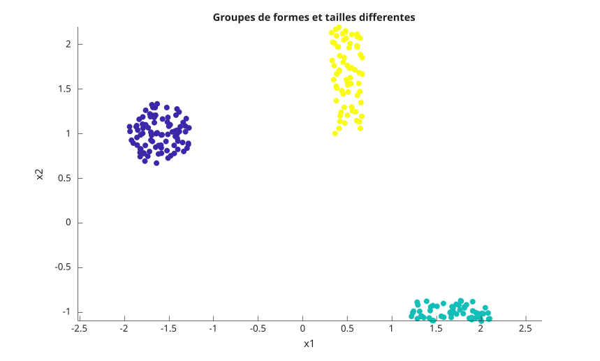
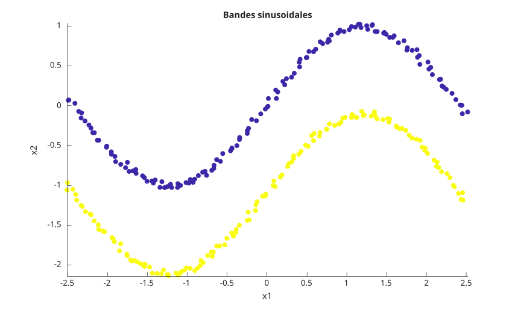
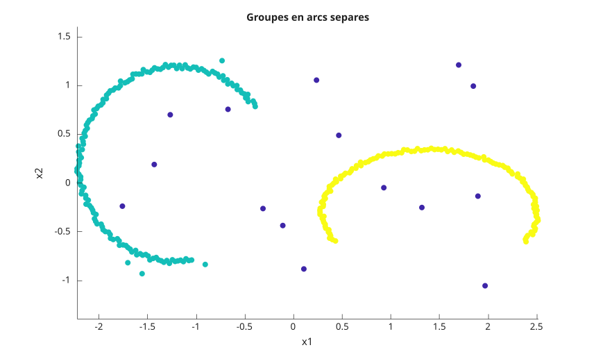
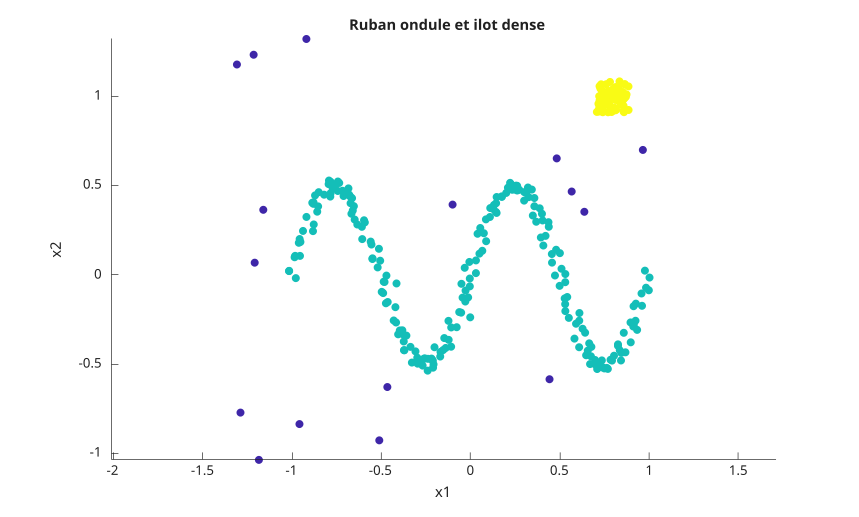
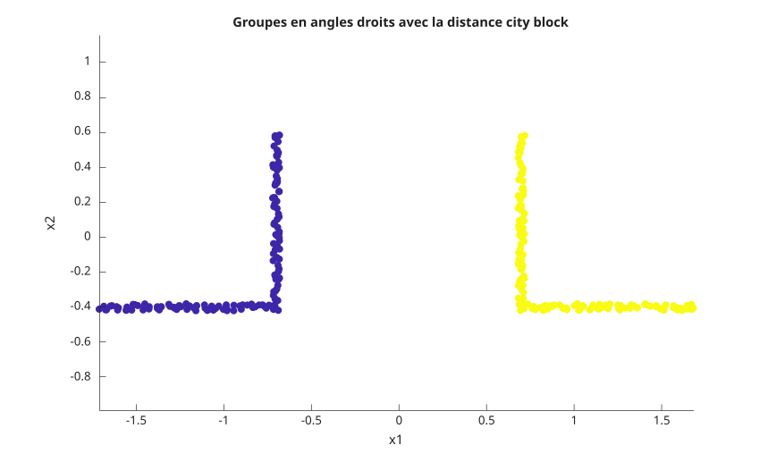

# dbscan

Regroupement spatial fonde sur la densite.

## 📝 Syntaxe

- idx = dbscan(X, epsilon, minpts)
- idx = dbscan(X, epsilon, minpts, 'Distance', distance)
- idx = dbscan(X, epsilon, minpts, 'Distance', 'minkowski', 'P', p)
- idx = dbscan(X, epsilon, minpts, 'Distance', 'seuclidean', 'Scale', scale)
- idx = dbscan(X, epsilon, minpts, 'Distance', 'mahalanobis', 'Cov', cov)
- idx = dbscan(D, epsilon, minpts, 'Distance', 'precomputed')
- idx = dbscan(B, [], minpts, 'Distance', 'precomputed')
- [idx, corepts] = dbscan(...)

## 📥 Argument d'entrée

- X - matrice numerique reelle pleine. Chaque ligne est une observation et chaque colonne est une variable. Une entree vide avec zero ligne est acceptee et renvoie des sorties vides.
- D - donnees de distances pre-calculees, reelles et pleines. D peut etre une matrice carree n-par-n ou un vecteur contenant les distances du triangle inferieur dans l'ordre des colonnes : d(2,1), d(3,1), ..., d(n,1), d(3,2), ..., d(n,n-1).
- B - donnees logiques de voisinage pre-calculees. Les valeurs true indiquent les observations voisines. B peut etre une matrice carree ou le meme format vectoriel compact que D. La diagonale est toujours consideree comme true, car chaque observation est voisine d'elle-meme.
- epsilon - scalaire positif, rayon du voisinage. Une distance exactement egale a epsilon appartient au voisinage. Utiliser [] seulement lorsque l'entree pre-calculee est logique.
- minpts - entier positif, nombre minimal d'observations dans un epsilon-voisinage pour obtenir un point coeur. L'observation elle-meme est incluse dans ce compte.
- distance - nom de distance ou handle de fonction. Les noms peuvent etre abreges lorsque l'abreviation n'est pas ambigue.
- p - scalaire positif utilise seulement avec 'minkowski'. L'exposant par defaut vaut 2.
- scale - vecteur positif fini utilise seulement avec 'seuclidean'. Sa longueur doit correspondre au nombre de colonnes de X. Si ce parametre est omis, l'echelle est calculee depuis X.
- cov - matrice symetrique definie positive utilisee seulement avec 'mahalanobis'. Sa taille doit correspondre au nombre de colonnes de X. Si ce parametre est omis, la matrice de covariance est calculee depuis X.

## 📤 Argument de sortie

- idx - vecteur colonne double contenant les etiquettes de groupes. Les etiquettes commencent a 1 dans l'ordre de decouverte. Les observations de bruit valent -1.
- corepts - vecteur colonne logique. La valeur true indique que l'observation correspondante contient au moins minpts observations dans son epsilon-voisinage.

## 📄 Description


<b>dbscan</b> regroupe les observations par connectivite de densite. L'algorithme recherche d'abord les observations situees a une distance inferieure ou egale a epsilon d'une observation candidate. Une candidate devient un point coeur lorsque ce voisinage contient au moins minpts observations. Les groupes sont ensuite etendus depuis les points coeur et incluent les points coeur et les points de bord atteignables par densite. 

La comparaison des distances est inclusive : distance <= epsilon. Ce detail est important pour les points situes exactement sur la limite du rayon. Les points qui ne sont atteignables depuis aucun point coeur sont renvoyes comme bruit avec l'etiquette -1. 

Les distances integrees prises en charge sont 'euclidean', 'squaredeuclidean', 'seuclidean', 'cityblock', 'chebychev', 'minkowski', 'mahalanobis', 'cosine', 'correlation', 'spearman', 'hamming', 'jaccard' et 'precomputed'. Les distances integrees sont en general plus rapides qu'un handle de fonction. 

Un handle de fonction de distance doit accepter deux entrees : une observation ligne et la matrice complete des donnees. Il doit renvoyer une distance numerique reelle pour chaque ligne de X. Le resultat peut etre un vecteur ligne ou colonne. 

Pour 'squaredeuclidean', epsilon est compare a la distance euclidienne au carre. Pour une entree numerique 'precomputed', epsilon est requis et compare aux valeurs stockees dans D. Pour une entree logique 'precomputed', epsilon doit etre [], car B encode deja la relation de voisinage. 

L'ordre des etiquettes suit l'ordre de decouverte des groupes a partir des lignes d'entree. Les observations de bord atteignables depuis plusieurs groupes sont affectees au premier groupe decouvert qui les atteint.

## Fonction(s) utilisée(s)


    pdist2
    kmeans
    kmedoids
    silhouette
  

## 💡 Exemples

Regrouper deux ensembles denses et une observation de bruit.

```matlab
X = [0 0; 0 0.1; 5 5; 5 5.1; 10 10];
[idx, corepts] = dbscan(X, 0.2, 2)
```
Renvoyer seulement les etiquettes de groupes.

```matlab
X = [0 0; 0 0.1; 5 5; 5 5.1];
idx = dbscan(X, 0.2, 2)
```
Utiliser une valeur minpts plus grande pour marquer toutes les observations comme bruit.

```matlab
X = [0; 0.1];
[idx, corepts] = dbscan(X, 1, 3)
```
Les points exactement a epsilon sont inclus dans le voisinage.

```matlab
X = [0; 1; 2];
idx = dbscan(X, 1, 2)
```
Regrouper des lignes dupliquees avec un tres petit rayon.

```matlab
X = [1 1; 1 1; 1 1; 5 5];
[idx, corepts] = dbscan(X, 1e-12, 3)
```
Utiliser la distance euclidienne au carre.

```matlab
X = [0 0; 0.1 0.05; 5 5; 5.05 5.05];
idx = dbscan(X, 1, 2, 'Distance', 'squaredeuclidean')
```
Utiliser la distance city block.

```matlab
X = [0 0; 0.1 0.05; 5 5; 5.05 5.05];
idx = dbscan(X, 0.2, 2, 'Distance', 'cityblock')
```
Utiliser la distance de Chebychev.

```matlab
X = [0 0; 0.1 0.05; 5 5; 5.05 5.05];
idx = dbscan(X, 0.1, 2, 'Distance', 'chebychev')
```
Utiliser la distance de Minkowski avec l'exposant 1.

```matlab
X = [0 0; 0.1 0.05; 5 5; 5.05 5.05];
idx = dbscan(X, 0.2, 2, 'Distance', 'minkowski', 'P', 1)
```
Utiliser la distance euclidienne standardisee avec une echelle explicite.

```matlab
X = [0 0; 0.1 0.05; 5 5; 5.05 5.05];
idx = dbscan(X, 0.2, 2, 'Distance', 'seuclidean', 'Scale', [1 1])
```
Utiliser la distance de Mahalanobis avec une matrice de covariance explicite.

```matlab
X = [0 0; 0.1 0.05; 5 5; 5.05 5.05];
idx = dbscan(X, 0.2, 2, 'Distance', 'mahalanobis', 'Cov', eye(2))
```
Utiliser la distance cosinus pour regrouper les observations de meme direction.

```matlab
X = [1 0; 2 0; 0 1; 0 2];
idx = dbscan(X, 0.01, 2, 'Distance', 'cosine')
```
Utiliser la distance de correlation.

```matlab
X = [1 2; 2 3; 10 9; 11 10];
idx = dbscan(X, 0.01, 2, 'Distance', 'correlation')
```
Utiliser la distance de Spearman.

```matlab
X = [1 2; 2 3; 10 9; 11 10];
idx = dbscan(X, 0.01, 2, 'Distance', 'spearman')
```
Utiliser la distance de Hamming sur des lignes binaires.

```matlab
X = [1 0 0; 1 0 0; 0 1 0; 0 1 0];
idx = dbscan(X, 0.01, 2, 'Distance', 'hamming')
```
Utiliser la distance de Jaccard sur des motifs creux.

```matlab
X = [1 0 0; 1 0 0; 0 1 0; 0 1 0];
idx = dbscan(X, 0.01, 2, 'Distance', 'jaccard')
```
Utiliser un handle de fonction de distance personnalise.

```matlab
X = [0 0; 0 0.1; 5 5; 5 5.1; 10 10];
f = @(row, A) sqrt((A(:, 1) - row(1)).^2 + (A(:, 2) - row(2)).^2);
idx = dbscan(X, 0.2, 2, 'Distance', f)
```
Utiliser une matrice carree de distances pre-calculees.

```matlab
X = [0; 0.1; 5; 5.1; 10];
D = abs(X - X');
idx = dbscan(D, 0.2, 2, 'Distance', 'precomputed')
```
Utiliser un vecteur compact de distances pre-calculees.

```matlab
Dv = [0.1 5 5.1 10 4.9 5 9.9 0.1 5 4.9];
idx = dbscan(Dv, 0.2, 2, 'Distance', 'precomputed')
```
Utiliser une matrice logique de voisinage pre-calculee.

```matlab
B = [true true false; true true true; false true true];
idx = dbscan(B, [], 2, 'Distance', 'precomputed')
```
Utiliser un vecteur logique compact de voisinages pre-calcules.

```matlab
Bv = [true false false true false true];
idx = dbscan(Bv, [], 2, 'Distance', 'precomputed')
```
Tracer des groupes allonges avec des points aberrants.

```matlab
f = figure();
rng(11);
n = 70;
u = 2 * rand(n, 1) - 1;
v = 2 * rand(n, 1) - 1;
X1 = [1.2 * u - 1.4, 0.35 * u + 0.12 * rand(n, 1)];
X2 = [0.25 * v + 2.0, 1.2 * v + 0.18 * rand(n, 1) + 1.2];
X3 = [4.8 * rand(18, 1) - 2.2, 3.8 * rand(18, 1) - 1.3];
X = [X1; X2; X3];
idx = dbscan(X, 0.32, 6);
c = idx;
c(c < 0) = 0;
scatter(X(:, 1), X(:, 2), 36, c, 'filled');
axis equal;
title('Groupes allonges avec points aberrants');
xlabel('x1');
ylabel('x2');
```

Tracer des groupes de formes et tailles differentes.

```matlab
f = figure();
rng(12);
n1 = 90;
n2 = 55;
n3 = 70;
theta = 2 * pi * rand(n1, 1);
r = 0.35 * sqrt(rand(n1, 1));
X1 = [r .* cos(theta) - 1.6, r .* sin(theta) + 1.0];
X2 = [0.9 * rand(n2, 1) + 1.2, 0.25 * rand(n2, 1) - 1.1];
X3 = [0.35 * (rand(n3, 1) - 0.5) + 0.5, 1.2 * (rand(n3, 1) - 0.5) + 1.6];
X = [X1; X2; X3];
idx = dbscan(X, 0.28, 5);
c = idx;
c(c < 0) = 0;
scatter(X(:, 1), X(:, 2), 36, c, 'filled');
axis equal;
title('Groupes de formes et tailles differentes');
xlabel('x1');
ylabel('x2');
```

Tracer deux bandes sinusoidales.

```matlab
f = figure();
rng(13);
n = 140;
t = linspace(-2.5, 2.5, n)';
X1 = [t, sin(1.3 * t)] + 0.08 * (rand(n, 2) - 0.5);
X2 = [t, sin(1.3 * t) - 1.1] + 0.08 * (rand(n, 2) - 0.5);
X = [X1; X2];
idx = dbscan(X, 0.18, 5);
c = idx;
c(c < 0) = 0;
scatter(X(:, 1), X(:, 2), 36, c, 'filled');
axis equal;
title('Bandes sinusoidales');
xlabel('x1');
ylabel('x2');
```

Tracer des groupes en arcs separes.

```matlab
f = figure();
rng(14);
t1 = linspace(0.2 * pi, 1.55 * pi, 150)';
t2 = linspace(1.85 * pi, 3.15 * pi, 130)';
r1 = 1 + 0.05 * (rand(150, 1) - 0.5);
r2 = 1 + 0.05 * (rand(130, 1) - 0.5);
X1 = [r1 .* cos(t1), r1 .* sin(t1)] + [-1.2, 0.2];
X2 = [1.1 * r2 .* cos(t2), 0.65 * r2 .* sin(t2)] + [1.4, -0.3];
X3 = [4 * rand(20, 1) - 2, 2.6 * rand(20, 1) - 1.3];
X = [X1; X2; X3];
idx = dbscan(X, 0.18, 5);
c = idx;
c(c < 0) = 0;
scatter(X(:, 1), X(:, 2), 36, c, 'filled');
axis equal;
title('Groupes en arcs separes');
xlabel('x1');
ylabel('x2');
```

Tracer un ruban ondule et un ilot dense.

```matlab
f = figure();
rng(15);
n = 220;
t = linspace(0, 4 * pi, n)';
X1 = [t / (2 * pi) - 1, 0.5 * sin(t)] + 0.07 * (rand(n, 2) - 0.5);
X2 = 0.18 * (rand(80, 2) - 0.5) + [0.8, 1.0];
X3 = [2.8 * rand(20, 1) - 1.4, 2.6 * rand(20, 1) - 1.1];
X = [X1; X2; X3];
idx = dbscan(X, 0.14, 5);
c = idx;
c(c < 0) = 0;
scatter(X(:, 1), X(:, 2), 36, c, 'filled');
axis equal;
title('Ruban ondule et ilot dense');
xlabel('x1');
ylabel('x2');
```

Tracer des groupes en angles droits avec la distance city block.

```matlab
f = figure();
rng(16);
n = 70;
t = linspace(0, 1, n)';
X1 = [[t, zeros(n, 1)]; [ones(n, 1), t]] + 0.04 * (rand(2 * n, 2) - 0.5) - [1.7, 0.4];
X2 = [[-t, zeros(n, 1)]; [-ones(n, 1), t]] + 0.04 * (rand(2 * n, 2) - 0.5) + [1.7, -0.4];
X = [X1; X2];
idx = dbscan(X, 0.16, 4, 'Distance', 'cityblock');
c = idx;
c(c < 0) = 0;
scatter(X(:, 1), X(:, 2), 36, c, 'filled');
axis equal;
title('Groupes en angles droits avec la distance city block');
xlabel('x1');
ylabel('x2');
```

Regrouper deux anneaux avec la distance par defaut.

```matlab
N = 90;
theta = linspace(0, 2 * pi, N)';
X = [[0.5 * cos(theta), 0.5 * sin(theta)]; [5 * cos(theta), 5 * sin(theta)]];
idx = dbscan(X, 1, 5)
```
Traiter une matrice de donnees vide.

```matlab
idx = dbscan(zeros(0, 2), 1, 2)
```


## 🕔 Historique

| Version | 📄 Description     |
| ------- | --------------- |
| 2.0.0   | version initiale |

<!--
## 👤 Auteur

Allan CORNET
-->
