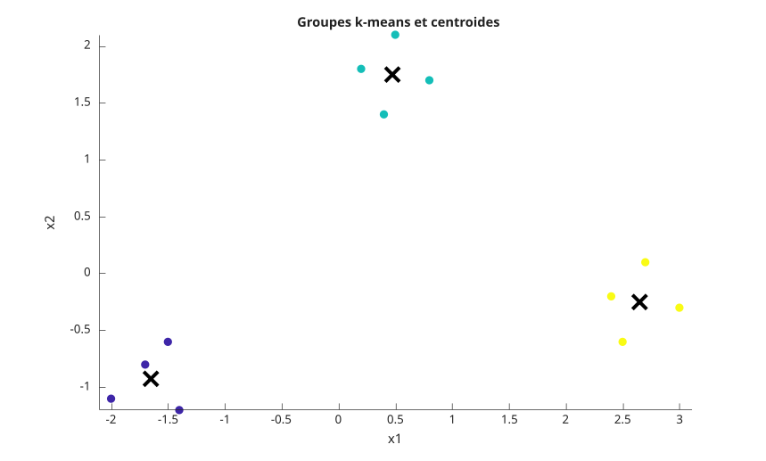
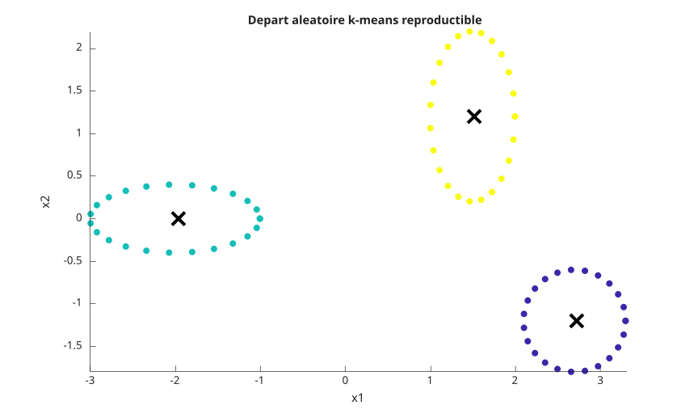
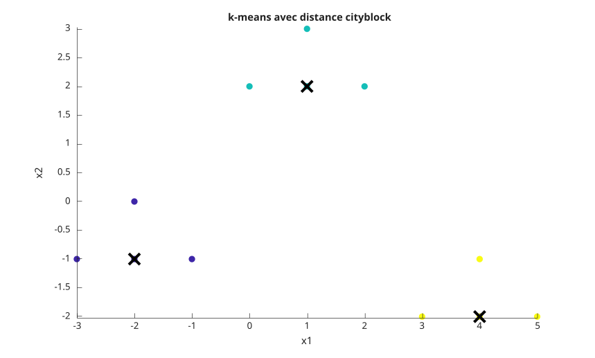

# kmeans

Classification k-means.

## 📝 Syntaxe

- idx = kmeans(X, k)
- idx = kmeans(X, k, 'Distance', distance)
- idx = kmeans(X, k, 'Start', start)
- [idx, C, sumd, D] = kmeans(...)

## 📥 Argument d'entrée

- X - matrice numerique reelle pleine. Les lignes sont les observations et les colonnes sont les variables.
- k - entier positif indiquant le nombre de groupes. Utiliser [] uniquement lorsque Start est un tableau numerique.
- distance - nom de distance : 'sqeuclidean', 'squaredeuclidean', 'cityblock', 'cosine', 'correlation' ou 'hamming'.
- start - choix des centroides initiaux : 'plus', 'sample', 'uniform', 'cluster', une matrice k-par-p ou un tableau k-par-p-par-r.

## 📤 Argument de sortie

- idx - vecteur colonne double des indices de groupe.
- C - matrice k-par-p des centroides.
- sumd - vecteur k-par-1 des sommes des distances intra-groupe.
- D - matrice n-par-k des distances entre chaque observation et chaque centroide.

## 📄 Description


<b>kmeans</b> partitionne les observations en k groupes en affectant iterativement chaque observation au centroide le plus proche puis en recalculant les centroides. 

Les initialisations aleatoires utilisent le generateur global de Nelson. Utiliser <b>rng</b> avant <b>kmeans</b>, ou transmettre <b>Options</b> cree avec <b>statset</b> et un <b>RandStream</b> dans <b>Streams</b>, pour obtenir une initialisation reproductible.

## Fonction(s) utilisée(s)


    statset
    statget
    rng
    table
  

## 💡 Exemples

Classer deux groupes.

```matlab
X = [0 0; 0 1; 5 5; 5 6];
[idx, C] = kmeans(X, 2, 'Start', [0 0; 5 5])
```
Tracer trois groupes et leurs centroides.

```matlab
f = figure();
X = [-2.0 -1.1;
     -1.7 -0.8;
     -1.4 -1.2;
     -1.5 -0.6;
      0.2  1.8;
      0.5  2.1;
      0.8  1.7;
      0.4  1.4;
      2.4 -0.2;
      2.7  0.1;
      3.0 -0.3;
      2.5 -0.6];
start = [-1.7 -0.8; 0.5 2.1; 2.7 0.1];
[idx, C] = kmeans(X, 3, 'Start', start);
scatter(X(:, 1), X(:, 2), 48, idx, 'filled');
hold on;
plot(C(:, 1), C(:, 2), 'kx', 'MarkerSize', 12, 'LineWidth', 3);
axis equal;
title('Groupes k-means et centroides');
xlabel('x1');
ylabel('x2');
```

Tracer une initialisation aleatoire reproductible.

```matlab
f = figure();
rng(4);
t = linspace(0, 2 * pi, 24)';
X1 = [cos(t) - 2, 0.4 * sin(t)];
X2 = [0.5 * cos(t) + 1.5, sin(t) + 1.2];
X3 = [0.6 * cos(t) + 2.7, 0.6 * sin(t) - 1.2];
X = [X1; X2; X3];
[idx, C] = kmeans(X, 3, 'Start', 'plus', 'Replicates', 4);
scatter(X(:, 1), X(:, 2), 36, idx, 'filled');
hold on;
plot(C(:, 1), C(:, 2), 'kx', 'MarkerSize', 12, 'LineWidth', 3);
axis equal;
title('Depart aleatoire k-means reproductible');
xlabel('x1');
ylabel('x2');
```

Tracer des groupes calcules avec la distance cityblock.

```matlab
f = figure();
X = [-3 -1;
     -2 -1;
     -2  0;
     -1 -1;
      0  2;
      1  2;
      1  3;
      2  2;
      3 -2;
      4 -2;
      4 -1;
      5 -2];
start = [-2 -1; 1 2; 4 -2];
[idx, C, sumd] = kmeans(X, 3, 'Start', start, 'Distance', 'cityblock');
scatter(X(:, 1), X(:, 2), 48, idx, 'filled');
hold on;
plot(C(:, 1), C(:, 2), 'kx', 'MarkerSize', 12, 'LineWidth', 3);
axis equal;
title('k-means avec distance cityblock');
xlabel('x1');
ylabel('x2');
```

