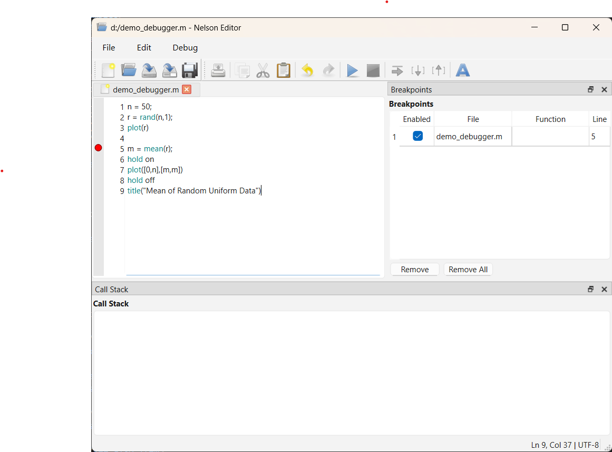

# débogage

Flux de travail de débogage pour les fichiers de code Nelson.

## 📄 Description

Le débogueur Nelson fournit des outils interactifs pour diagnostiquer et corriger les problèmes dans les scripts et les fonctions en contrôlant l'exécution et en inspectant l'état du programme.

Un flux de travail typique de débogage consiste à préparer le code, à interrompre l'exécution à des emplacements spécifiques, à examiner les valeurs des variables, à exécuter les instructions pas à pas, et à reprendre ou arrêter l'exécution.

Avant de commencer une session de débogage, assurez-vous que tous les fichiers de code sont enregistrés et accessibles depuis le dossier actuel ou le chemin de recherche. Les modifications non enregistrées peuvent ne pas être prises en compte lors de l'exécution du code depuis la ligne de commande.

L'exécution peut être interrompue en définissant des points d'arrêt ou en interrompant un programme en cours d'exécution. Lorsque l'exécution est interrompue, Nelson entre en mode débogage et l'invite de commande change pour indiquer que le débogueur a le contrôle.

Pendant que l'exécution est interrompue, la ligne courante n'a pas encore été exécutée. Vous pouvez inspecter les variables dans l'espace de travail actuel, exécuter le code ligne par ligne, entrer ou sortir des fonctions, ou continuer l'exécution jusqu'au prochain point d'arrêt.

Chaque fonction a son propre espace de travail. Lorsqu'on entre dans une fonction, l'espace de travail actif change pour refléter le contexte de la fonction.

Après avoir identifié le problème, terminez la session de débogage pour revenir au mode d'exécution normal. La fin de la session restaure l'invite de commande standard et efface le contexte du débogueur.

## 💡 Exemples

Crée demo_debugger.m pour des exemples de débogage.

```matlab
n = 50;
r = rand(n,1);
plot(r)
m = mean(r);
hold on
plot([0,n],[m,m])
hold off
title("Mean of Random Uniform Data")
```

Définissez un point d'arrêt dans la fonction demo_debugger. Cliquez sur la marge gauche à côté du numéro de ligne pour basculer un point d'arrêt.


Démarrez le débogage en appelant la fonction demo_debugger depuis la ligne de commande ou le bouton "Exécuter le fichier".


## 🔗 Voir aussi

[edit](../text_editor/edit.md), [dbstop](../debugger/dbstop.md), [dbstep](../debugger/dbstep.md), [dbcont](../debugger/dbcont.md), [dbquit](../debugger/dbquit.md), [dbstatus](../debugger/dbstatus.md).

## 🕔 Historique

| Version | 📄 Description   |
| ------- | ---------------- |
| 1.16.0  | Version initiale |

<!--
## 👤 Auteur

Allan CORNET
-->
